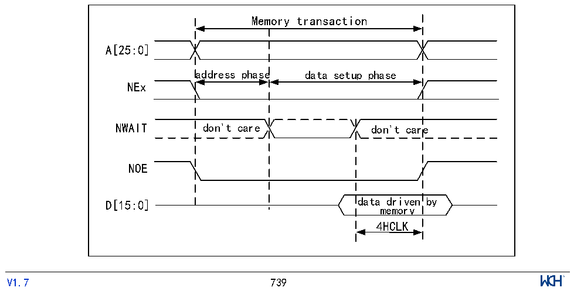

<!-- source-page: 743 -->

[← p.742](0742.md) · [index](../README.md) · [PDF p.743](https://ch32-riscv-ug.github.io/CH32H417/datasheet_zh/CH32H417RM.PDF#page=743) · [p.744 →](0744.md)

<!-- header: CH32H417系列应用手册 https://wch.cn -->

> ⬆ **Table continued** — rendered in full at [page 742](0742.md). <!-- p743-table-001 -->

异步访问中的WAIT管理  
如果异步存储器发出WAIT信号，指示尚未准备好接受或提供数据，则R32_FMC_BCRx寄存器中的  
ASYNCWAIT位必须置1。  
如果WAIT信号处于有效状态（电平高低取决于WAITPOL位），则由DATAST位控制的第二个访问  
阶段（数据建立阶段）将延长，直到WAIT变为无效状态。与数据建立阶段不同，由ADDSET和ADDHLD  
位控制的第一个访问阶段（地址建立和地址保持阶段）对 WAIT 不敏感，因此第一个访问阶段不会延  
长。  
必须配置数据建立阶段，以便在存储器事务结束前4个HCLK周期检测到WAIT。必须考虑以下情  
况：  
1）存储器发出的WAIT信号和NOE/NEW信号对齐：  
DATAST≥（4*HCLK）+ max_wait_assertion_time  
2）存储器发出的WAIT信号和NEx对齐（或者NOE/NWE信号不翻转）：  
如果  
max_wait_assertion_time&gt;address_phase+hold_phase  
那么：  
DATAST≥（4*HCLK）+（max_wait_assertion_time–address_phase–hold_phase）  
否则  
DATAST≥4*HCLK  
其中，max_wait_assertion_time 是在 NEx/NOE/NWE 变为低电平后存储器使能 WAIT 信号所花费  
的最长时间。  
图40-15和图40-16显示了异步存储器释放WAIT之后，在存储器访问阶段增加的HCLK时钟周期  
的个数（与上述情况无关）。  

图40-16 读取访问波形期间的异步等待  
 <!-- rendered from the PDF; verify at https://ch32-riscv-ug.github.io/CH32H417/datasheet_zh/CH32H417RM.PDF#page=743 -->

🖼 Text parsed from the figure above

Memory transaction  
A[25:0]  
address phase data setup phase  
NEx  
NWAIT don&#x27;t care don&#x27;t care  
NOE  
D[15:0] data driven by  
memory  
4HCLK  
<!-- image: p743-draw-image-00001 inside the figure -->
<!-- footer: V1.7 739 -->

