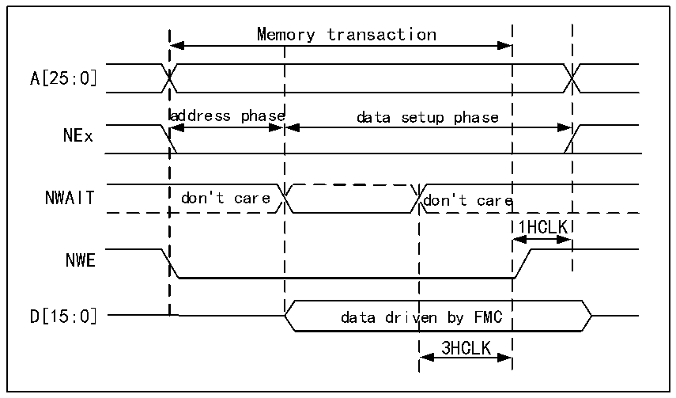

<!-- source-page: 744 -->

[← p.743](0743.md) · [index](../README.md) · [PDF p.744](https://ch32-riscv-ug.github.io/CH32H417/datasheet_zh/CH32H417RM.PDF#page=744) · [p.745 →](0745.md)

<!-- header: CH32H417系列应用手册 https://wch.cn -->
注：NWAIT极性取决于R32_FMC_BCRx寄存器中的WAITPOL位设置。  

图40-17 写入访问波形期间的异步等待  
 <!-- rendered from the PDF; verify at https://ch32-riscv-ug.github.io/CH32H417/datasheet_zh/CH32H417RM.PDF#page=744 -->

🖼 Text parsed from the figure above

Memory transaction  
A[25:0]  
address phase data setup phase  
NEx  
NWAIT don&#x27;t care don&#x27;t care  
1HCLK  
NWE  
D[15:0] data driven by FMC  
3HCLK  

注：NWAIT极性取决于R32_FMC_BCRx寄存器中的WAITPOL位设置。  

### 40.5.5 同步事务

存储器时钟FMC_CLK是HCLK的约数。它取决于CLKDIV的值和MWID/HB数据大小，如以下公式所  
示：  
FMC_CLK分频比 = max（CLKDIV+1，MWID（HB数据大小））  
MWID为16位或8位时，FMC_CLK分频比始终由CLKDIV的设定值定义。  
MWID为32位时，FMC_CLK分频比还取决于HB数据大小。  
示例：  
● CLKDIV=1，MWID=32位，HB数据大小=8位时，FMC_CLK=HCLK/4。  
● CLKDIV=1，MWID=16位，HB数据大小=8位时，FMC_CLK=HCLK/2。  
NOR Flash指定了从NADV使能到CLK高电平的最短时间。为了符合这一限制，FMC不会在同步访  
问的第一个内部时钟周期内（NADV使能之前）将时钟发到存储器。这样可以确保存储器时钟的上升沿  
出现在NADV低脉冲的中间。  
数据延迟与NOR延迟  
数据延迟是对数据进行采样之前需要等待的周期数。DATLAT 的值必须与 NOR FLASH 配置寄存器  
中指定的延迟值一致。当数据延迟计数中NADV为低电平时，FMC不会计入时钟周期。  
一些NOR Flash将NADV低电平周期计入数据延迟计数，这样NOR Flash延迟和FMC DATLAT参数  
之间的确切关系可以是以下任一种：  
● NOR Flash延迟=（DATLAT+2）个CLK时钟周期  
● NOR Flash延迟=（DATLAT+3）个CLK时钟周期  
近来有一些存储器会在延迟阶段使能 NWAIT。在这种情况下，可以将 DATLAT 设置为最小值。然  
后，FMC 会对数据进行采样，并且等待足够长的时间来评估数据是否有效。这样，FMC 就能检测到存  
储器存在延迟的时间，从而处理真实数据。  
其他存储器不会在延迟期间使能NWAIT。在这种情况下，必须正确设置FMC和存储器的延迟，否  
则可能会将无效数据误用为有效数据，或者在存储器访问初始阶段丢失有效数据。  
单次突发传输  
<!-- image: p744-draw-image-00001 bbox=[504.72, 786.24, 525.24, 796.68] -->
<!-- footer: V1.7 740 -->
