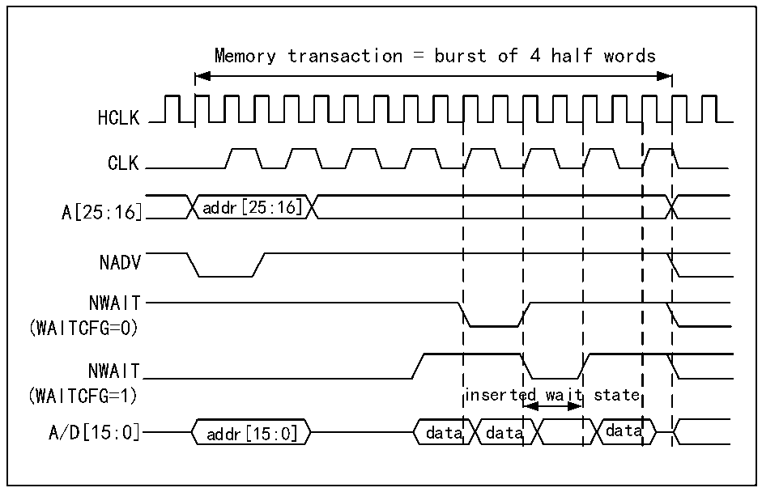

<!-- source-page: 745 -->

[← p.744](0744.md) · [index](../README.md) · [PDF p.745](https://ch32-riscv-ug.github.io/CH32H417/datasheet_zh/CH32H417RM.PDF#page=745) · [p.746 →](0746.md)

<!-- header: CH32H417系列应用手册 https://wch.cn -->
当所选存储区域配置为同步突发模式时，例如，如果向 16 位存储器请求了一个 HB 单次突发事  
务，则 FMC 会执行长度为1 的突发事务（如果 HB 传输为16位）或者长度为 2的突发事务（如果 HB  
传输为32位），然后在最后一个数据选通时禁止片选信号。  
与异步读取操作相比，就周期而言这并不是最有效的传输方法。但是，随机异步读取需要先重新  
编程存储器访问模式，这样总时间会更长。  
越过Cellular RAM1.5的边界页  
Cellular RAM1.5 不允许突发访问越过页边界。根据存储器页大小配置 R32_FMC_BCR1 寄存器中  
的CPSIZE位来达到存储器页大小时，FMC控制器会自动分离突发访问。  
等待管理  
对于同步NOR Flash，会在配置的延迟周期（相当于（DATLAT+2）个CLK时钟周期）之后对NWAIT  
进行评估。  
如果NWAIT有效（WAITPOL=0时为低电平，WAITPOL=1时为高电平），会插入等待状态，直到NWAIT  
无效（WAITPOL=0时为高电平，WAITPOL=1时为低电平）。  
当 NWAIT 无效时，数据将立即（位 WAITCFG=1）或在下一个时钟边沿（位 WAITCFG=0）被视为有  
效。  
通过NWAIT信号插入等待周期期间，控制器会继续将时钟脉冲发送到存储器，保持片选和输出使  
能信号有效。但不将数据视为有效。  
突发模式下，NOR Flash NWAIT信号有两种时序配置：  
● Flash在等待周期之前一个数据周期发出NWAIT信号（复位后的默认值）。  
● Flash在等待周期期间发出NWAIT信号。  
FMC支持这两种NOR Flash等待周期配置，通过R32_FMC_BCRx寄存器的WAITCFG位（x=0..3）针  
对每个片选进行配置。  

图40-18 等待配置波形  
 <!-- rendered from the PDF; verify at https://ch32-riscv-ug.github.io/CH32H417/datasheet_zh/CH32H417RM.PDF#page=745 -->

🖼 Text parsed from the figure above

Memory transaction = burst of 4 half words  
HCLK  
CLK  
A[25:16] addr[25:16]  
NADV  
NWAIT  
(WAITCFG=0)  
NWAIT  
(WAITCFG=1) inserted wait state  
A/D[15:0] addr[15:0] data data data  

<!-- image: p745-draw-image-00001 bbox=[504.72, 786.24, 525.24, 796.68] -->
<!-- footer: V1.7 741 -->
