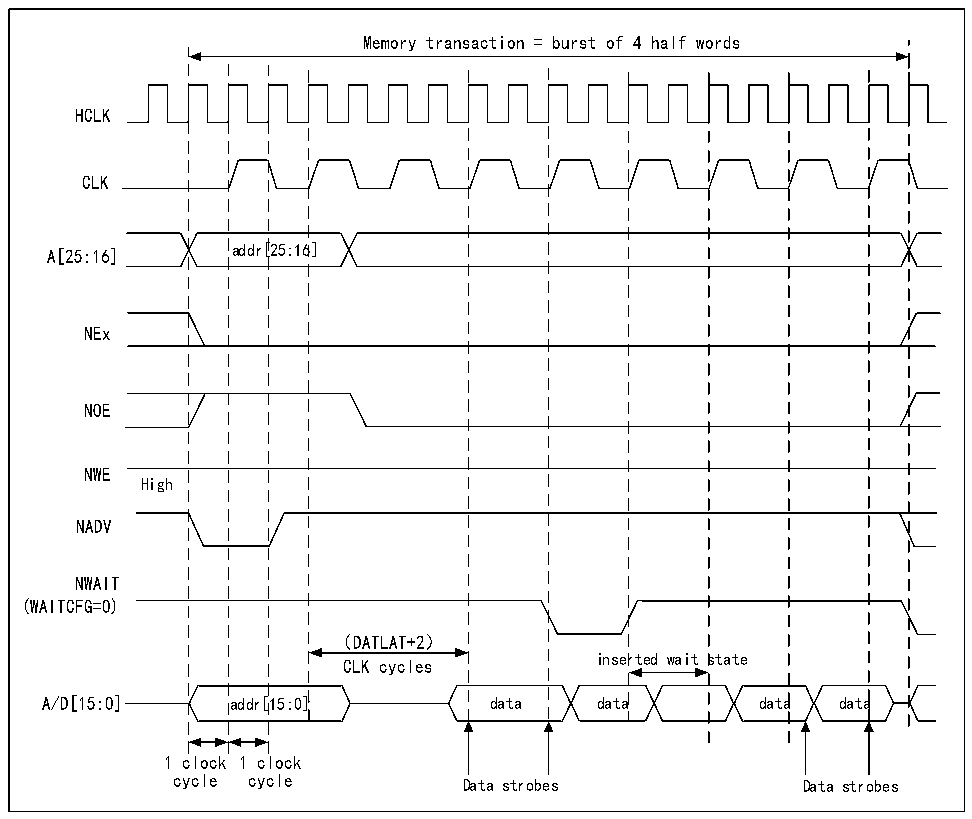

<!-- source-page: 746 -->

[← p.745](0745.md) · [index](../README.md) · [PDF p.746](https://ch32-riscv-ug.github.io/CH32H417/datasheet_zh/CH32H417RM.PDF#page=746) · [p.747 →](0747.md)

<!-- header: CH32H417系列应用手册 https://wch.cn -->

图40-19 同步复用读取模式波形-NOR、PSRAM（CRAM）  
 <!-- rendered from the PDF; verify at https://ch32-riscv-ug.github.io/CH32H417/datasheet_zh/CH32H417RM.PDF#page=746 -->

🖼 Text parsed from the figure above

Memory transaction = burst of 4 half words  
HCLK  
CLK  
A[25:16] addr[25:16]  
NEx  
NOE  
NWE  
High  
NADV  
NWAIT  
(WAITCFG=0)  
（DATLAT+2）  
inserted wait state  
CLK cycles  
A/D[15:0] addr[15:0] data data data data  
1 clock 1 clock  
cycle cycle Data strobes Data strobes  

注：字节通道输出NBL未显示，它们对于NOR访问保持高电平，对于PSRAM（CRAM）访问则保持低电  
平。  

<!-- p746-table-001 (table-40-33@1) pages 746-747 -->
<table><caption>表40-33 R32_FMC_BCRx位字段</caption><tr><th>位号</th><th>位名</th><th>要设置的值</th></tr><tr><td>31</td><td>FMC_EN</td><td>0x1</td></tr><tr><td>[30:26]</td><td>保留</td><td>0x00</td></tr><tr><td>[25:24]</td><td>BMP</td><td>0x0或0x1</td></tr><tr><td>[23:20]</td><td>保留</td><td>0x0</td></tr><tr><td>19</td><td>CBURSTRW</td><td>对同步读取没有影响</td></tr><tr><td>[18:16]</td><td>CPSIZE</td><td>0x0（对异步模式没有影响）</td></tr><tr><td>15</td><td>ASYNCWAIT</td><td>0x0</td></tr><tr><td>14</td><td>EXTMOD</td><td>0x0</td></tr><tr><td>13</td><td>WAITEN</td><td>在存储器支持该特性的情况下置位为1，否则保持为0</td></tr><tr><td>12</td><td>WREN</td><td>对同步读取没有影响</td></tr><tr><td>11</td><td>WAITCFG</td><td>是否置位视存储器情况而定</td></tr><tr><td>10</td><td>保留</td><td>0x0</td></tr><tr><td>9</td><td>WAITPOL</td><td>是否置位视存储器情况而定</td></tr><tr><td>8</td><td>BURSTEN</td><td>0x1</td></tr><tr><td>7</td><td>保留</td><td>0x1</td></tr><tr><td>6</td><td>FACCEN</td><td>在存储器支持的情况下置位（NOR Flash）</td></tr><tr><td>[5:4]</td><td>MWID</td><td>根据需要进行设置</td></tr><tr><td>[3:2]</td><td>MTYP</td><td>0x1或0x2</td></tr><tr><td>1</td><td>MUXEN</td><td>根据需要进行设置</td></tr><tr><td>0</td><td>MBKEN</td><td>0x1</td></tr></table>

<!-- image: p746-draw-image-00001 bbox=[504.72, 786.24, 525.24, 796.68] -->
<!-- footer: V1.7 742 -->
