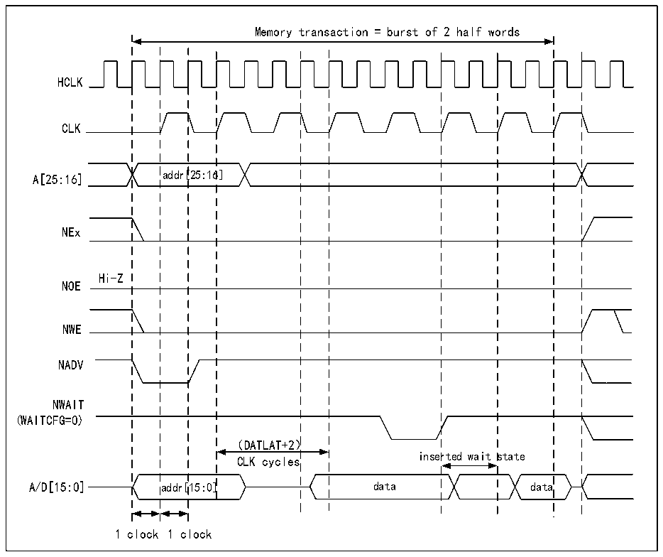

<!-- source-page: 747 -->

[← p.746](0746.md) · [index](../README.md) · [PDF p.747](https://ch32-riscv-ug.github.io/CH32H417/datasheet_zh/CH32H417RM.PDF#page=747) · [p.748 →](0748.md)

<!-- header: CH32H417系列应用手册 https://wch.cn -->

> ⬆ **Table continued** — rendered in full at [page 746](0746.md). <!-- p747-table-001 -->

<!-- p747-table-002 (table-40-34@1) -->
<table><caption>表40-34 R32_FMC_BTRx位字段</caption><tr><th>位号</th><th>位名</th><th>要设置的值</th></tr><tr><td>[31:30]</td><td>保留</td><td>0x0</td></tr><tr><td>[29:28]</td><td>ACCMOD</td><td>0x0</td></tr><tr><td>[27:24]</td><td>DATLAT</td><td>数据延迟</td></tr><tr><td>[23:20]</td><td>CLKDIV</td><td style="text-align:left">0x0，使CLK=HCLK（不支持） 0x1，使CLK=2*HCLK …</td></tr><tr><td>[19:16]</td><td>BUSTURN</td><td style="text-align:left">NEx变为高电平到NEx变为低电平之间的时间（BUSTURNHCLK）</td></tr><tr><td>[15:8]</td><td>DATAST</td><td>无关</td></tr><tr><td>[7:4]</td><td>ADDHLD</td><td>无关</td></tr><tr><td>[3:0]</td><td>ADDSET</td><td>无关</td></tr></table>

图40-20 同步复用写入模式波形-PSRAM（CRAM）  
 <!-- rendered from the PDF; verify at https://ch32-riscv-ug.github.io/CH32H417/datasheet_zh/CH32H417RM.PDF#page=747 -->

🖼 Text parsed from the figure above

Memory transaction = burst of 2 half words  
HCLK  
CLK  
A[25:16] addr[25:16]  
NEx  
Hi-Z  
NOE  
NWE  
NADV  
NWAIT  
(WAITCFG=0)  
（DATLAT+2）  
inserted wait state  
CLK cycles  
A/D[15:0] addr[15:0] data data  
1 clock 1 clock  

<!-- image: p747-draw-image-00001 bbox=[504.72, 786.24, 525.24, 796.68] -->
<!-- footer: V1.7 743 -->
