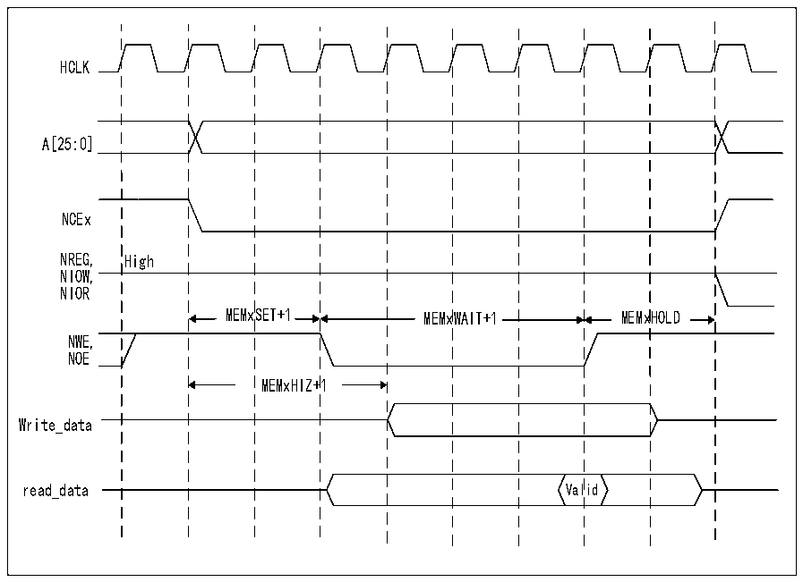

<!-- source-page: 759 -->

[← p.758](0758.md) · [index](../README.md) · [PDF p.759](https://ch32-riscv-ug.github.io/CH32H417/datasheet_zh/CH32H417RM.PDF#page=759) · [p.760 →](0760.md)

<!-- header: CH32H417系列应用手册 https://wch.cn -->

图40-21 NAND Flash控制器的通用存储器访问波形  
 <!-- rendered from the PDF; verify at https://ch32-riscv-ug.github.io/CH32H417/datasheet_zh/CH32H417RM.PDF#page=759 -->

🖼 Text parsed from the figure above

HCLK  
A[25:0]  
NCEx  
NREG, High  
NIOW,  
NIOR  
MEMxSET+1 MEMxWAIT+1 MEMxHOLD  
NWE,  
NOE  
MEMxHIZ+1  
Write_data  
Valid  
read_data Valid  

注：进行写访问期间NOE保持高电平（无效）。进行读访问期间NWE保持高电平（无效）。  
每个时序配置寄存器包含四个参数，其中三个参数用于定义NAND Flash的三个访问阶段的HCLK  
周期数，另一个参数用于定义进行写访问时开始驱动数据总线的时序。上图介绍了通用存储器访问的  
时序参数定义，特性存储器空间的访问时序与此类似。  

### 40.6.4 NAND Flash操作

NAND Flash设备的命令锁存使能（CLE）信号和地址锁存使能（ALE）信号由FMC控制器的地址信  
号驱动。这意味着要向 NAND Flash 发送命令或地址，CPU 必须对其存储器空间中的特定地址执行写  
操作。  
从NAND Flash设备进行的典型页读取操作需要执行以下步骤：  
1）根据NAND Flash的特性（PWID位指示NAND Flash数据总线宽度，PTYP=1，根据需要PWAITEN=0  
或1；有关时序配置，请参考第40.4.2节：NAND Flash地址映射），配置FMC_PCR和FMC_PMEM（对  
于某些设备，配置R32_FMC_PATT，请参考第40.6.5节：NAND Flash预等待功能）寄存器，进而配置  
和使能相应的存储区域。  
2）CPU向通用存储器空间执行字节写操作，此时数据字节等于一个Flash命令字节（例如Samsung  
NAND Flash设备的字节为0x00）。在写入选通期间（NWE上为低电平脉冲），NAND Flash的LE输入  
有效，因此将已写入的字节视为NAND Flash的一个命令。该命令由存储器设备锁存后，随后进行页  
读取操作时，不需要再次写入该命令。  
3）通过在通用存储器空间或特性空间写入STARTAD[7:0]、STARTAD[16:9]、STARTAD[24:17]以及  
STARTAD[25]（针对64Mb*8位的NAND Flash）这4个字节（对于容量较小的设备写入3个字节），  
CPU能够发送读操作的起始地址（STARTAD）。在写入选通期间（NWE上为低电平脉冲），NAND Flash  
设备的ALE输入有效，因此将已写入的字节视为读操作的起始地址。借助特性存储器空间，可使用FMC  
的另一种不同时序配置，实现某些NAND Flash所需的预等待功能（有关详细信息，请参考第40.6.5  
节：NAND Flash预等待功能）。  
4）控制器在对同一个或另一个存储区域进行新访问之前，等待NAND Flash准备好（R/NB信号处  
<!-- image: p759-draw-image-00001 bbox=[504.72, 786.24, 525.24, 796.68] -->
<!-- footer: V1.7 755 -->
