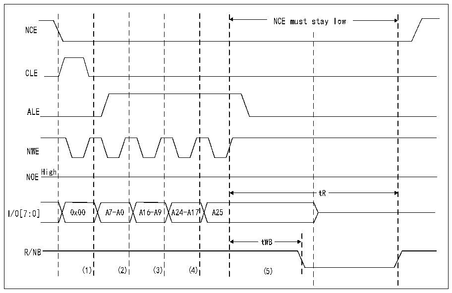

<!-- source-page: 760 -->

[← p.759](0759.md) · [index](../README.md) · [PDF p.760](https://ch32-riscv-ug.github.io/CH32H417/datasheet_zh/CH32H417RM.PDF#page=760) · [p.761 →](0761.md)

<!-- header: CH32H417系列应用手册 https://wch.cn -->
于高电平）。等待期间，控制器保持NCE信号有效（低电平）。  
5）然后CPU能够从通用存储器空间执行字节读操作，进而按字节读取NAND Flash页（数据字段  
+备用字段）。  
6）可读取下一个NAND Flash页，而无需任何CPU命令或地址写操作。可采用以下三种不同的方  
式实现：  
–执行步骤5中介绍的操作  
–通过重新开始步骤3中的操作随机访问一个新地址  
–通过重新开始步骤2向NAND Flash设备发送新命令  

### 40.6.5 NAND Flash预等待功能

一些NAND Flash设备需要在写入地址的最后一部分后，控制器等待R/NB信号变为低电平，如下  
图所示。  

图40-22 访问非“CE无关”NAND-Flash  
 <!-- rendered from the PDF; verify at https://ch32-riscv-ug.github.io/CH32H417/datasheet_zh/CH32H417RM.PDF#page=760 -->

🖼 Text parsed from the figure above

NCE must stay low  
NCE  
CLE  
ALE  
NWE  
High  
NOE  
tR  
I/0[7:0] 0x00 A7-A0 A16-A9 A24-A17 A25  
tWB  
R/NB  
(1) (2) (3) (4) (5)  

1）CPU在地址0x70010000处写入字节0x00。  
2）CPU在地址0x70020000处写入字节A7～A0。  
3）CPU在地址0x70020000处写入字节A16～A9。  
4）CPU在地址0x70020000处写入字节A24～A17。  
5）CPU在地址0x78020000处写入字节A25：FMC通过R32_FMC_PATT2时序定义执行写访问，其中  
ATTHOLD≥7（假设（7+1）*HCLK=112ns&gt;tWB最大值）。这可确保NCE保持低电平，直到R/NB再次变  
为低电平后变为高电平（只有NCE信号对之有作用的NAND Flash才需要此功能）。  
当需要此功能时，可通过编程MEMHOLD值确保满足tWB时序。然而CPU对NAND Flash进行的所  
有读或写访问均会经过（MEMHOLD+1）个HCLK周期的保持延迟（该延迟插入在NWE信号的上升沿与下  
一访问之间）。  
要克服该时序限制，可使用特性存储器空间，将其时序寄存器编程为满足 tWB 时序的 ATTHOLD 值  
并将 MEMHOLD 保持为其最小值。然后，CPU 必须使用通用存储器空间进行所有的 NAND Flash 读和写  
访问，向NAND Flash设备写入最后一个地址字节时除外，此时CPU必须对特性存储器空间执行写操  
作。  
<!-- image: p760-draw-image-00001 bbox=[504.72, 786.24, 525.24, 796.68] -->
<!-- footer: V1.7 756 -->
