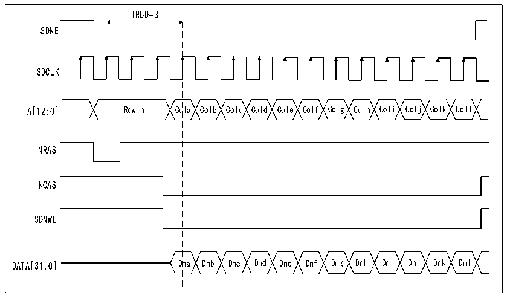

<!-- source-page: 767 -->

[← p.766](0766.md) · [index](../README.md) · [PDF p.767](https://ch32-riscv-ug.github.io/CH32H417/datasheet_zh/CH32H417RM.PDF#page=767) · [p.768 →](0768.md)

<!-- header: CH32H417系列应用手册 https://wch.cn -->
标存储区域位相应置1。  
8）编程 R32_FMC_SDRTR 寄存器中的刷新速率。刷新速率对应于刷新周期之间的延迟。其值必须  
与SDRAM设备相适应。  
在这一阶段，SDRAM设备已做好接受命令的准备。如果进行SDRAM访问期间发生系统复位，则数  
据总线仍可能由SDRAM设备驱动。因此，必须在复位后重新初始化SDRAM设备，NOR Flash/PSRAM/SRAM  
或NAND Flash控制器才能发送新的访问命令。  
注：如果有两个SDRAM设备连接到FMC，对命令模式寄存器同时访问这两个器件（加载模式寄存  
器命令）的情况，将按R32_FMC_SDTR1寄存器中为SDRAM存储区域1配置的时序参数（TMRD和TRAS  
时序）发出访问命令。  
SDRAM控制器写周期  
SDRAM控制器可接收单次的和突发的写请求，并将其视为单次存储器访问。在这两种情况下，SDRAM  
控制器都会跟踪各存储区域的有效行，以能够对不同的存储区域进行连续的写访问（多存储区域乒乓  
访问）。执行任何写访问前，必须将R32_FMC_SDCRx寄存器中的WP位清零，禁止SDRAM存储区域的  
写保护。  
SDRAM控制器始终会检查下一个访问：  
1）如果下一个访问发生在同一行或在其它有效行，则直接执行写操作。  
2）如果下一个访问指向一个无效行，则 SDRAM 控制器将生成预充电命令、激活该新行并初始化  
写命令。  

图40-23 突发写入SDRAM访问波形  
 <!-- rendered from the PDF; verify at https://ch32-riscv-ug.github.io/CH32H417/datasheet_zh/CH32H417RM.PDF#page=767 -->

🖼 Text parsed from the figure above

TRCD=3  
SDNE  
SDCLK  
A[12:0] Row n Cola Colb Colc Cold Cole Colf Colg Colh Coli Colj Colk Coll  
NRAS  
NCAS  
SDNWE  
DATA[31:0] Dna Dnb Dnc Dnd Dne Dnf Dng Dnh Dni Dnj Dnk Dnl  

SDRAM控制器读周期  
SDRAM控制器可接收单次的和突发的读请求，并将其视为单次存储器访问。在这两种情况下，SDRAM  
控制器都会跟踪各存储区域的有效行，以能够对不同的存储区域进行连续的读访问（多存储区域乒乓  
访问）。  
<!-- image: p767-draw-image-00001 bbox=[504.72, 786.24, 525.24, 796.68] -->
<!-- footer: V1.7 763 -->
