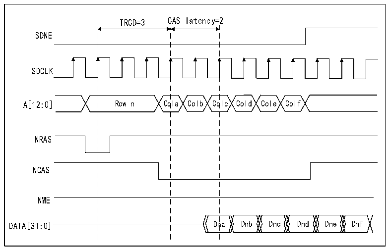

<!-- source-page: 768 -->

[← p.767](0767.md) · [index](../README.md) · [PDF p.768](https://ch32-riscv-ug.github.io/CH32H417/datasheet_zh/CH32H417RM.PDF#page=768) · [p.769 →](0769.md)

<!-- header: CH32H417系列应用手册 https://wch.cn -->

图40-24 突发读SDRAM访问  
 <!-- rendered from the PDF; verify at https://ch32-riscv-ug.github.io/CH32H417/datasheet_zh/CH32H417RM.PDF#page=768 -->

🖼 Text parsed from the figure above

TRCD=3 CAS latency=2  
SDNE  
SDCLK  
A[12:0] Row n Cola Colb Colc Cold Cole Colf  
NRAS  
NCAS  
NWE  
DATA[31:0] Dna Dnb Dnc Dnd Dne Dnf  

FMC SDRAM控制器具有可缓存的读FIFO（6行*32位），它用于根据以下公式在CAS延迟周期和  
RPIPE 延迟期间提前存储读取的数据。必须将 R32_FMC_SDCR1 寄存器中的 RBURST 位置 1 才能接受下  
一个读访问。预期的数据数量=CAS延迟+1+（RPIPE延迟）/2，示例：  
● CAS延迟=3，RPIPE延迟=0：四个数据（未提交）存储在FIFO中。  
● CAS延迟=3，RPIPE延迟=2：五个数据（未提交）存储在FIFO中。  
读FIFO的每行都具有14位地址标记用于标识自身内容：11位用于表示列地址，2位用于表示选  
择内部存储区域和有效行，1位用于选择SDRAM设备，在HB突发读取期间，如果提前到达行末尾，则  
提前读取的数据（未提交）不存储到读FIFO。对于单次读访问，数据将正确存储到读FIFO。  
每当出现读请求时，SDRAM控制器将检查：  
● 地址与地址标记之一是否匹配，如果找到匹配，则直接从FIFO读取数据并清空相应地址标记/行  
内容，同时压缩FIFO中的剩余数据以避免空行。  
● 否则，向存储器发送新的读命令并用新数据更新 FIFO。如果 FIFO 已满，则较早的数据将丢失。  
<!-- image: p768-draw-image-00001 bbox=[504.72, 786.24, 525.24, 796.68] -->
<!-- footer: V1.7 764 -->
