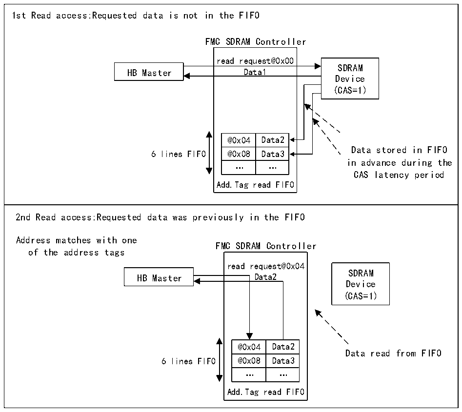

<!-- source-page: 769 -->

[← p.768](0768.md) · [index](../README.md) · [PDF p.769](https://ch32-riscv-ug.github.io/CH32H417/datasheet_zh/CH32H417RM.PDF#page=769) · [p.770 →](0770.md)

<!-- header: CH32H417系列应用手册 https://wch.cn -->

图40-25 RBURST位置1时的读访问逻辑图（CAS=1，RPIPE=0）  
 <!-- rendered from the PDF; verify at https://ch32-riscv-ug.github.io/CH32H417/datasheet_zh/CH32H417RM.PDF#page=769 -->

🖼 Text parsed from the figure above

1st Read access:Requested data is not in the FIFO FMC SDRAM Controller read request@0x00SDRAM HB Master Data1Device (CAS=1) @0x04 Data2 Data stored in FIFO 6 lines FIFO @0x08 Data3 in advance during the … … CAS latency period Add.Tag read FIFO  2nd Read access:Requested data was previously in the FIFO Address matches with one FMC SDRAM Controller of the address tags read request@0x04SDRAM HB Master Data2Device (CAS=1) @0x04 Data2 Data read from FIFO 6 lines FIFO @0x08 Data3 … … Add.Tag read FIFO  
read request@0x00  Data1  Data1 @0x04 Data2 @0x08 Data3 … … Add.Tag read FIFO  

<!-- p769-table-003 (table-40-43@1) -->
<table><tr><th>@0x04</th><th>Data2</th></tr><tr><td>@0x08</td><td>Data3</td></tr><tr><td>…</td><td>…</td></tr></table>

<!-- p769-table-004 (table-40-43@1) -->
<table><tr><th>@0x04</th><th>Data2</th></tr><tr><td>@0x08</td><td>Data3</td></tr><tr><td>…</td><td>…</td></tr></table>

读访问或预充电命令期间，读FIFO将刷新并做好填充新数据的准备。  
接到第一个读请求后，如果当前访问还未进行到行边界，则 SDRAM 控制器将在 CAS 延迟周期和  
RPIPE延迟（如果已配置）期间接受下一个读访问。这将通过递增存储器地址来实现。必须满足以下  
条件：  
● R32_FMC_SDCR1寄存器中的RBURST控制位必须置1  
地址管理取决于下一个HB请求：  
● 下一个HB请求是连续的（HB突发）  
这种情况下，SDRAM控制器将递增地址。  
● 下一个HB请求不连续  
- 若新的读请求指向与上一请求相同的行或另一个有效行，则新地址将传送给存储器，同时主
设备在CAS延迟周期停止工作，等待从存储器获取新数据。  
- 若新的读请求指向无效行，则 SDRAM 控制器生成预充电命令、激活该新行并初始化读命令。
如果RURST位置0，则不使用读FIFO。  
行和存储区域边界管理  
当读/写访问跨越了行边界时，如果下一个读/写访问是连续的并且当前访问已执行到行界，则  
SDRAM控制器将执行以下操作：  
1）对有效行进行预充电；  
<!-- image: p769-draw-image-00001 bbox=[504.72, 786.24, 525.24, 796.68] -->
<!-- footer: V1.7 765 -->
