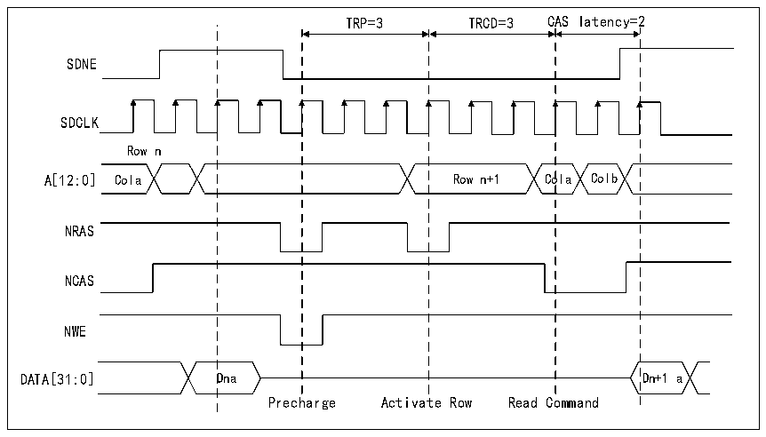
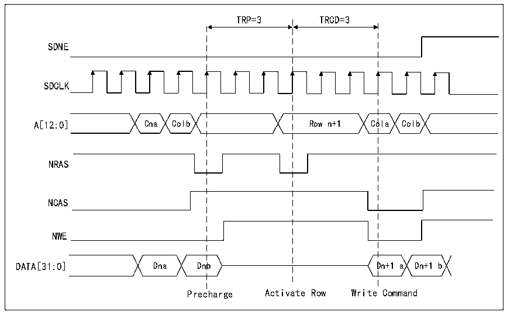

<!-- source-page: 770 -->

[← p.769](0769.md) · [index](../README.md) · [PDF p.770](https://ch32-riscv-ug.github.io/CH32H417/datasheet_zh/CH32H417RM.PDF#page=770) · [p.771 →](0771.md)

<!-- header: CH32H417系列应用手册 https://wch.cn -->
2）激活新行；  
3）启动读/写命令。  
对于各种列和数据总线宽度配置，都支持在行边界自动激活下一行。  
SDRAM控制器可根据需要在以下命令之间插入附加时钟周期：  
● 在预充电和激活命令之间插入以匹配 TRP 参数（仅当下一个访问指向同一存储区域中的其它行  
时）  
● 在激活和读命令之间插入以匹配TRCD参数。  
这些参数在FMC_SDTRx寄存器中定义。  
有关跨越行边界读取和突发写访问的信息，请参考下图。  

图40-26 跨行边界的读访问  
 <!-- rendered from the PDF; verify at https://ch32-riscv-ug.github.io/CH32H417/datasheet_zh/CH32H417RM.PDF#page=770 -->

🖼 Text parsed from the figure above

TRP=3 TRCD=3 CAS latency=2  
SDNE  
SDCLK  
Row n  
A[12:0] Cola Row n+1 Cola Colb  
NRAS  
NCAS  
NWE  
DATA[31:0] Dna Dn+1 a  
Precharge Activate Row Read Command  

图40-27 跨行边界的写访问  
 <!-- rendered from the PDF; verify at https://ch32-riscv-ug.github.io/CH32H417/datasheet_zh/CH32H417RM.PDF#page=770 -->

🖼 Text parsed from the figure above

TRP=3 TRCD=3  
SDNE  
SDCLK  
A[12:0] Cna Colb Row n+1 Cola Colb  
NRAS  
NCAS  
NWE  
DATA[31:0] Dna Dnb Dn+1 a Dn+1 b  
Precharge Activate Row Write Command  

如果下一个访问是连续的并且当前访问跨越了存储区域边界，则SDRAM控制器将激活下一个存储  
<!-- image: p770-draw-image-00001 bbox=[504.72, 786.24, 525.24, 796.68] -->
<!-- footer: V1.7 766 -->
