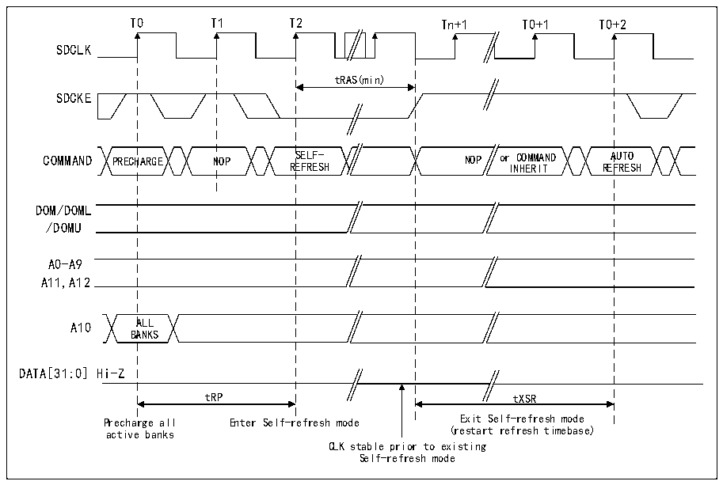
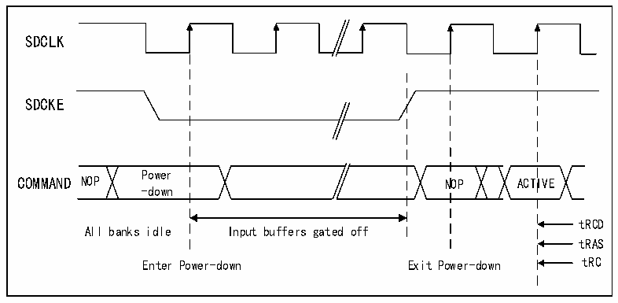

<!-- source-page: 772 -->

[← p.771](0771.md) · [index](../README.md) · [PDF p.772](https://ch32-riscv-ug.github.io/CH32H417/datasheet_zh/CH32H417RM.PDF#page=772) · [p.773 →](0773.md)

<!-- header: CH32H417系列应用手册 https://wch.cn -->
后，选定的设备将保持正常模式。  
要退出自刷新模式，必须将MODE位置为“000”（正常模式）并配置R32_FMC_SDCMR寄存器中的  
目标存储区域位（CTB1和/或CTB2）。  

图40-28 自刷新模式  
 <!-- rendered from the PDF; verify at https://ch32-riscv-ug.github.io/CH32H417/datasheet_zh/CH32H417RM.PDF#page=772 -->

🖼 Text parsed from the figure above

T0 T1 T2 Tn+1 T0+1 T0+2  
SDCLK  
tRAS(min)  
SDCKE  
COMMAND PRECHARGE NOP SELF- NOP or COMMAND AUTO  
REFRESH INHERIT REFRESH  
DOM/DOML  
/DOMU  
A0-A9  
A11,A12  
A10 ALL  
BANKS  
DATA[31:0] Hi-Z  
tRP tXSR  
Precharge all Enter Self-refresh mode Exit Self-refresh mode  
active banks (restart refresh timebase)  
CLK stable prior to existing  
Self-refresh mode  

掉电模式  
通过将MODE位置为“110”并配置R32_FMC_SDCMR寄存器中的目标存储区域位（CTB1和/或CTB2）  
来选择该模式。  

图40-29 掉电模式  
 <!-- rendered from the PDF; verify at https://ch32-riscv-ug.github.io/CH32H417/datasheet_zh/CH32H417RM.PDF#page=772 -->

🖼 Text parsed from the figure above

SDCLK  
SDCKE  
Power  
COMMAND NOP NOP ACTIVE  
-down  
tRCD  
All banks idle Input buffers gated off  
tRAS  
Enter Power-down Exit Power-down tRC  

如果写数据FIFO非空，则所有数据都将在掉电模式激活前发送到存储器。  
SDRAM 控制器会在有 SDRAM 设备被选定后立即退出掉电模式。存储器访问完成后，选定的 SDRAM  
设备将保持正常模式。  
在掉电模式期间，将禁用SDRAM设备的所有输入/输出缓冲区，只有保持低电平的SDCKE除外。  
SDRAM设备保持掉电模式的时间不会长于刷新周期，并且自身无法执行自刷新循环。因此，SDRAM  
<!-- image: p772-draw-image-00001 bbox=[504.72, 786.24, 525.24, 796.68] -->
<!-- footer: V1.7 768 -->
