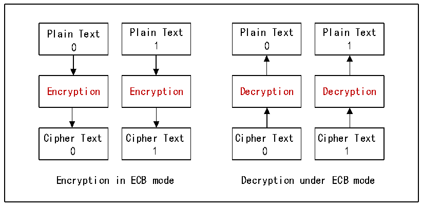

<!-- source-page: 780 -->

[← p.779](0779.md) · [index](../README.md) · [PDF p.780](https://ch32-riscv-ug.github.io/CH32H417/datasheet_zh/CH32H417RM.PDF#page=780) · [p.781 →](0781.md)

<!-- header: CH32H417系列应用手册 https://wch.cn -->

# 第 41 章 加密模块（ECDC）

系统内置了分组密码算法模块，支持 AES 和 SM4 两种分组密码算法以及电子密码本（ECB）和计  
数器（CTR）模式。模块以 128 位数据大小为基本单位完成一次加解密过程，提供了对内存中数据以  
DMA方式加解密以及SFR寄存器单次加解密模式。  

## 41.1 主要特征

● SM4算法128位密钥的ECB模式和CTR模式  
● AES算法128/192/256位密钥的ECB模式和CTR模式  
● 支持软件写SFR的方式直接加密单个128位数据  
● 支持DMA的方式（存储器到存储器）加解密软件指定长度的数据块  

## 41.2 AES/SM4 算法

AES（Advanced Encryption Standard）算法是一种区块加密法，采用对称分组密码体制，是对  
称密钥加密中最流行的算法之一。SM4分组密码算法一般是用于无线局域网和可信计算机的专用分组  
密码算法，同时也可用于其它环境下的数据加密保护。  
在数据加解密过程中，需要载入密钥。对于AES算法，根据设置密钥长度为128/192/256位，使  
用时，需分别将用户密钥扩展为11×128/13×128/15×128位的扩展密钥。而SM4算法，将128位的  
用户密钥扩展成为 32×32 位的扩展密钥。这些扩展密钥被保存在内部寄存器中，以方便在加解密时  
使用。  

## 41.3 ECB 与 CTR 模式

AES/SM4支持两种模式，电子密码本（ECB）模式和计数器（CTR）模式，其中CTR模式的安全性  
能要高于ECB模式。如图41-1和41-2所示的工作框图。  

图41-1 ECB模式加解密过程  
 <!-- rendered from the PDF; verify at https://ch32-riscv-ug.github.io/CH32H417/datasheet_zh/CH32H417RM.PDF#page=780 -->

🖼 Text parsed from the figure above

Plain Text Plain Text Plain Text Plain Text  
0 1 0 1  
Encryption Encryption Decryption Decryption  
Cipher Text Cipher Text Cipher Text Cipher Text  
0 1 0 1  
Encryption in ECB mode Decryption under ECB mode  

<!-- image: p780-draw-image-00001 bbox=[504.72, 786.24, 525.24, 796.68] -->
<!-- footer: V1.7 776 -->
