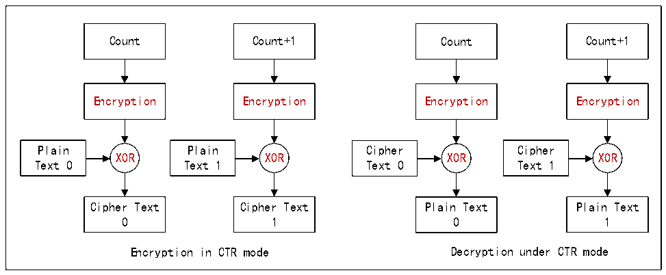

<!-- source-page: 781 -->

[← p.780](0780.md) · [index](../README.md) · [PDF p.781](https://ch32-riscv-ug.github.io/CH32H417/datasheet_zh/CH32H417RM.PDF#page=781) · [p.782 →](0782.md)

<!-- header: CH32H417系列应用手册 https://wch.cn -->

图41-2 CTR模式加解密过程  
 <!-- rendered from the PDF; verify at https://ch32-riscv-ug.github.io/CH32H417/datasheet_zh/CH32H417RM.PDF#page=781 -->

🖼 Text parsed from the figure above

Count Count+1 Count Count+1  
Encryption Encryption Encryption Encryption  
Plain Plain Cipher Cipher  
XOR XOR XOR XOR  
Text 0 Text 1 Text 0 Text 1  
Cipher Text Cipher Text Plain Text Plain Text  
0 1 0 1  
Encryption in CTR mode Decryption under CTR mode  

在ECB模式下，明文（plain text）与密文（cipher text）是一一对应的，加密之后的明文直  
接作为密文；而在CTR模式下，需要预先载入128位的计数值，将计数值加密，加密之后的计数值与  
明文异或作为密文。值得注意的是，CTR解密模式下，也是只对计数值进行加密，而非解密。  

## 41.4 模块应用

### 41.4.1 加解密模块初始化

● 时钟配置：设置R32_ECEC_CTRL寄存器的RB_ECDC_CLKDIV_MASK位，配置模块运行的时钟。如果  
不使用此模块可以将其设置为0，关闭模块降低功耗。  
● 数据大小端：设置R32_ECEC_CTRL寄存器的RB_ECDC_DAT_MOD位，可选择加解密数据的大小端存  
储方式。按128bits（16字节）一包大小端存储。  
● 密钥扩展：加解密过程中使用的不是用户密钥而是扩展密钥。当设置完用户密钥长度和内容后，  
需要通知硬件执行密钥扩展动作，当密钥扩展后会被保存到到模块内部寄存器。之后才可以正常进行  
数据加解密工作。设置 R32_ECEC_CTRL 寄存器 RB_ECDC_WRSRAM_EN、RB_ECDC_ALGRM_MOD、  
RB_ECDC_CIPHER_MOD、RB_ECDC_KLEN_MASK，使能SRAM数据加解密、选择加解密算法、分组密码模式、  
密钥长度；然后配置用户密钥寄存器组R32_ECDC_KEY，填入用户密钥内容。将R32_ECEC_CTRL寄存器  
的RB_ECDC_KEYEX_EN置1再清0后，硬件开始执行密钥扩展功能。  
● 计数器初值：如果使用CTR模式进行加解密，还需一个初始的计数器值。设置CTR模式计数值寄  
存器组R32_ECDC_IV填入128位计数器值，每次成功完成一次数据加解密（128bit数据）模块内部的  
计数器值将加1。ECB模式无需此计数器值。  

### 41.4.2 加解密配置

模块的加解密数据流包含存储器到存储器、单次 128bit 数据加解密两种方式，具体可以参考表  
41-1的配置。  

<!-- p781-table-001 (table-41-1@1) pages 781-782 -->
<table><caption>表41-1 不同数据流模式配置</caption><tr><th>加解密数据流</th><th>RB_ECDC_WRSRAM_EN</th><th>RB_ECDC_NORMAL_EN</th><th>RB_ECDC_MODE_SEL</th><th>其他</th></tr><tr><td>SRAM数据加密</td><td>1</td><td>1</td><td>0</td><td rowspan="2" style="text-align:left">需配置寄存器R32_ECDC_SRC_ADDR， R32_ECDC_DST_ADDR和R32_ECDC_SRAM_LEN</td></tr><tr><td>SRAM数据解密</td><td>1</td><td>1</td><td>1</td></tr><tr><td style="text-align:left">128bits数据单次加密</td><td>-</td><td>1</td><td>0</td><td rowspan="2" style="text-align:left">写 R32_ECDC_SGSD 寄存器，填入原始数据（明文或密文） 读 R32_ECDC_SGRT 寄存器，读出加解密后的结果数据。</td></tr><tr><td style="text-align:left">128bits数据单次解密</td><td>-</td><td>1</td><td>1</td></tr></table>

<!-- image: p781-draw-image-00001 bbox=[504.72, 786.24, 525.24, 796.68] -->
<!-- footer: V1.7 777 -->
