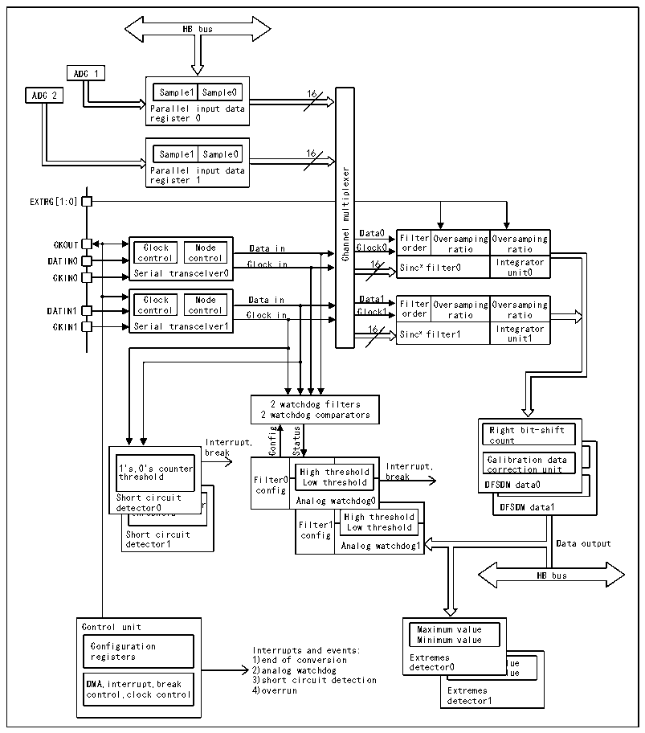

<!-- source-page: 787 -->

[← p.786](0786.md) · [index](../README.md) · [PDF p.787](https://ch32-riscv-ug.github.io/CH32H417/datasheet_zh/CH32H417RM.PDF#page=787) · [p.788 →](0788.md)

<!-- header: CH32H417系列应用手册 https://wch.cn -->

## 42.2 概述

图42-1 DFSDM的结构框图  
 <!-- rendered from the PDF; verify at https://ch32-riscv-ug.github.io/CH32H417/datasheet_zh/CH32H417RM.PDF#page=787 -->

🖼 Text parsed from the figure above

HB bus  
ADC 1  ADC 2  
Sample1  Sample0  
ADC 2 Sample1  
Sample0 16  
Parallel input data  
register 0  
Sample1  Sample0  
Parallel input data  
multiplexer  
register 1  
EXTRG[1:O]  
Channel  
Filter order  Oversamping O ratio I  Oversamping ratio Integrator  
CKOUT Clock Mode Clock0 order ratio ratio  
Data in  
DA C T K I I N N 0 0 S c e o r n i t a r l o l tran c s o c n e t l r v o e l r0 16 Sincx filter0 Int u e n g i r t a 0 tor  
Clock in  
Clock Mode control control Serial transcelver1  Clock in  
Filter Oversamping O order ratio I Sincx filter1  Oversamping ratio Integrator unit1  
2 watchdog filters  
2 watchdog comparators  
Right bit-shift count Right bit-shift  Ca co DFS  aliR cbi org uah ntt ti obni td-asthai ft orrection unit SDCMa ldiabtraa0tion data corretion unit  
Interrupt,gifnoCsutatS count  
break Right bit-shift  
1&#x27;s,0&#x27;s counter threshold SShhoorrtt cciirrccuuiitt ddeettee1 t cc&#x27; h ts rto, eor0 sr0&#x27; h0s o l c d ounte  1&#x27;s,0&#x27;s counter threshold  hhoorrtt cciirrccuuiitt eettee1 t cc&#x27; h ts rto, eor0 sr0&#x27; h0s o l c d ounte  
1 t &#x27; h s r , e 0 s &#x27; h s o l c d ounter Filter0 H L i o g w h t t h h r r e e s s h h o o l l d d I b n r t e e a r k rupt, D C c F a o S l r DC i r c Ma b e o l r c u di a t n ab t i t tr i o aa o n 0t n i u o d n n a i t t d a a ta  
Low threshold Analog watchdog0 High th  Analog wa  atchdog0 High th  Filter1 config  High threshold Low threshold  
Short circuit config  
HB bus  
Maximum value Minimum value Extremes detector0Maximum val Minimum val  Maximum value Minimum value  s r0Maximum val Minimum val  lue lue  
Control unit Maximum value  
Configuration Interrupts and events:  
registers 1 2 ) ) e a n n d a l o o f g c w o a n t v c e h r d s o i g on E d x e t t r e e c m t e o s r0M M a i x n i i m m u u m m v v a a l l u u e e  
DMA,interrupt,break 3)short circuit detection  
control,clock control 4)overrun Extremes  
detector1  

## 42.3 功能描述

### 42.3.1 DFSDM复位和时钟

DFSDM开关控制  
通过将R32_DFSDM_CH0CFGR1寄存器中的DFSDMEN位设置为1，实现DFSDM接口的全局使能。DFSDM  
接口全局使能后，所有配置的输入通道y（y=0/1）以及数字滤波器DFSDM_FLTx（x=0/1）将在其各自  
的使能位（R32_DFSDM_CHyCFGR1 中的通道使能位 CHEN 和 R32_DFSDM_FLTxCR1 中的 DFSDM_FLTx 使能  
位DFEN）置1时开始工作。  
数字滤波器 DFSDM_FLTx（x=0/1）通过将 R32_DFSDM_FLTxCR1 寄存器的 DFEN 置 1 来使能。使能  
DFSDM_FLTx（DFEN=1）后，Sincx数字滤波器单元和积分器单元会重新初始化。  
通过将 DFEN 清零，正在进行的所有转换都会立即停止，DFSDM_FLTx 会置于停止模式。除  
R32_DFSDM_FLTxAWSR和R32_DFSDM_FLTxISR（均被复位）外，所有寄存器设置保持不变。  
通过将 R32_DFSDM_CHyCFGR1 寄存器的 CHEN 置 1 使能通道 y（y=0/1）。通道使能后，会从外部  
ΣΔ调制器或并行内部数据源（ADC或存储器的CPU/DMA写操作）接收串行数据。  
<!-- image: p787-draw-image-00001 bbox=[504.72, 786.24, 525.24, 796.68] -->
<!-- footer: V1.7 783 -->
