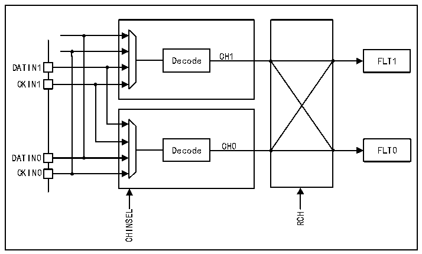

<!-- source-page: 789 -->

[← p.788](0788.md) · [index](../README.md) · [PDF p.789](https://ch32-riscv-ug.github.io/CH32H417/datasheet_zh/CH32H417RM.PDF#page=789) · [p.790 →](0790.md)

<!-- header: CH32H417系列应用手册 https://wch.cn -->

图42-2 输入通道引脚重定向  
 <!-- rendered from the PDF; verify at https://ch32-riscv-ug.github.io/CH32H417/datasheet_zh/CH32H417RM.PDF#page=789 -->

🖼 Text parsed from the figure above

CH1  
Decode FLT1  
DATIN1  
CKIN1  
CH0  
Decode FLT0  
DATIN0  
CKIN0  
CHINSEL RCH  

时钟信号输出  
可在 CKOUT 引脚上提供一个时钟信号，用于驱动外部 ΣΔ 调制器时钟输入。CKOUT 信号的频率  
通过预分频器（参考 R32_DFSDM_CH0CFGR1 寄存器 CKOUTDIV 位）从 DFSDM 时钟或音频时钟（参考  
R32_DFSDM_CH0CFGR1寄存器中的CKOUTSRC位）中获取。如果输出时钟停止，则CKOUT信号会被置于  
低电平状态（通过在R32_DFSDM_CHyCFGR1寄存器中设置CKOUTDIV=0或在R32_DFSDM_CH0CFGR1寄存  
器中设置DFSDMEN=0，可以停止输出时钟）。在以下时间执行输出时钟停止：  
● 当CKOUTSRC=0时，DFSDMEN清零后4个系统时钟周期  
● 当CKOUTSRC=1时，DFSDMEN清零后1个系统时钟周期和3个音频时钟周期  
在更改CKOUTSRC之前，软件必须等待CKOUT停止，以避免在CKOUT引脚上产生毛刺信号。输出  
时钟信号频率必须在0～20MHz范围内。  
SPI数据输入格式操作  
在 SPI 格式下，数据流通过数据和时钟信号以串行格式进行传输。数据信号始终由 DATINy 引脚  
提供。时钟信号可以通过 CKINy 引脚从外部提供，也可以通过取自 CKOUT 信号源的信号从内部提供。  
若选择外部时钟源（SPICKSEL[1:0]=0），则根据R32_DFSDM_CHyCFGR1寄存器中的SITP位设置，  
在（CKINy引脚）时钟的上升沿或下降沿采样（DATINy引脚）数据信号。  
内部时钟源——参见R32_DFSDM_CHyCFGR1寄存器中的SPICKSEL[1:0]：  
● CKOUT信号：  
- 用于连接外部ΣΔ调制器，调制器直接使用其时钟输入（来自CKOUT）来生成输出串行通信
时钟。  
- 采样点：上升沿/下降沿，具体取决于SITP设置。
● CKOUT/2信号（在CKOUT上升沿生成）：  
- 用于连接外部ΣΔ调制器，调制器将时钟输入（来自CKOUT）除以2，来生成输出串行通信
时钟（该输出时钟变化在各个时钟输入上升沿有效）。  
- 采样点：每第二个CKOUT下降沿。
● CKOUT/2信号（在CKOUT下降沿生成）：  
- 用于连接外部ΣΔ调制器，调制器将时钟输入（来自CKOUT）除以2，来生成输出串行通信
时钟（该输出时钟变化在各个时钟输入下降沿有效）。  
- 采样点：每第二个CKOUT上升沿。
注：只有在外部ΣΔ调制器将CKOUT信号用作时钟输入（以实现同步时钟和数据操作）时，才  
能使用内部时钟源。使用内部时钟源可省去CKINy引脚连接（CKINy引脚可用于其他用途）。如果采  
<!-- image: p789-draw-image-00001 bbox=[504.72, 786.24, 525.24, 796.68] -->
<!-- footer: V1.7 785 -->
