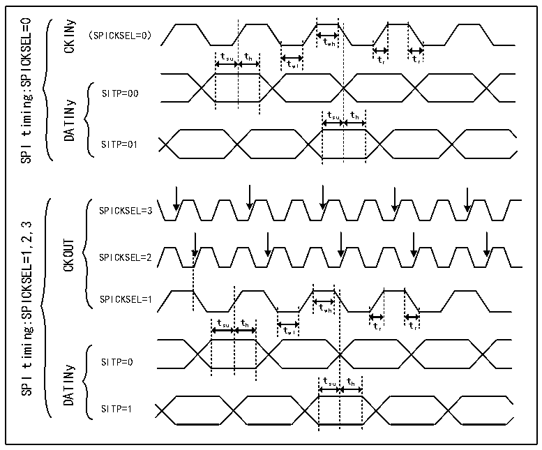

<!-- source-page: 790 -->

[← p.789](0789.md) · [index](../README.md) · [PDF p.790](https://ch32-riscv-ug.github.io/CH32H417/datasheet_zh/CH32H417RM.PDF#page=790) · [p.791 →](0791.md)

<!-- header: CH32H417系列应用手册 https://wch.cn -->
用SPI编码，时钟源信号频率必须在0～20MHz范围内，且小于fDFSDMCLK/4。  

图42-3 通道收发器时序图  
 <!-- rendered from the PDF; verify at https://ch32-riscv-ug.github.io/CH32H417/datasheet_zh/CH32H417RM.PDF#page=790 -->

🖼 Text parsed from the figure above

timing:SPICKSEL=0  
CKINy  
（SPICKSEL=0）  
twh  
t su t h t wl t r t r  
SITP=00  
DATINy  
tsu th  
SITP=01  
SPI  
SPICKSEL=3  
timing:SPICKSEL=1,2,3  
CKOUT  
SPICKSEL=2  
SPICKSEL=1  
twh  
t su t h t wl t r t r  
SITP=0  
DATINy  
SPI  
tsu th  
SITP=1  

时钟缺失检测  
该功能能够检测通道串行时钟输入的时钟缺失或存在情况，确保转换过程和错误报告的正常运作。  
通过R32_DFSDM_CHyCFGR1寄存器CKABEN位在各个输入通道y上使能或禁止时钟缺失检测。如果使能  
了给定通道的时钟缺失检测，则会对其连续执行时钟缺失检测。如果出现输入时钟错误，则时钟缺失  
标志会置1（CKABF[y]=1），并会调用中断（CKABIE=1时）。时钟缺失标志清零（R32_DFSDM_FLT0ICR  
寄存器的 CLRCKABF）后，会刷新时钟缺失标志。相应通道 y 禁止时，则时钟缺失状态位 CKABF[y]还  
会由硬件置1（如果CHEN[y]=0，则CKABF[y]保持在置1状态）。  
一旦发生时钟缺失事件，数据转换（和/或模拟看门狗和短路检测器）将提供错误数据。在报告  
时钟缺失时，用户应处理此事件并丢弃相关数据。  
时钟缺失功能仅在将系统时钟用于 CKOUT 信号（R32_DFSDM_CH0CFGR1 寄存器中的 CKOUTSRC=0）  
时可用。  
当收发器未同步时，时钟缺失标志将被置位，且无法通过 R32_DFSDM_FLT0ICR 寄存器中的  
CLRCKABF[y]位清零。与时钟缺失检测功能相关的软件操作序列应如下：  
● 通过设置CHEN=1启用指定通道  
● 尝试清零时钟缺失标志（通过设置CLRCKABF=1），直到时钟缺失标志实际清零（CKABF=0）。此  
时，收发器已同步（信号时钟有效），能够接收数据  
● 使能时钟缺失功能CKABEN=1且相关中断CKABIE=1，以检测SPI时钟是否丢失  
若使用 SPI 数据格式，时钟缺失检测将基于外部输入时钟与输出时钟生成的 CKOUT 信号进行比  
较。输入通道中的外部输入时钟信号必须每经过CKOUT信号（由R32_DFSDM_CH0CFGR1寄存器CKOUTDIV  
字段控制）的8个信号周期更改一次。  
<!-- image: p790-draw-image-00001 bbox=[504.72, 786.24, 525.24, 796.68] -->
<!-- footer: V1.7 786 -->
