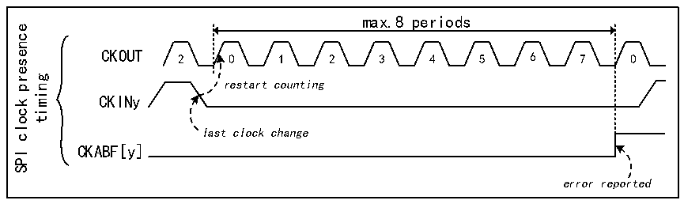

<!-- source-page: 791 -->

[← p.790](0790.md) · [index](../README.md) · [PDF p.791](https://ch32-riscv-ug.github.io/CH32H417/datasheet_zh/CH32H417RM.PDF#page=791) · [p.792 →](0792.md)

<!-- header: CH32H417系列应用手册 https://wch.cn -->

图42-4 SPI时钟缺失时序图  
 <!-- rendered from the PDF; verify at https://ch32-riscv-ug.github.io/CH32H417/datasheet_zh/CH32H417RM.PDF#page=791 -->

🖼 Text parsed from the figure above

max.8 periods  
presence  
CKOUT 2 0 1 2 3 4 5 6 7 0  
gnimit restart counting  
CKINy  
clock  
last clock change  
CKABF[y]  
SPI  
error reported  

如果出现输入时钟恢复错误，则时钟缺失标志会置1（CKABF[y]=1），并会调用中断（CKABIE=1  
时）。时钟缺失标志清零（通过R32_DFSDM_FLT0ICR寄存器的CLRCKABF）后，会刷新时钟缺失标志。  
外部串行时钟频率测量  
通过测量通道的串行时钟输入频率，可以实时获取来自外部 ΣΔ 调制器的数据速率，这对于应  
用目的至关重要。  
外部串行时钟输入频率可以通过在一个转换持续时间内对 DFSDM 时钟（fDFSDMCLK）进行计数的定时  
器来测量。计数在转换触发（常规或注入）后的第一个输入数据时钟处开始，并在转换结束（转换结  
束标志置 1）前的最后一个输入数据时钟处结束。转换完成（JEOCF=1 或 REOCF=1）时，会在寄存器  
R32_DFSDM_FLTxCNVTIMR的计数器CNVCNT[27:0]中更新每次转换的时间（第一个串行采样和最后一个  
串行采样之间的时间）。然后用户可以根据数字滤波器设置（FORD、FOSR、IOSR、FAST）计算数据速  
率。只有在滤波器被旁路（FOSR=0，只有积分器有效，R32_DFSDM_FLTxCNVTIMR寄存器CNVCNT[27:0]=0）  
时，才会停止外部串行频率测量。  
对于并行数据输入（参见第 42.3.4 节：并行数据输入），测量的频率代表了一次转换期间的平  
均输入数据速率。  
注：转换被中断（例如，通过禁止/使能所选通道）时，还会在CNVCNT[27:0]中对中断时间进行计数。  
因此，为得到正确的转换时间结果，建议不要中断转换。建议在连续快速模式下测量时钟。  
转换时间：  
FAST=0时的注入转换或常规转换（或者FAST=1时的首次转换）：  
对于Sincx滤波器（x=1..5）：  
t=CNVCNT/fDFSDMCLK=[FOSR*（2IOSR+FORD+1）+2]/fCKIN  
对于FastSinc滤波器：  
t=CNVCNT/fDFSDMCLK=[FOSR*（FOSR*（2IOSR+5）+2）]/fCKIN  
FAST=1时的常规转换（首次转换除外）：  
对于Sincx和FastSinc滤波器：  
t=CNVCNT/fDFSDMCLK=[FOSR*2IOSR]/fCKIN  
如果FOSR=FOSR[9:0]+1=1（滤波器旁路，仅积分器有效），则：  
t=2IOSR/fCKIN（...但是CNVCNT=0）  
其中：  
1) fCKIN 为（给定通道CKINy引脚上的）通道输入时钟频率或（并行数据输入时的）输入数据速率；  
2) FOSR 为滤波器过采样率：FOSR=FOSR[9:0]+1（参考R32_DFSDM_FLTxFCR寄存器）；  
3) 2IOSR为积分器过采样率（参考R32_DFSDM_FLTxFCR寄存器）；  
4) FORD 为滤波器阶数：FORD=FORD[2:0]（参考R32_DFSDM_FLTxFCR寄存器）。  
通道偏移设置  
每个通道都有自身的偏移设置（在寄存器中），该偏移值最终会从给定通道的各个转换结果（注  
<!-- image: p791-draw-image-00001 bbox=[504.72, 786.24, 525.24, 796.68] -->
<!-- footer: V1.7 787 -->
