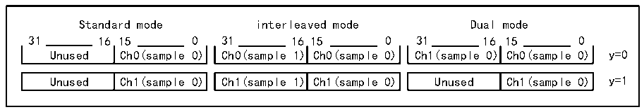

<!-- source-page: 793 -->

[← p.792](0792.md) · [index](../README.md) · [PDF p.793](https://ch32-riscv-ug.github.io/CH32H417/datasheet_zh/CH32H417RM.PDF#page=793) · [p.794 →](0794.md)

<!-- header: CH32H417系列应用手册 https://wch.cn -->
ADC2）。与ADC2相关的通道1将处于空闲状态。  
来自存储器的输入（直接由CPU/DMA写入）  
当CPU或DMA（DATMPX[1:0]=2）直接将数据写入R32_DFSDM_CHyDATINR寄存器时，这些数据可以  
作为输入，用于处理来自存储器或外设的数字数据流。  
数据可由CPU或DMA写入到R32_DFSDM_CHyDATINR寄存器中：  
1）CPU数据写入：  
输入数据直接由CPU写入到R32_DFSDM_CHyDATINR寄存器中。  
2）DMA数据写入：  
DMA 应配置为存储器到存储器传输模式，以将存储器缓冲区中的数据传输至  
R32_DFSDM_CHyDATINR寄存器中。目标存储器地址为R32_DFSDM_CHyDATINR寄存器的地址。数据以DMA  
传输速度从存储器传输至DFSDM并行输入。  
此DMA不同于读取DFSDM转换结果所使用的DMA。这两个DMA可同时使用，第一个DMA（配置为  
存储器到存储器传输）用于输入数据写入，第二个DMA（配置为外设到存储器传输）用于数据结果读  
取。  
对R32_DFSDM_CHyDATINR的访问可为16位或32位宽，允许分别在一次写操作中加载一个或两个  
采样。32位输入数据寄存器（R32_DFSDM_CHyDATINR）可用一个或两个16位数据采样进行填充，具体  
取决于在R32_DFSDM_CHyCFGR1寄存器的DATPACK[1:0]字段中定义的数据封装操作模式：  
1）标准模式（DATPACK[1:0]=00b）：  
只有一个样本存储在 R32_DFSDM_CHyDATINR 寄存器的 INDAT0[15:0]字段中，其用作通道 y 的输  
入数据。高 16 位（INDAT1[15:0]）被忽略，且被写保护。数字滤波器必须执行一次输入采样（通过  
INDAT0[15:0]），以便清空由CPU/DMA填充后的数据寄存器。该模式与对R32_DFSDM_CHyDATINR寄存  
器的16位CPU/DMA访问结合使用，以在每次写操作时加载一个采样。  
2）交错模式（DATPACK[1:0]=01b）：  
R32_DFSDM_CHyDATINR寄存器被用作两个采样缓冲区。第一个采样存储在INDAT0[15:0]中，第二  
个采样存储在 INDAT1[15:0]中。数字滤波器必须通过通道 y 执行两次输入采样，以清  
R32_DFSDM_CHyDATINR 寄存器。该模式与对 R32_DFSDM_CHyDATINR 寄存器的 32 位 CPU/DMA 访问结合  
使用，以在每次写操作时加载两个采样。  
3）双通道模式（DATPACK[1:0]=10b）：  
将两个采样写入到 R32_DFSDM_CHyDATINR 寄存器中。INDAT0[15:0]中的数据用于通道 y，  
INDAT1[15:0]中的数据用于通道y+1。INDAT1[15:0]中的数据会被自动复制到下一（y+1）通道数据寄  
存器 DFSDM_CH[y+1]DATINR）的 INDAT0[15:0]中。数字滤波器必须执行两次采样（一次来自通道 y，  
另一次来自通道（y+1）），以清空R32_DFSDM_CHyDATINR寄存器。  
只能针对偶数通道数（y=0）进行双通道模式设置（DATPACK[1:0]=10b）。如果将奇数通道（y=1）  
设为双通道模式，则对于该通道，INDAT0[15:0]INDAT1[15:0]部分均被写保护。如果偶数通道被设为  
双通道模式，则下一奇数通道必须设置成标准模式（DATPACK[1:0]=00b），以便与偶数通道正确配合。  
有关R32_DFSDM_CHyDATINR寄存器数据模式和通道数据样本分配，请参考下图。  

图42-5 R32_DFSDM_CHyDATINR寄存器操作模式和分配  
 <!-- rendered from the PDF; verify at https://ch32-riscv-ug.github.io/CH32H417/datasheet_zh/CH32H417RM.PDF#page=793 -->

🖼 Text parsed from the figure above

Standard mode interleaved mode Dual mode  
31 16 15 0 31 16 15 0 31 16 15 0  
Unused Ch0(sample 0) Ch0(sample 1) Ch0(sample 0) Ch1(sample 0) Ch0(sample 0) y=0  
Unused  Ch1(sample 0)  
Ch1(sample 1)  Ch1(sample 0)  
Unused  Ch1(sample 0)  

首先使能所选输入通道（通道 y），以便进行数据采集（启动通道 y 转换），然后必须向  
R32_DFSDM_CHyDATINR寄存器进行写操作，以加载一个或两个采样。否则，在下次处理时会丢失写入  
的数据。  
<!-- image: p793-draw-image-00001 bbox=[504.72, 786.24, 525.24, 796.68] -->
<!-- footer: V1.7 789 -->
