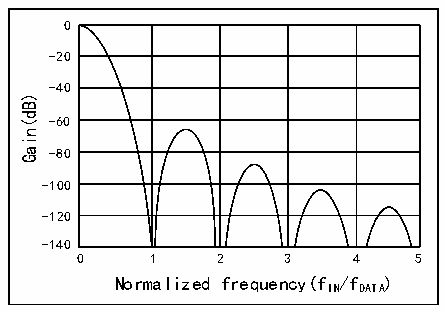

<!-- source-page: 795 -->

[← p.794](0794.md) · [index](../README.md) · [PDF p.795](https://ch32-riscv-ug.github.io/CH32H417/datasheet_zh/CH32H417RM.PDF#page=795) · [p.796 →](0796.md)

<!-- header: CH32H417系列应用手册 https://wch.cn -->

图42-6 示例：Sinc3滤波器响应  
 <!-- rendered from the PDF; verify at https://ch32-riscv-ug.github.io/CH32H417/datasheet_zh/CH32H417RM.PDF#page=795 -->

🖼 Text parsed from the figure above

0  
-20  
-40  
Gain(dB)  
-60  
-80  
-100  
-120  
-140  
0 1 2 3 4 5  
Normalized frequency(fIN/fDATA)  

<!-- p795-table-002 (table-42-1@1) -->
<table><caption>表42-1 滤波器最大输出分辨率（来自滤波器输出的峰值数据值），基于某些FOSR值</caption><tr><th>FOSR</th><th>Sinc1</th><th>Sinc2</th><th>FastSinc</th><th>Sinc3</th><th>Sinc4</th><th>Sinc5</th></tr><tr><td>x</td><td>+/-x</td><td>+/-x2</td><td>+/-2x2</td><td>+/-x3</td><td>+/-x4</td><td>+/-x5</td></tr><tr><td>4</td><td>+/-4</td><td>+/-16</td><td>+/-32</td><td>+/-64</td><td>+/-256</td><td>+/-1024</td></tr><tr><td>8</td><td>+/-8</td><td>+/-64</td><td>+/-128</td><td>+/-512</td><td>+/-4096</td><td>-</td></tr><tr><td>32</td><td>+/-32</td><td>+/-1024</td><td>+/-2048</td><td>+/-32768</td><td>+/-1048576</td><td>+/-33554432</td></tr><tr><td>64</td><td>+/-64</td><td>+/-4096</td><td>+/-8192</td><td>+/-262144</td><td>+/-16777216</td><td>+/-1073741824</td></tr><tr><td>128</td><td>+/-128</td><td>+/-16384</td><td>+/-32768</td><td>+/-2097152</td><td>+/268435456</td><td></td></tr><tr><td>256</td><td>+/-256</td><td>+/-65536</td><td>+/-131072</td><td>+/16777216</td><td rowspan="2" colspan="2" style="text-align:left">在满量程输入的条件下，结果会溢出（&gt;32位有符号整数值）</td></tr><tr><td>1024</td><td>+/-1024</td><td>+/-1048576</td><td>+/-2097152</td><td>+/1073741824</td></tr></table>

### 42.3.7 积分器单元

积分器会对来自数字滤波器的数据进一步提升抽取率和分辨率。对于来自滤波器的给定数量的数  
据采样，积分器对其进行简单的求和。  
积分器过采样率参数定义了将多少个数据的和作为积分器的一个数据输出。IOSR 可设置为介于  
1～256范围内（参考R32_DFSDM_FLTxFCR寄存器中的IOSR[3:0]位说明）。  

<!-- p795-table-003 (table-42-2@1) -->
<table><caption>表42-2 积分器最大输出分辨率（来自积分器输出的峰值数据值），基于某些IOSR值，FOSR=256以及Sinc3滤波器类型（最大数据）</caption><tr><th>IOSR</th><th>Sinc1</th><th>Sinc2</th><th>FastSinc</th><th>Sinc3</th><th>Sinc4</th><th>Sinc5</th></tr><tr><td>x</td><td>+/-FOSR.x</td><td>+/-FOSR2.x</td><td>+/-2FOSR2.x</td><td>+/-FOSR3.x</td><td>+/-FOSR4.x</td><td>+/-FOSR5.x</td></tr><tr><td>4</td><td>-</td><td>-</td><td>-</td><td>+/-67108864</td><td>-</td><td>-</td></tr><tr><td>32</td><td>-</td><td>-</td><td>-</td><td>+/-536870912</td><td>-</td><td>-</td></tr><tr><td>128</td><td>-</td><td>-</td><td>-</td><td>+/-2147483648</td><td>-</td><td>-</td></tr><tr><td>256</td><td>-</td><td>-</td><td>-</td><td>+/-232</td><td>-</td><td>-</td></tr></table>

### 42.3.8 模拟看门狗

模拟看门狗用于在达到或超出给定阈值上限或者达到或低于给定阈值下限时，触发外部信号（断  
路或中断）。随即可调用中断/事件/断路生成。  
每个模拟看门狗都会根据（R32_DFSDM_FLTxCR1寄存器中）AWFSEL位设置监视串行数据接收器输  
出（在每个通道上模拟看门狗滤波器之后）或数据输出寄存器（当前注入或常规转换结果）。是否需  
要通过模拟看门狗x监视的输入通道可以通过R32_DFSDM_FLTxCR2寄存器中的AWDCH[1:0]选择。  
输入通道上的模拟看门狗转换与标准转换无关。在标准转换模式下，模拟看门狗在每个输入通道  
上使用自己的滤波器和信号处理，与注入或常规主转换无关。在连续转换模式下，对所选输入通道执  
行模拟看门狗转换，以便在注入或常规主转换暂停（RCIP=0，JCIP=0）时也仍能对通道进行监视。  
<!-- image: p795-draw-image-00001 bbox=[504.72, 786.24, 525.24, 796.68] -->
<!-- footer: V1.7 791 -->
