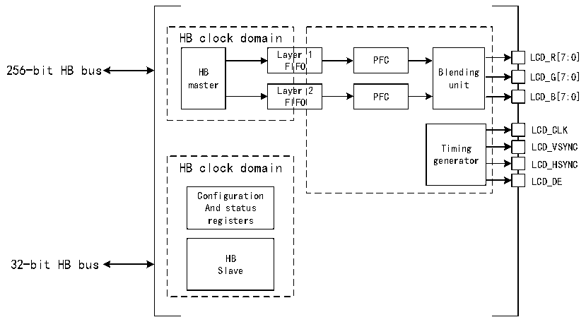

<!-- source-page: 824 -->

[← p.823](0823.md) · [index](../README.md) · [PDF p.824](https://ch32-riscv-ug.github.io/CH32H417/datasheet_zh/CH32H417RM.PDF#page=824) · [p.825 →](0825.md)

<!-- header: CH32H417系列应用手册 https://wch.cn -->

# 第 43 章 LCD-TFT 显示控制器（LTDC）

LCD-TFT（薄膜晶体管-液晶屏显示器）显示控制器（LTDC）主要提供并行数字RGB以及水平同步、  
垂直同步、像素时钟和数据使能的信号，可作为输出信号到不同LCD和TFT面板接口。  

## 43.1 主要特征

● 提供2个显示层，包含了专有的8*256位FIFO  
● 支持查色表（CLUT），每个图层高达256种颜色  
● 支持可编程不同显示面板的时序  
● 支持可编程背景色  
● 支持可编程HSYNC，VSYNC和数据使能信号的极性  
● 每个显示层可选择高达8个输入颜色的格式  
● 支持使用alpha值（每像素或常数）的两层之间进行灵活的混合  
● 支持色键（透明颜色）  
● 支持可编程窗口位置和大小  
● 支持薄膜晶体管（TFT）彩色显示器  
● 支持高达3个可编程中断时间  

## 43.2 概述

图43-1 LTDC结构框图  
 <!-- rendered from the PDF; verify at https://ch32-riscv-ug.github.io/CH32H417/datasheet_zh/CH32H417RM.PDF#page=824 -->

🖼 Text parsed from the figure above

HB clock domain  
Layer 1 PFC LCD_R[7:0]  
Laye FI  er IFO  1  Laye FI  er IFO  2  
256-bit HB bus HB FIFO Blending  
LCD_G[7:0]  
master unit  
PFC LCD_B[7:0]  
LCD_CLK  
Timing LCD_VSYNC  
HB clock domain generator LCD_HSYNC  
LCD_DE  
Configuration  
And status  
registers  
32-bit HB bus HB  
Slave  

（1）PFC:pixel format converter,performing the pixel format conversion from the selected input pixel format of a layer to words.  
（2）Itdc_ker_ck:pixel clock.  

## 43.3 功能描述

### 43.3.1 LTDC 同步时序

LTDC接口是一个同步数据接口，包括像素时钟，像素数据以及水平和垂直同步信号。图43-2  
展示了LTDC同步时序发生器模块生成的可配置时序参数。  
<!-- image: p824-draw-image-00001 bbox=[504.72, 786.24, 525.24, 796.68] -->
<!-- footer: V1.7 820 -->
