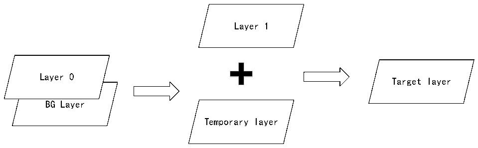

<!-- source-page: 827 -->

[← p.826](0826.md) · [index](../README.md) · [PDF p.827](https://ch32-riscv-ug.github.io/CH32H417/datasheet_zh/CH32H417RM.PDF#page=827) · [p.828 →](0828.md)

<!-- header: CH32H417系列应用手册 https://wch.cn -->
像素值将被R32_LTDC_LxDCCR寄存器定义的像素值替代。  
混合顺序固定，即由下至上。混合单元首先混合层0和背景层得到一个临时层，然后混合层1和  
临时层，得到目的层。背景层的 ARGB 值在 R32_LTDC_BCCR 寄存器定义。如果某层被禁止，混合功能  
使用该层的默认颜色。若要层禁止时不显示默认颜色，需将R32_LTDC_LxBFCR寄存器中此层的混合系  
数设置为其复位值。混合过程如图43-3所示。  

图43-3 混合过程框图  
 <!-- rendered from the PDF; verify at https://ch32-riscv-ug.github.io/CH32H417/datasheet_zh/CH32H417RM.PDF#page=827 -->

🖼 Text parsed from the figure above

Layer 1  
Layer 0  
Target layer  
BG Layer  
Temporary layer  

通用混合公式：BC = BF1 * C + BF2 * CS；  
BC为混合的颜色；BF1为混合因子1；C为当前层颜色；BF2为混合因子2；CS下一级层混合的颜  
色。  
其中，当前像素的混合因子有两种取值，由寄存器配置。一种是像素Alpha乘以常数Alpha，另  
一种是常数Alpha。  
注：常数Alpha值是在寄存器中编程的值，由硬件实现255等分。  
例如：仅使能第一层，BF1配置为常数Alpha，BF2配置为1-常数Alpha  
常数Alpha：在LxCACR寄存器中编程的常数Alpha为240（0xF0）。  
因此，常数Alpha值为240/255=0.94  
C：当前层红色通道为0x80  
Cs：背景红色通道为0x30  
第一层与背景色混合。  
红色通道最终结果 = 常数Alpha * C + （1-常数Alpha） * Cs  
= 0.94 * 0x80 + （1 - 0.94） * 0x30 =0x7B。  
绿色和蓝色通道同理。  

### 43.3.6 色键

色键（RGB）可配置为代表透明像素。运行时，可配置色键值并用其替换像素RGB值。  
使能色键后，当前像素（格式转换后、CLUT分别混合前的像素）将与色键进行比较。如果当前像  
素与编程的RGB值相匹配，则该像素的所有通道（ARGB）均设置为0。  
色键通过LTDC_LxCKCR寄存器配置。编程值取决于像素格式，因为它会在像素格式转换为ARGB888  
后与当前像素进行比较。  
例如，将中黄色（50%红 + 50%绿）用作透明色键，则：  
- 在RGB565中，中黄色为0x8400。将LTDC_LxCKCR设为0x848200。
- 在ARGB8888中，中黄色为0x808000，将LTDC_LxCKCR设为0x808000。
- 在所有基于CLUT的颜色模式（L8、AL88、AL44）下，将其中一个调色板条目设为中黄色0x808000，
将LTDC_LxCKCR设为0x808000。  

### 43.3.7 重载影子寄存器

<!-- image: p827-draw-image-00001 bbox=[504.72, 786.24, 525.24, 796.68] -->
<!-- footer: V1.7 823 -->
