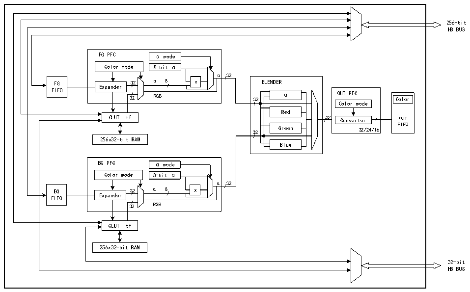

<!-- source-page: 841 -->

[← p.840](0840.md) · [index](../README.md) · [PDF p.841](https://ch32-riscv-ug.github.io/CH32H417/datasheet_zh/CH32H417RM.PDF#page=841) · [p.842 →](0842.md)

<!-- header: CH32H417系列应用手册 https://wch.cn -->

图44-1 GPHA结构框图  
 <!-- rendered from the PDF; verify at https://ch32-riscv-ug.github.io/CH32H417/datasheet_zh/CH32H417RM.PDF#page=841 -->

🖼 Text parsed from the figure above

256-bit  
HB BUS  
FG PFC α mode Color mode 8-bit α α 32 α 8 x Expander 32 RGB  Expander  
mode  8-bit α  
α 32  
FIFO  
α  Red  Green Blue  
Color  OUTFIFO  
Color mode  
FIFO  
32 Green 32/24/16  
256x32-bit RAM  
BG PFC α mode Color mode 8-bit α α 32 α 8 x Expander 32 RGB  Expander  
α 32  
FIFO  
CLUT itf  
256x32-bit RAM  
32-bit  
HB BUS  

GPHA 控制器执行直接存储器传输，它作为一个 HB 主设备可以控制 HB 总线矩阵来启动 HB 事务。  
HB从设备端口用于编程GPHA控制器。  
GPHA支持以下3种模式下工作：  
- 寄存器到存储器；
- 存储器到存储器并执行像素格式转换；
- 存储器到存储器并执行像素格式转换和混合。
GPHA功能包括以下操作：  
- 支持对目标图像的指定部分或全部区域填充特定颜色；
- 支持源图像的部分或全部内容复制到目标图像对应的部分或全部中；
- 支持源图像的部分或全部内容至目标图像的部分或全部内容的像素格式转换复制；
- 支持将像素格式不同的两个源图像部分和/或全部混合，再将结果复制到颜色格式不同的部分
或整个目标图像中。  

### 44.2.2 GPHA 控制

通过R32_GPHA_CTLR寄存器可配置GPHA控制器，可以执行以下操作：  
1） 选择GPHA工作模式；  
2） 使能/禁止GPHA中断；  
3） 启动/挂起/中止进行中的数据传输。  

### 44.2.3 GPHA 前景层FIFO和背景层FIFO

GPHA前景层（FG）FIFO和背景层（BG）FIFO的协同工作是GPHA高效图像处理的关键，它们获取  
待复制以及待处理的输入数据，这些FIFO会根据相应像素格式转换器（PFC）中预设的颜色格式获取  
像素。可通过以下寄存器对它们进行编程：  
- GPHA前景层存储器地址寄存器（R32_GPHA_FGMAR）
- GPHA前景层偏移寄存器（R32_GPHA_FGOR）
- GPHA背景层存储器地址寄存器（R32_GPHA_BGMAR）
<!-- image: p841-draw-image-00001 bbox=[504.72, 786.24, 525.24, 796.68] -->
<!-- footer: V1.7 837 -->
