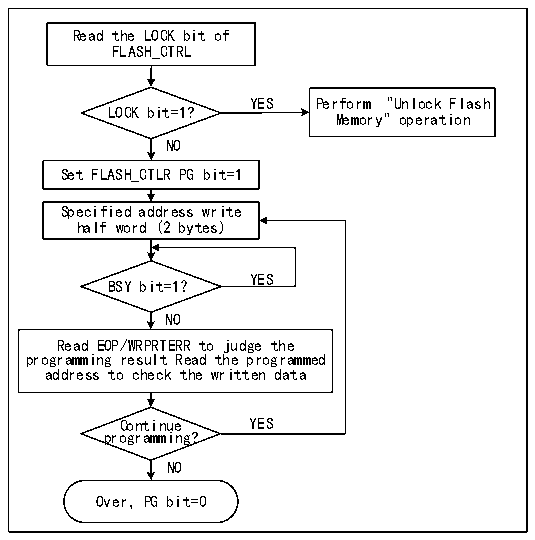
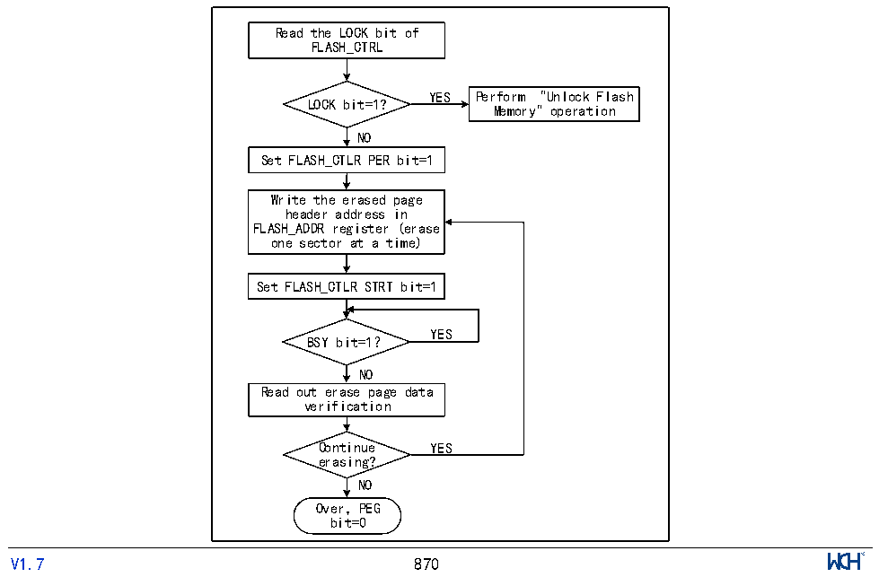

<!-- source-page: 874 -->

[← p.873](0873.md) · [index](../README.md) · [PDF p.874](https://ch32-riscv-ug.github.io/CH32H417/datasheet_zh/CH32H417RM.PDF#page=874) · [p.875 →](0875.md)

<!-- header: CH32H417系列应用手册 https://wch.cn -->

图46-1 FLASH编程  
 <!-- rendered from the PDF; verify at https://ch32-riscv-ug.github.io/CH32H417/datasheet_zh/CH32H417RM.PDF#page=874 -->

🖼 Text parsed from the figure above

Read the LOCK bit of  
FLASH_CTRL  
YES Perform &quot;Unlock Flash  
LOCK bit=1?  
Memory&quot; operation  
NO  
Set FLASH_CTLR PG bit=1  
Specified address write  
half word (2 bytes)  
YES  
BSY bit=1？  
NO  
Read EOP/WRPRTERR to judge the  
programming result Read the programmed  
address to check the written data  
Continue YES  
programming?  
NO  
Over，PG bit=0  

1）检查R32_FLASH_CTLR寄存器LOCK，如果为1，需要执行“解除闪存锁”操作。  
2）设置R32_FLASH_CTLR寄存器的PG位为‘1’，开启标准编程模式。  
3）向指定闪存地址（偶地址）写入要编程的半字。  
4）等待BSY位变为‘0’或R32_FLASH_STATR寄存器的EOP位为‘1’表示编程结束，将EOP位清0。  
5）查询R32_FLASH_STATR寄存器看是否有错误，或者读编程地址数据校验。  
6）继续编程可以重复3-5步骤，结束编程将PG位清0。  

### 46.5.4 主存储器标准擦除

闪存按扇区擦除。  

图46-2 FLASH页擦除  
 <!-- rendered from the PDF; verify at https://ch32-riscv-ug.github.io/CH32H417/datasheet_zh/CH32H417RM.PDF#page=874 -->

🖼 Text parsed from the figure above

Read the LOCK bit of  
FLASH_CTRL  
YES Perform &quot;Unlock Flash  
LOCK bit=1?  
Memory&quot; operation  
NO  
Set FLASH_CTLR PER bit=1  
Write the erased page  
header address in  
FLASH_ADDR register (erase  
one sector at a time)  
Set FLASH_CTLR STRT bit=1  
YES  
BSY bit=1？  
NO  
Read out erase page data  
verification  
Continue YES  
erasing?  
NO  
Over，PEG  
bit=0  
<!-- image: p874-draw-image-00001 inside the figure -->
<!-- footer: V1.7 870 -->

