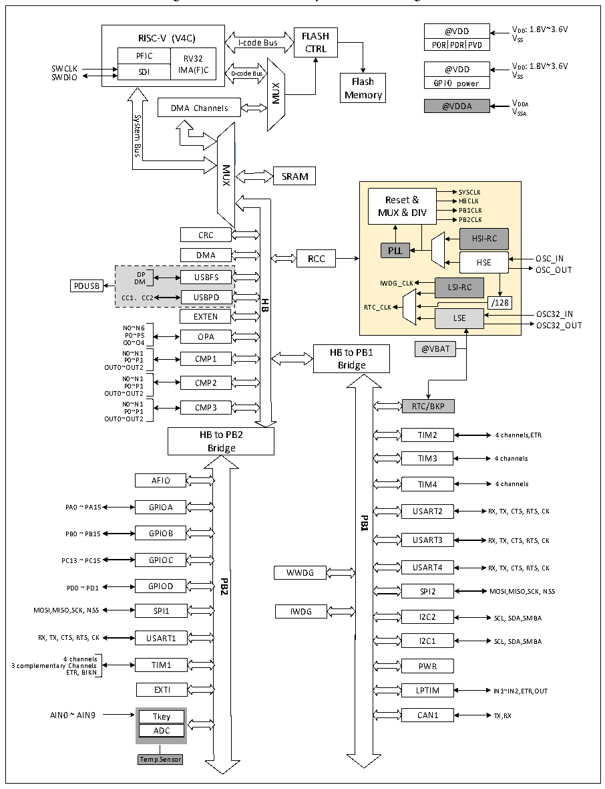

<!-- source-page: 5 -->

[← p.4](0004.md) · [index](../README.md) · [PDF p.5](https://ch32-riscv-ug.github.io/CH32L103/datasheet_en/CH32L103DS0.PDF#page=5) · [p.6 →](0006.md)

<!-- header: CH32L103 Datasheet https://wch-ic.com -->

Figure 1-1-1 CH32L103 System Block Diagram  
 <!-- rendered from the PDF; verify at https://ch32-riscv-ug.github.io/CH32L103/datasheet_en/CH32L103DS0.PDF#page=5 -->

🖼 Text parsed from the figure above

@VDD VDD: 1.8V~3.6V  
RISC-V (V4C)  PFICSDI  RV32IMA(F)C  
<!-- image: p5-draw-image-00003 inside the figure -->
RISC-V (V4C) FLASH  
VSS  
I-code Bus  
POR PDR PVD  
CTRL  
SWCLK @VDD VDD: 1.8V~3.6V SWDIO GPIO power VSS  
SDI IMA(F)CD-codeBus Flash  
MUX  
Memory  
DMA Channels @VDDA V V D SS D A A System  
<!-- image: p5-draw-image-00002 inside the figure -->
Bus  
MUX  
SRAM  
SYSCLK  
Reset &amp; HBCLK  
MUX &amp; DIV PB1CLK  
PB2CLK  
CRC  
HSI-RC  
PLL  
DMA RCC  
HSE OSC_IN  
OSC_OUT  
DP  
USBFS  
DM IWDG_CLK LSI-RC  
PDUSB  
USBPD  
CC1、CC2  
<strong>HB</strong>  
/128  
RTC_CLK  
LSE OSC32_IN  
EXTEN  
N0~N6 OSC32_OUT  
P0~P5  
OPA  
O0~O4  
@VBAT N0~N1  
HB to PB1  
P0~P1 CMP1 OUT0~OUT2  
Bridge  
N P 0 0 ~ ~ N P1 1 CMP2  
OUT0~OUT2  
N0~N1 CMP3 RTC/BKP  
P0~P1  
OUT0~OUT2  
HB to PB2  
TIM2  
4 channels,ETR  
Bridge  
TIM3  
4 channels  
AFIO 4 channels  
TIM4  
PA0 ~ PA15 GPIOA RX, TX, CTS, RTS, CK  
USART2  
<strong>PB1</strong>  
PB0 ~ PB15 GPIOB  
USART3  
RX, TX, CTS, RTS, CK  
PC13 ~ PC15 GPIOC  
USART4 WWDG  
RX, TX, CTS, RTS, CK  
<strong>PB2</strong>  
PD0 ~ PD1 GPIOD MOSI,MISO,SCK, NSS  
SPI2  
MOSI,MISO,SCK, NSS SPI1  
IWDG  
I2C2  
SCL, SDA,SMBA  
RX, TX, CTS, RTS, CK USART1 SCL, SDA,SMBA  
I2C1  
4 channels  
3 complementary Channels TIM1  
PWR  
ETR, BIKN  
EXTI IN1~IN2,ETR,OUT  
LPTIM  
AIN0 ~ AIN9 Tkey TX,RX  
CAN1  
Tkey ADC  
Temp Sensor  

<!-- image: p5-draw-image-00001 bbox=[511.32, 783.6, 530.76, 793.8] -->
<!-- footer: V2.1 2 -->
