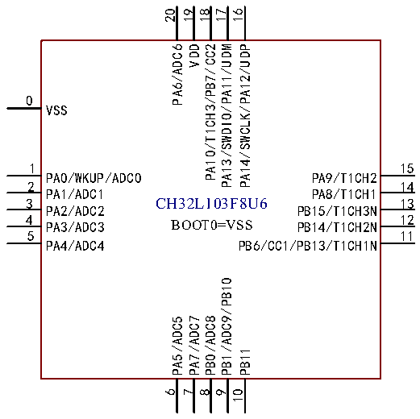

<!-- source-page: 19 -->

[← p.18](0018.md) · [index](../README.md) · [PDF p.19](https://ch32-riscv-ug.github.io/CH32L103/datasheet_en/CH32L103DS0.PDF#page=19) · [p.20 →](0020.md)

<!-- header: CH32L103 Datasheet https://wch-ic.com -->
CH32L103G8R6  
1 28  
PA14/SWCLK/PB5/CMP3P0 PA13/SWDIO/PA12/UDP  
2  
27  
PB6/CC1/SCL/T4CH1 PA11/UDM/T1CH4  
3  
26  
PB7/CC2/SDA/T4CH2 PA10/T1CH3  
4 25  
PB3/CMPxN PA9/T1CH2  
5 24  
PB8/T4CH3/CMP2P PA8/T1CH1  
6 23  
VDD PB15/T1CH3N  
7 22  
VSS PB14/T1CH2N  
8 21  
PD0 PB13/T1CH1N  
9 20  
PA0/WKUP/ADC0 PB12/T1BK/CMP3O  
10 19  
PA1/ADC1 PB11/CMP3N1  
11 18  
PA2/ADC2/CMP1P PB1/ADC9/OPAO/PB10/CMP3P1  
12 17  
PA3/ADC3 PA7/ADC7/OPAN  
13 16  
PA4/ADC4 PB0/ADC8/OPAP  
14 15  
PA5/ADC5 PA6/ADC6  
BOOT0=VSS  

 <!-- p19-cluster-01 uncaptioned graphics, rendered from the PDF; verify at https://ch32-riscv-ug.github.io/CH32L103/datasheet_en/CH32L103DS0.PDF#page=19 -->

🖼 Text parsed from the figure above

20  
19 18  
17  
16  
PA6/ADC6  
VDD  
PA10/T1CH3/PB7/CC2  
PA13/SWDIO/PA11/UDM  
PA14/SWCLK/PA12/UDP  
0  
VSS  
1  
15  
PA0/WKUP/ADC0 PA9/T1CH2  
2  
14  
PA1/ADC1 PA8/T1CH1  
3  
13  
CH32L103F8U6  
PA2/ADC2 PB15/T1CH3N  
4  
12  
BOOT0=VSS  
PA3/ADC3 PB14/T1CH2N  
5  
11  
PA4/ADC4 PB6/CC1/PB13/T1CH1N  
PB1/ADC9/PB10  
PA5/ADC5  
PA7/ADC7  
PB0/ADC8  
PB11  
6 7  
8  
9  
10  

CH32L103F8P6  
1 20  
BOOT0/PB8 PA14/SWCLK/PB7/CC2  
2 19  
OSC_IN/PD0 PA13/SWDIO/PB6/CC1  
3 18  
OSC_OUT/PD1 PA12/UDP  
4 17  
NRST PA11/UDM  
5 16  
VDDA VDD  
6 15  
PA0/WKUP/ADC0 VSS  
7 14  
PA1/ADC1 PB1/ADC9  
8 13  
PA2/ADC2 PA7/ADC7  
9 12  
PA3/ADC3 PA6/ADC6  
10 11  
PA4/ADC4 PA5/ADC5  
BOOT1=VSS  
<!-- image: p19-draw-image-00001 bbox=[515.88, 783.6, 535.32, 793.8] -->
<!-- footer: V2.1 16 -->
