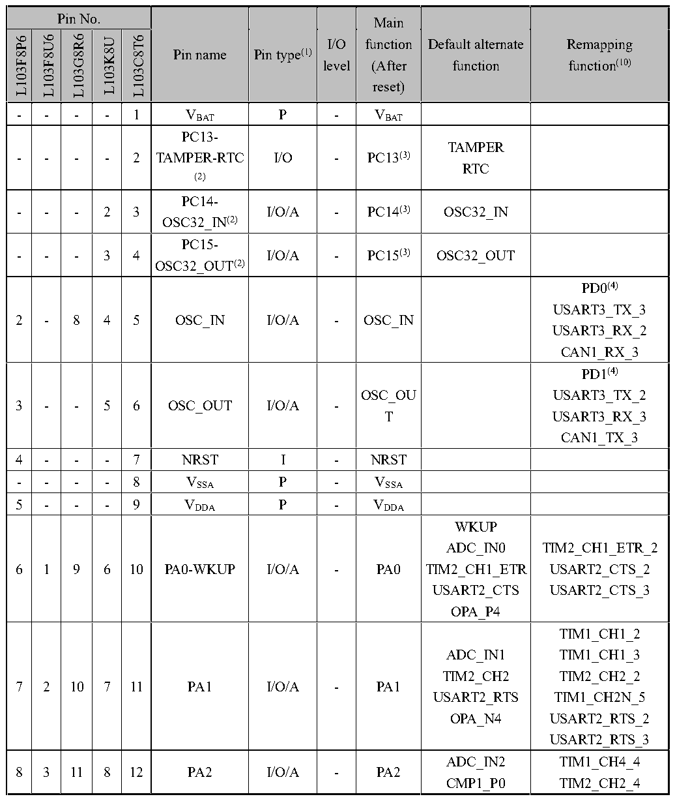

<!-- source-page: 21 -->

[← p.20](0020.md) · [index](../README.md) · [PDF p.21](https://ch32-riscv-ug.github.io/CH32L103/datasheet_en/CH32L103DS0.PDF#page=21) · [p.22 →](0022.md)

<!-- header: CH32L103 Datasheet https://wch-ic.com -->

## 2.2 Pin Description

Note that the pin function descriptions in the table below are for all functions and do not refer to specific chip  
models. Peripheral resources may vary from model to model, so please check the availability of this function  
against the chip model resource table before viewing.  

 <!-- p21-cluster-01 uncaptioned graphics, rendered from the PDF; verify at https://ch32-riscv-ug.github.io/CH32L103/datasheet_en/CH32L103DS0.PDF#page=21 -->

🖼 Text parsed from the figure above

<!-- p21-table-001 (table-2-1-1@1) pages 21-26 -->
<table><caption>Table 2-1-1 CH32L103 Pin definitions</caption><tr><th colspan="5">Pin No.</th><th rowspan="5">Pin name</th><th rowspan="5">Pin type(1)</th><th rowspan="5" style="text-align:left">I/O level</th><th>Main</th><th rowspan="5" style="text-align:left">Default alternate function</th><th rowspan="5" style="text-align:left">Remapping function(10)</th></tr><tr><td rowspan="4">L103F8P6</td><td rowspan="4">L103F8U6</td><td rowspan="4">L103G8R6</td><td rowspan="4">L103K8U</td><td rowspan="4">L103C8T6</td><td style="text-align:left">Main function</td></tr><tr><td>(After</td></tr><tr><td>reset)</td></tr><tr><td></td></tr><tr><td>-</td><td>-</td><td>-</td><td>-</td><td>1</td><td style="text-align:left">VBAT</td><td>P</td><td>-</td><td style="text-align:left">VBAT</td><td></td><td></td></tr><tr><td>-</td><td>-</td><td>-</td><td>-</td><td>2</td><td style="text-align:left">PC13- TAMPER-RTC (2)</td><td>I/O</td><td>-</td><td>PC13(3)</td><td style="text-align:left">TAMPERRTC</td><td></td></tr><tr><td>-</td><td>-</td><td>-</td><td>2</td><td>3</td><td style="text-align:left">PC14- OSC32_IN(2)</td><td>I/O/A</td><td>-</td><td>PC14(3)</td><td>OSC32_IN</td><td></td></tr><tr><td>-</td><td>-</td><td>-</td><td>3</td><td>4</td><td style="text-align:left">PC15- OSC32_OUT(2)</td><td>I/O/A</td><td>-</td><td>PC15(3)</td><td>OSC32_OUT</td><td></td></tr><tr><td>2</td><td>-</td><td>8</td><td>4</td><td>5</td><td>OSC_IN</td><td>I/O/A</td><td>-</td><td>OSC_IN</td><td></td><td style="text-align:left">PD0(4) USART3_TX_3USART3_RX_2CAN1_RX_3</td></tr><tr><td>3</td><td>-</td><td>-</td><td>5</td><td>6</td><td>OSC_OUT</td><td>I/O/A</td><td>-</td><td style="text-align:left">OSC_OUT</td><td></td><td style="text-align:left">PD1(4) USART3_TX_2USART3_RX_3CAN1_TX_3</td></tr><tr><td>4</td><td>-</td><td>-</td><td>-</td><td>7</td><td>NRST</td><td>I</td><td>-</td><td>NRST</td><td></td><td></td></tr><tr><td>-</td><td>-</td><td>-</td><td>-</td><td>8</td><td style="text-align:left">VSSA</td><td>P</td><td>-</td><td style="text-align:left">VSSA</td><td></td><td></td></tr><tr><td>5</td><td>-</td><td>-</td><td>-</td><td>9</td><td style="text-align:left">VDDA</td><td>P</td><td>-</td><td style="text-align:left">VDDA</td><td></td><td></td></tr><tr><td>6</td><td>1</td><td>9</td><td>6</td><td>10</td><td>PA0-WKUP</td><td>I/O/A</td><td>-</td><td>PA0</td><td style="text-align:left">WKUPADC_IN0TIM2_CH1_ETRUSART2_CTSOPA_P4</td><td style="text-align:left">TIM2_CH1_ETR_2USART2_CTS_2USART2_CTS_3</td></tr><tr><td>7</td><td>2</td><td>10</td><td>7</td><td>11</td><td>PA1</td><td>I/O/A</td><td>-</td><td>PA1</td><td style="text-align:left">ADC_IN1TIM2_CH2USART2_RTSOPA_N4</td><td style="text-align:left">TIM1_CH1_2TIM1_CH1_3TIM2_CH2_2TIM1_CH2N_5USART2_RTS_2USART2_RTS_3</td></tr><tr><td>8</td><td>3</td><td>11</td><td>8</td><td>12</td><td>PA2</td><td>I/O/A</td><td>-</td><td>PA2</td><td style="text-align:left">ADC_IN2CMP1_P0</td><td style="text-align:left">TIM1_CH4_4TIM2_CH2_4</td></tr><tr><td colspan="5">Pin No.</td><td rowspan="5">Pin name</td><td rowspan="5">Pin type(1)</td><td rowspan="5" style="text-align:left">I/O level</td><td>Main</td><td rowspan="5" style="text-align:left">Default alternate function</td><td rowspan="5" style="text-align:left">Remapping function(10)</td></tr><tr><td rowspan="4">L103F8P6</td><td rowspan="4">L103F8U6</td><td rowspan="4">L103G8R6</td><td rowspan="4">L103K8U</td><td rowspan="4">L103C8T6</td><td style="text-align:left">Main function</td></tr><tr><td>(After</td></tr><tr><td>reset)</td></tr><tr><td></td></tr><tr><td></td><td></td><td></td><td></td><td></td><td></td><td></td><td></td><td></td><td style="text-align:left">OPA_O2TIM2_CH3USART2_TX</td><td style="text-align:left">TIM2_CH2_5TIM2_CH3_1USART1_CTS_2</td></tr><tr><td>9</td><td>4</td><td>12</td><td>9</td><td>13</td><td>PA3</td><td>I/O/A</td><td>-</td><td>PA3</td><td style="text-align:left">ADC_IN3OPA_O0TIM2_CH4USART2_RX</td><td style="text-align:left">TIM1_ETR_3TIM1_CH4_5TIM2_CH1_ETR_4TIM2_CH4_1USART1_CK_2</td></tr><tr><td>10</td><td>5</td><td>13</td><td>10</td><td>14</td><td>PA4</td><td>I/O/A</td><td>-</td><td>PA4</td><td style="text-align:left">ADC_IN4OPA_O3USART2_CKSPI1_NSS</td><td style="text-align:left">TIM2_CH4_7USART1_TX_2USART1_RX_3USART2_CK_2USART2_CK_3</td></tr><tr><td>11</td><td>6</td><td>14</td><td>11</td><td>15</td><td>PA5</td><td>I/O/A</td><td>-</td><td>PA5</td><td style="text-align:left">ADC_IN5SPI1_SCKOPA_N3</td><td style="text-align:left">TIM2_CH3_7USART1_TX_3USART1_RX_2USART4_TX_1</td></tr><tr><td>12</td><td>20</td><td>15</td><td>12</td><td>16</td><td>PA6</td><td>I/O/A</td><td>-</td><td>PA6</td><td style="text-align:left">ADC_IN6TIM3_CH1SPI1_MISOOPA_N1OPA_P5</td><td style="text-align:left">TIM1_BKIN_1TIM2_CH4_4TIM2_CH4_5USART1_CK_3USART1_CK_4USART4_CK_1</td></tr><tr><td>13</td><td>7</td><td>17</td><td>13</td><td>17</td><td>PA7</td><td>I/O/A</td><td>-</td><td>PA7</td><td style="text-align:left">SPI1_MOSIADC_IN7TIM3_CH2OPA_N5OPA_P3</td><td style="text-align:left">TIM1_CH1N_1TIM1_CH2_2TIM1_CH2_3USART4_CTS_1</td></tr><tr><td>-</td><td>8</td><td>16</td><td>14</td><td>18</td><td>PB0</td><td>I/O/A</td><td>-</td><td>PB0</td><td style="text-align:left">ADC_IN8TIM3_CH3USART4_TXCMP1_OUT0OPA_P1OPA_O4</td><td style="text-align:left">TIM1_CH2N_1TIM1_CH2N_2TIM1_CH2N_3TIM3_CH3_1</td></tr><tr><td>14</td><td>9</td><td>18</td><td>15</td><td>19</td><td>PB1(7)(8)</td><td>I/O/A</td><td>-</td><td>PB1</td><td style="text-align:left">ADC_IN9TIM3_CH4USART4_RXCMP1_N0OPA_O1</td><td style="text-align:left">TIM1_CH1_5TIM1_CH4_2TIM1_CH4_3TIM1_CH2N_4TIM1_CH3N_1TIM3_CH4_1</td></tr><tr><td colspan="5">Pin No.</td><td rowspan="5">Pin name</td><td rowspan="5">Pin type(1)</td><td rowspan="5" style="text-align:left">I/O level</td><td>Main</td><td rowspan="5" style="text-align:left">Default alternate function</td><td rowspan="5" style="text-align:left">Remapping function(10)</td></tr><tr><td rowspan="4">L103F8P6</td><td rowspan="4">L103F8U6</td><td rowspan="4">L103G8R6</td><td rowspan="4">L103K8U</td><td rowspan="4">L103C8T6</td><td style="text-align:left">Main function</td></tr><tr><td>(After</td></tr><tr><td>reset)</td></tr><tr><td></td></tr><tr><td>-</td><td>-</td><td>-</td><td>16</td><td>20</td><td>PB2(5)</td><td>I/O/A</td><td>FT</td><td style="text-align:left">PB2BOOT1(5)</td><td style="text-align:left">USART4_CKCMP1_P1</td><td>LPT_OUT_1</td></tr><tr><td>-</td><td>9</td><td>18</td><td>-</td><td>21</td><td>PB10(7)(8)</td><td>I/O/A</td><td>FT</td><td>PB10</td><td style="text-align:left">USART3_TXI2C2_SCLCMP1_OUT1CMP3_P1OPA_N2OPA_N6</td><td style="text-align:left">TIM4_CH1_1TIM2_CH3_2TIM2_CH3_3</td></tr><tr><td>-</td><td>10</td><td>19</td><td>-</td><td>22</td><td>PB11</td><td>I/O/A</td><td>FT</td><td>PB11</td><td style="text-align:left">CMP2_OUT1CMP3_N1OPA_N0USART3_RXI2C2_SDA</td><td style="text-align:left">TIM1_CH1N_2TIM1_CH1N_3TIM2_CH4_2TIM2_CH4_3TIM4_CH2_1USART1_TX_4I2C1_SDA_3</td></tr><tr><td>15</td><td>0</td><td>7</td><td>0</td><td>23</td><td style="text-align:left">VSS</td><td>P</td><td>-</td><td style="text-align:left">VSS</td><td></td><td></td></tr><tr><td>16</td><td>19</td><td>6</td><td>1</td><td>24</td><td style="text-align:left">VDD</td><td>P</td><td>-</td><td style="text-align:left">VDD</td><td></td><td></td></tr><tr><td>-</td><td>-</td><td>20</td><td>-</td><td>25</td><td>PB12</td><td>I/O</td><td>FT</td><td>PB12</td><td style="text-align:left">CMP3_OUT1TIM1_BKINLPTIM_CH1USART3_CKI2C2_SMBASPI2_NSS</td><td style="text-align:left">TIM1_CH3_4TIM2_CH3_4TIM2_CH3_5USART1_TX_5USART3_CK_2USART3_CK_3SPI1_NSS_3</td></tr><tr><td>-</td><td>11</td><td>21</td><td>-</td><td>26</td><td>PB13(8)</td><td>I/O</td><td>FT</td><td>PB13</td><td style="text-align:left">TIM1_CH1NLPTIM_CH2USART3_CTSSPI2_SCK</td><td style="text-align:left">USART3_CTS_2USART3_CTS_3</td></tr><tr><td>-</td><td>12</td><td>22</td><td>-</td><td>27</td><td>PB14</td><td>I/O/A</td><td>FT</td><td>PB14</td><td style="text-align:left">TIM1_CH2NLPTIM_ETRUSART3_RTSSPI2_MISOOPA_P2</td><td style="text-align:left">USART3_RTS_2USART3_RTS_3</td></tr><tr><td>-</td><td>13</td><td>23</td><td>17</td><td>28</td><td>PB15</td><td>I/O/A</td><td>FT</td><td>PB15</td><td style="text-align:left">TIM1_CH3NLPTIM_OUTSPI2_MOSIOPA_P0</td><td></td></tr><tr><td colspan="5">Pin No.</td><td rowspan="5">Pin name</td><td rowspan="5">Pin type(1)</td><td rowspan="5" style="text-align:left">I/O level</td><td>Main</td><td rowspan="5" style="text-align:left">Default alternate function</td><td rowspan="5" style="text-align:left">Remapping function(10)</td></tr><tr><td rowspan="4">L103F8P6</td><td rowspan="4">L103F8U6</td><td rowspan="4">L103G8R6</td><td rowspan="4">L103K8U</td><td rowspan="4">L103C8T6</td><td style="text-align:left">Main function</td></tr><tr><td>(After</td></tr><tr><td>reset)</td></tr><tr><td></td></tr><tr><td>-</td><td>14</td><td>24</td><td>18</td><td>29</td><td>PA8</td><td>I/O</td><td>FT</td><td>PA8</td><td style="text-align:left">MCOTIM1_CH1USART1_CK</td><td style="text-align:left">TIM1_CH1_1USART1_CK_1</td></tr><tr><td>-</td><td>15</td><td>25</td><td>19</td><td>30</td><td>PA9</td><td>I/O</td><td>FT</td><td>PA9</td><td style="text-align:left">TIM1_CH2USART1_TX</td><td>TIM1_CH2_1</td></tr><tr><td>-</td><td>18</td><td>26</td><td>20</td><td>31</td><td>PA10(8)</td><td>I/O</td><td>FT</td><td>PA10</td><td style="text-align:left">TIM1_CH3USART1_RX</td><td>TIM1_CH3_1</td></tr><tr><td>17</td><td>17</td><td>27</td><td>21</td><td>32</td><td>PA11(8)</td><td>I/O</td><td>FT</td><td>PA11</td><td style="text-align:left">TIM1_CH4USART1_CTSUSBDMCAN1_RX</td><td style="text-align:left">TIM1_CH4_1USART1_CTS_1USART2_TX_2USART2_RX_3</td></tr><tr><td>18</td><td>16</td><td rowspan="2">28</td><td>22</td><td>33</td><td>PA12(7)(8)</td><td>I/O</td><td>FT</td><td>PA12</td><td style="text-align:left">USART1_RTSUSBDPCAN1_TXTIM1_ETR</td><td style="text-align:left">USART1_RTS_1TIM1_ETR_1TIM1_BKIN_4TIM1_BKIN_5TIM2_CH1_ETR_5TIM2_CH1_ETR_7USART1_RX_5USART2_TX_3USART2_RX_2I2C1_SDA_2SPI1_NSS_2</td></tr><tr><td>19</td><td>17</td><td>23</td><td>34</td><td>PA13(7)(8)(9)</td><td>I/O</td><td>FT</td><td>SWDIO</td><td></td><td style="text-align:left">TIM1_ETR_5TIM1_BKIN_2TIM1_BKIN_3USART1_RTS_2USART1_RTS_4I2C1_SCL_2</td></tr><tr><td>-</td><td>-</td><td>-</td><td>-</td><td>35</td><td style="text-align:left">VSS</td><td>P</td><td>-</td><td style="text-align:left">VSS</td><td></td><td></td></tr><tr><td>-</td><td>-</td><td>-</td><td>-</td><td>36</td><td style="text-align:left">VDD</td><td>P</td><td>-</td><td style="text-align:left">VDD</td><td></td><td></td></tr><tr><td>20</td><td>16</td><td>1</td><td>24</td><td>37</td><td>PA14(7)(8)(9)</td><td>I/O</td><td>FT</td><td>SWCLK</td><td></td><td style="text-align:left">TIM1_CH3_2TIM1_CH3_3TIM1_CH1N_4TIM1_CH1N_5USART1_CTS_4</td></tr><tr><td>-</td><td>-</td><td>-</td><td>25</td><td>38</td><td>PA15</td><td>I/O</td><td>FT</td><td>PA15</td><td></td><td style="text-align:left">TIM2_CH1_ETR_1TIM2_CH1_ETR_3USART4_RTS_1SPI1_NSS_1</td></tr><tr><td colspan="5">Pin No.</td><td rowspan="5">Pin name</td><td rowspan="5">Pin type(1)</td><td rowspan="5" style="text-align:left">I/O level</td><td>Main</td><td rowspan="5" style="text-align:left">Default alternate function</td><td rowspan="5" style="text-align:left">Remapping function(10)</td></tr><tr><td rowspan="4">L103F8P6</td><td rowspan="4">L103F8U6</td><td rowspan="4">L103G8R6</td><td rowspan="4">L103K8U</td><td rowspan="4">L103C8T6</td><td style="text-align:left">Main function</td></tr><tr><td>(After</td></tr><tr><td>reset)</td></tr><tr><td></td></tr><tr><td>-</td><td>-</td><td>4</td><td>26</td><td>39</td><td>PB3</td><td>I/O/A</td><td>FT</td><td>PB3</td><td style="text-align:left">CMP1_N1CMP2_N0CMP3_N0USART4_CTS</td><td style="text-align:left">TIM2_CH2_1TIM2_CH2_3SPI1_SCK_1</td></tr><tr><td>-</td><td>-</td><td>-</td><td>27</td><td>40</td><td>PB4</td><td>I/O/A</td><td>FT</td><td>PB4</td><td style="text-align:left">CMP3_OUT0USART4_RTS</td><td style="text-align:left">TIM3_CH1_1SPI1_MISO_1</td></tr><tr><td>-</td><td>-</td><td>1</td><td>28</td><td>41</td><td>PB5(7)</td><td>I/O/A</td><td>FT</td><td>PB5</td><td style="text-align:left">I2C1_SMBACMP2_OUT0CMP3_P0</td><td style="text-align:left">LPTIM_CH1_1TIM3_CH2_1USART4_RX_1I2C1_SMBA_2I2C1_SMBA_3SPI1_MOSI_1</td></tr><tr><td>19</td><td>11</td><td>2</td><td>29</td><td>42</td><td>PB6(8)(9)</td><td>I/O/A</td><td>FT</td><td>PB6</td><td style="text-align:left">TIM4_CH1I2C1_SCLCC1CMP2_P1</td><td style="text-align:left">LPTIM_ETR_1USART1_TX_1USART1_CK_5SPI1_SCK_2SPI1_SCK_3TIM1_ETR_2TIM1_ETR_4TIM1_CH3_5</td></tr><tr><td>20</td><td>18</td><td>3</td><td>30</td><td>43</td><td>PB7(8)(9)</td><td>I/O/A</td><td>FT</td><td>PB7</td><td style="text-align:left">TIM4_CH2I2C1_SDACC2CMP2_N1</td><td style="text-align:left">LPTIM_CH2_1USART1_RX_1USART1_CTS_3USART1_CTS_5SPI1_MOSI_2SPI1_MOSI_3TIM1_CH1_4TIM1_CH3N_5</td></tr><tr><td rowspan="2">1</td><td>-</td><td>-</td><td>31</td><td>44</td><td>BOOT0(6)</td><td>I</td><td>-</td><td>BOOT0</td><td></td><td></td></tr><tr><td>-</td><td>5</td><td>32</td><td>45</td><td>PB8(6)</td><td>I/O/A</td><td>FT</td><td>PB8</td><td style="text-align:left">TIM4_CH3CMP2_P0</td><td style="text-align:left">TIM4_CH3_1USART1_RTS_3USART1_RTS_5SPI1_MISO_2SPI1_MISO_3CAN1_RX_2TIM1_CH2_4TIM1_CH2_5TIM2_CH2_7</td></tr><tr><td>-</td><td>-</td><td>-</td><td>31</td><td>46</td><td>PB9(6)</td><td>I/O</td><td>FT</td><td>PB9</td><td>TIM4_CH4</td><td style="text-align:left">TIM4_CH4_1USART1_RX_4</td></tr><tr><td colspan="5">Pin No.</td><td rowspan="5">Pin name</td><td rowspan="5">Pin type(1)</td><td rowspan="5" style="text-align:left">I/O level</td><td>Main</td><td rowspan="5" style="text-align:left">Default alternate function</td><td rowspan="5" style="text-align:left">Remapping function(10)</td></tr><tr><td rowspan="4">L103F8P6</td><td rowspan="4">L103F8U6</td><td rowspan="4">L103G8R6</td><td rowspan="4">L103K8U</td><td rowspan="4">L103C8T6</td><td style="text-align:left">Main function</td></tr><tr><td>(After</td></tr><tr><td>reset)</td></tr><tr><td></td></tr><tr><td></td><td></td><td></td><td></td><td></td><td></td><td></td><td></td><td></td><td></td><td style="text-align:left">I2C1_SCL_3CAN1_TX_2TIM1_CH3N_2TIM1_CH3N_3TIM1_CH3N_4</td></tr><tr><td>-</td><td>-</td><td>-</td><td>-</td><td>47</td><td style="text-align:left">VSS</td><td>P</td><td>-</td><td style="text-align:left">VSS</td><td></td><td></td></tr><tr><td>-</td><td>-</td><td>-</td><td>-</td><td>48</td><td style="text-align:left">VDD</td><td>P</td><td>-</td><td style="text-align:left">VDD</td><td></td><td></td></tr></table>

- - - 1 VBAT P - VBAT  
- - - 8 VSSA P - VSSA  
5 - - - 9 VDDA P - VDDA  

<!-- image: p21-draw-image-00001 bbox=[515.88, 783.6, 535.32, 793.8] -->
<!-- footer: V2.1 18 -->
