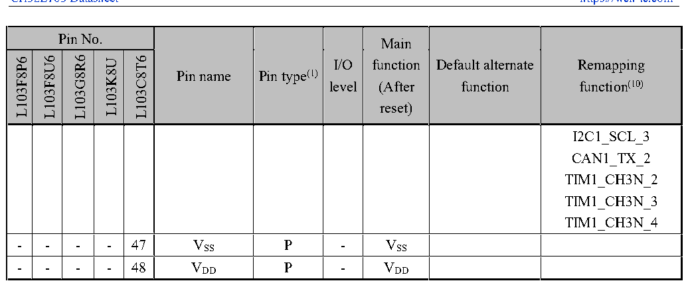

<!-- source-page: 26 -->

[← p.25](0025.md) · [index](../README.md) · [PDF p.26](https://ch32-riscv-ug.github.io/CH32L103/datasheet_en/CH32L103DS0.PDF#page=26) · [p.27 →](0027.md)

<!-- header: CH32L103 Datasheet https://wch-ic.com -->

 <!-- p26-cluster-01 uncaptioned graphics, rendered from the PDF; verify at https://ch32-riscv-ug.github.io/CH32L103/datasheet_en/CH32L103DS0.PDF#page=26 -->

🖼 Text parsed from the figure above

> ⬆ **Table continued** — rendered in full at [page 21](0021.md). <!-- p26-table-001 -->

<em>Note 1: Explanation of table abbreviations:</em>  
<em>I = TTL/CMOS level Schmitt input; O = CMOS level tri-state output;</em>  
<em>A = analog signal input or output; P = power supply; FT = tolerant 5V;</em>  
<em>Note 2: Both VDD and VBAT can be connected with an internal analog switch to supply power to the backup area</em>  
<em>and the pins PC13, PC14 and PC15. This analog switch can only pass a limited current (3mA). When powered by</em>  
<em>VDD, PC14 and PC15 can be used for GPIO or LSE pins, and PC13 can be used as a general-purpose I/O port,</em>  
<em>TAMPER pin, RTC calibration clock, RTC alarm clock or second output; PC13, PC14 and PC15 can only work in</em>  
<em>2MHz mode when they are used as GPIO output pins, and the maximum driving load is 30pF, and they cannot be</em>  
<em>used as current sources (such as driving LEDs). When the power is supplied by VBAT, PC14 and PC15 can only be</em>  
<em>used for LSE pin, and PC13 can be used as TAMPER pin, RTC alarm clock or second output.</em>  
<em>Note 3: these pins are in the main function state when the backup domain is powered on for the first time, and</em>  
<em>even if they are reset, the state of these pins is controlled by the backup domain register (these registers will not be</em>  
<em>reset by the master reset system). For specific information on how to control these IO ports, please refer to the</em>  
<em>relevant sections of the battery backup domain and BKP registers in the CH32L103RM manual.</em>  
<em>Note 4: For the CH32L103C8T6 chip, pin 5 and pin 6 are configured as OSC_IN and OSC_OUT function pins by</em>  
<em>default after chip reset, and the software can reset these 2 pins to PD0 and PD1 functions; for the CH32L103K8U</em>  
<em>chip, pin 4 and pin 5 are configured as OSC_IN and OSC_OUT function pins by default after chip reset. The</em>  
<em>software can reset these two pins to PD0 and PD1 functions; For the CH32L103G8R6 chip, pin 8 is configured as</em>  
<em>the OSC_IN function pin by default after chip reset, and the software can reset these two pins to PD0 function; for</em>  
<em>the CH32L103F8P6 chip, pin 2 and pin 3 are configured as the OSC_IN and OSC_OUT function pins by default</em>  
<em>after chip reset, and the software can reset these two pins to PD0 and PD1 functions. For more detailed</em>  
<em>information, please refer to the Multiplexed Function I/O section and the Debug Setup section of the</em>  
<em>CH32L103RM manual.</em>  
<em>Note 5: For chips where neither the BOOT0 nor BOOT1/PB2 pins are brought out, the internal BOOT0 pin is</em>  
<em>internally shorted to GND, while the BOOT1/PB2 pin is left floating. In low-power operation, it is recommended</em>  
<em>to configure PB2 as a pull-down input mode to prevent additional current flow.</em>  
<em>For chips where the BOOT1/PB2 pin is brought out but the BOOT0 pin is not, the internal BOOT0 pin is</em>  
<em>internally shorted to GND.</em>  
<!-- image: p26-draw-image-00001 bbox=[515.88, 783.6, 535.32, 793.8] -->
<!-- footer: V2.1 23 -->
