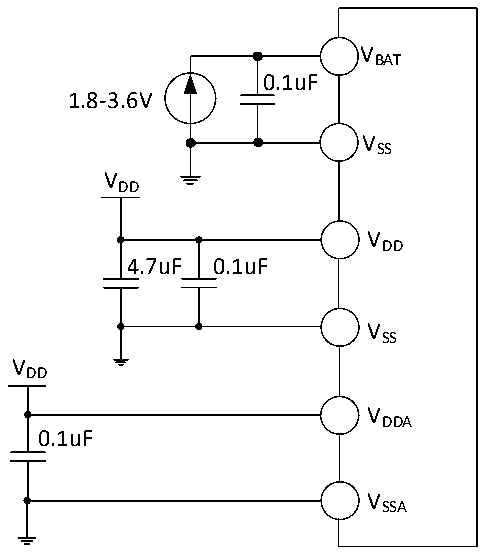

<!-- source-page: 36 -->

[← p.35](0035.md) · [index](../README.md) · [PDF p.36](https://ch32-riscv-ug.github.io/CH32L103/datasheet_en/CH32L103DS0.PDF#page=36) · [p.37 →](0037.md)

<!-- header: CH32L103 Datasheet https://wch-ic.com -->

# Chapter 3 Electrical Characteristics

## 3.1 Test Conditions

Unless otherwise specified and indicated, all voltages are referenced to VSS.  
All minimum and maximum values are guaranteed in the worst conditions of ambient temperature, supply voltage  
and clock frequency.  
The typical value of CH32L103 is based on the ambient temperature of 25℃ and VDD= 3.3V.  
The typical value of CH32M103G8R6 is based on the ambient temperature of 25℃, the power supply VHV= 15V  
and VHREG= 7V, and the environment with VDD= 3.3V for design guidance.  
The data based on comprehensive evaluation, design simulation or technology characteristics are not tested in  
production. On the basis of comprehensive evaluation, the minimum and maximum values refer to sample tests.  
Unless otherwise specified that is tested, the characteristic parameters are guaranteed by comprehensive evaluation  
or design.  
Power supply scheme:  

Figure 3-1-1 CH32L103 Typical circuit for conventional power supply  
 <!-- rendered from the PDF; verify at https://ch32-riscv-ug.github.io/CH32L103/datasheet_en/CH32L103DS0.PDF#page=36 -->

🖼 Text parsed from the figure above

VBAT  
0.1uF  
1.8-3.6V  
VSS  
VDD  
VDD  
4.7uF 0.1uF  
VSS  
VDD  
VDDA  
0.1uF  
VSSA  

<!-- image: p36-draw-image-00001 bbox=[515.88, 783.6, 535.32, 793.8] -->
<!-- footer: V2.1 33 -->
