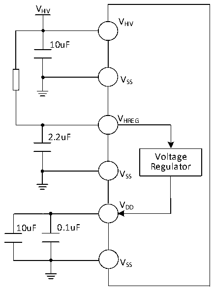

<!-- source-page: 37 -->

[← p.36](0036.md) · [index](../README.md) · [PDF p.37](https://ch32-riscv-ug.github.io/CH32L103/datasheet_en/CH32L103DS0.PDF#page=37) · [p.38 →](0038.md)

<!-- header: CH32L103 Datasheet https://wch-ic.com -->

Figure 3-1-1 CH32M103 Typical circuit for conventional power supply (The resistor in the figure is optional,  
 <!-- rendered from the PDF; verify at https://ch32-riscv-ug.github.io/CH32L103/datasheet_en/CH32L103DS0.PDF#page=37 -->

which is used to share the voltage drop and reduce the chip heating.)  

🖼 Text parsed from the figure above

VHV  
VHV  
10uF  
VSS  
VHREG  
2.2uF  
Voltage  
Regulator  
VSS  
VDD  
10uF 0.1uF  
VSS  

## 3.2 Absolute Maximum Ratings

Critical or exceeding the absolute maximum value may cause the chip to operate improperly or even be damaged.  

<!-- p37-table-001 (table-3-1@1) pages 37-38 -->
<table><caption>Table 3-1 Absolute maximum ratings</caption><tr><th>Symbol</th><th colspan="3">Description</th><th>Min.</th><th>Max.</th><th>Unit</th></tr><tr><td rowspan="2" style="text-align:left">TA</td><td rowspan="2" style="text-align:left">Ambient temperature during operation</td><td colspan="2" style="text-align:left">Chips with a model number ending in 6</td><td>-40</td><td>85</td><td>℃</td></tr><tr><td colspan="2" style="text-align:left">Chips with a model number ending in 7</td><td>-40</td><td>105</td><td>℃</td></tr><tr><td style="text-align:left">TS</td><td colspan="3">Ambient temperature during storage</td><td>-40</td><td>125</td><td>℃</td></tr><tr><td rowspan="2" style="text-align:left">VDD</td><td colspan="2" style="text-align:left">External mains supply voltage (including V and V ) DDA DD</td><td>CH32L103</td><td>-0.3</td><td>4.0</td><td>V</td></tr><tr><td colspan="2" style="text-align:left">Output voltage of internal voltage regulator</td><td>CH32M103G8R6</td><td>-0.3</td><td>4.0</td><td>V</td></tr><tr><td style="text-align:left">VHV</td><td colspan="2" style="text-align:left">Power supply voltage of high voltage power supply and gate driver</td><td>CH32M103G8R6</td><td>-0.4</td><td>28</td><td>V</td></tr><tr><td style="text-align:left">VHREG</td><td colspan="2" style="text-align:left">Input power supply voltage of internal voltage regulator</td><td>CH32M103G8R6</td><td>-0.4</td><td>28</td><td>V</td></tr><tr><td rowspan="2" style="text-align:left">VIN</td><td colspan="3">Input voltage on FT (tolerate 5V) pin.</td><td style="text-align:left">V -0.3SS</td><td>5.5</td><td>V</td></tr><tr><td colspan="3">Voltage on other pins</td><td style="text-align:left">V -0.3SS</td><td style="text-align:left">V +0.3DD</td><td>V</td></tr><tr><td style="text-align:left">VHO</td><td colspan="2">Output voltage of high-side driver</td><td>CH32M103G8R6</td><td>-0.4</td><td style="text-align:left">V +0.4HV</td><td>V</td></tr><tr><td style="text-align:left">VLO</td><td colspan="2">Output voltage of low-side driver</td><td>CH32M103G8R6</td><td>-0.4</td><td style="text-align:left">V +0.4HV</td><td>V</td></tr><tr><td style="text-align:left">| V | DD_x</td><td colspan="3" style="text-align:left">Voltage difference between V of main power supply pin DD</td><td></td><td>50</td><td>mV</td></tr><tr><td style="text-align:left">| V | SS_x</td><td colspan="3" style="text-align:left">Voltage difference between different grounding pins</td><td></td><td>50</td><td>mV</td></tr><tr><td rowspan="3" style="text-align:left">△ △ VESD(HBM)</td><td colspan="3" style="text-align:left">ESD Electrostatic Discharge Voltage (HBM) on normal I/OPins</td><td colspan="2">4K</td><td>V</td></tr><tr><td colspan="3" style="text-align:left">ESD Electrostatic Discharge Voltage (HBM) on USB Pins</td><td colspan="2">4K</td><td>V</td></tr><tr><td colspan="2" style="text-align:left">ESD Electrostatic Discharge Voltage (HBM) on dedicated pin</td><td>CH32M103G8R6</td><td colspan="2">2K</td><td>V</td></tr><tr><td style="text-align:left">IAVVHV</td><td colspan="3" style="text-align:left">V pin continuous input current HV</td><td></td><td>50</td><td>mA</td></tr><tr><td style="text-align:left">IVDD</td><td colspan="3" style="text-align:left">Total current through V /V power line (supply current) DD DDA</td><td></td><td>150</td><td>mA</td></tr><tr><td style="text-align:left">IVss</td><td colspan="3" style="text-align:left">Total current through V ground line (outgoing current) SS</td><td></td><td>150</td><td>mA</td></tr><tr><td rowspan="2" style="text-align:left">IIO</td><td colspan="3" style="text-align:left">Pour current on arbitrary I/O and control pins</td><td></td><td>25</td><td>mA</td></tr><tr><td colspan="3" style="text-align:left">Source current on arbitrary I/O and control pins</td><td></td><td>-25</td><td>mA</td></tr><tr><td rowspan="3" style="text-align:left">IINJ(PIN)</td><td colspan="3">NRST pin injection current</td><td></td><td>+/-5</td><td>mA</td></tr><tr><td colspan="3" style="text-align:left">OSC_IN pin of HSE and OSC_IN pin of LSE injection current</td><td></td><td>+/-5</td><td>mA</td></tr><tr><td colspan="3">Injection current on other pins</td><td></td><td>+/-5</td><td>mA</td></tr><tr><td style="text-align:left">∑IINJ(PIN)</td><td colspan="3" style="text-align:left">Total injection current on all IO and control pins</td><td></td><td>+/-25</td><td>mA</td></tr></table>

<!-- image: p37-draw-image-00001 bbox=[515.88, 783.6, 535.32, 793.8] -->
<!-- footer: V2.1 34 -->
