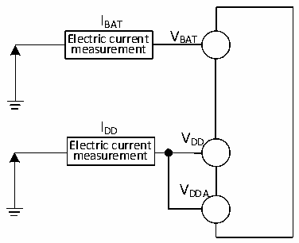
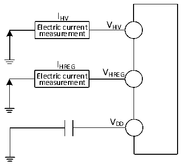

<!-- source-page: 41 -->

[← p.40](0040.md) · [index](../README.md) · [PDF p.41](https://ch32-riscv-ug.github.io/CH32L103/datasheet_en/CH32L103DS0.PDF#page=41) · [p.42 →](0042.md)

<!-- header: CH32L103 Datasheet https://wch-ic.com -->

Figure 3-2-1 Current consumption measurement  
 <!-- rendered from the PDF; verify at https://ch32-riscv-ug.github.io/CH32L103/datasheet_en/CH32L103DS0.PDF#page=41 -->

🖼 Text parsed from the figure above

IBAT  
Electric current V BAT  
measurement  
I  
DD V  
Electric current DD  
measurement  
VDDA  

Figure 3-2-2 CH32M103G8R6 Current consumption measurement  
 <!-- rendered from the PDF; verify at https://ch32-riscv-ug.github.io/CH32L103/datasheet_en/CH32L103DS0.PDF#page=41 -->

🖼 Text parsed from the figure above

IHV  
Electric current V HV  
measurement  
IHREG  
V  
Electric current HREG  
measurement  
VDD  

CH32L103 is in the following conditions:  
Tested with room temperature VDD= 3.3V: Bit CC1_PD of R16_PORT_CC1 and Bit CC2_PD of R16_PORT_CC2  
are both = 0, all I/O pins are configured as pull-down inputs running on the high-speed internal RC oscillator HSI  
with HSI = 8M. FPLCK1=FHCLK/2 and FPLCK2=FHCLK to enable or disable the power consumption of all peripheral  
clocks.  
CH32M103G8R6 is in the following conditions:  
In VHV= 15V, VHREG= 7V, VDD= 3.3V condition, during the test: bit CC1_PD of R16_PORT_CC1 and bit  
CC2_PD of R16_PORT_CC2 are both = 0, and all I/O pins are configured as pull-down inputs, running in  
high-speed internal RC oscillators HSI, HSI = 8M, FPLCK1=FHCLK/2 and FPLCK2= FHCLK, enabling or turning off  
the power consumption of all peripheral clocks.  
<em>Note: For pins not packaged in small package models or pins that are packaged but unused, it is recommended to</em>  
<em>configure them as pull-up inputs or pull-down inputs. Failure to do so may affect current specifications. For</em>  
<em>specific procedures, please refer to the EVT low-power example code.</em>  

<!-- p41-table-001 (table-3-6@1) pages 41-42 -->
<table><caption>Table 3-6 Data Processing Code Running from FLASH, Setting LDOTRIM[1:0]=10, LDO_EC=0</caption><tr><th>Symbol</th><th>Parameter</th><th colspan="3">Condition</th><th colspan="2">Typ.</th><th>Unit</th></tr><tr><td rowspan="2"></td><td rowspan="2"></td><td rowspan="2">HSILP</td><td rowspan="2">PLLON</td><td rowspan="2" style="text-align:left">FHCLK</td><td rowspan="2" style="text-align:left">Enable all peripherals</td><td>Disable all</td><td rowspan="2"></td></tr><tr><td>peripherals</td></tr><tr><td rowspan="16" style="text-align:left">I (1)(2) DD</td><td rowspan="8" style="text-align:left">Supply current in Run mode</td><td>0</td><td>1</td><td>96MHz</td><td>7.46</td><td>4.70</td><td rowspan="8">mA</td></tr><tr><td>0</td><td>1</td><td>48MHz</td><td>5.13</td><td>3.77</td></tr><tr><td>0</td><td>1</td><td>8MHz</td><td>2.23</td><td>1.95</td></tr><tr><td>0</td><td>1</td><td>1MHz</td><td>1.46</td><td>1.43</td></tr><tr><td>1</td><td>1</td><td>1MHz</td><td>1.27</td><td>1.24</td></tr><tr><td>0</td><td>0</td><td>8MHz</td><td>2.14</td><td>1.87</td></tr><tr><td>0</td><td>0</td><td>1MHz</td><td>1.37</td><td>1.34</td></tr><tr><td>1</td><td>0</td><td>1MHz</td><td>1.19</td><td>1.17</td></tr><tr><td rowspan="8" style="text-align:left">Supply current in sleep mode (when peripherals are powered and clock is held)</td><td>0</td><td>1</td><td>96MHz</td><td>5.58</td><td>2.82</td><td rowspan="8">mA</td></tr><tr><td>0</td><td>1</td><td>48MHz</td><td>3.52</td><td>2.14</td></tr><tr><td>0</td><td>1</td><td>8MHz</td><td>1.74</td><td>1.47</td></tr><tr><td>0</td><td>1</td><td>1MHz</td><td>1.40</td><td>1.37</td></tr><tr><td>1</td><td>1</td><td>1MHz</td><td>1.21</td><td>1.18</td></tr><tr><td>0</td><td>0</td><td>8MHz</td><td>1.65</td><td>1.38</td></tr><tr><td>0</td><td>0</td><td>1MHz</td><td>1.31</td><td>1.28</td></tr><tr><td>1</td><td>0</td><td>1MHz</td><td>1.13</td><td>1.10</td></tr></table>

<!-- image: p41-draw-image-00001 bbox=[515.88, 783.6, 535.32, 793.8] -->
<!-- footer: V2.1 38 -->
