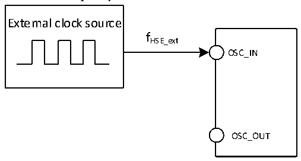

<!-- source-page: 47 -->

[← p.46](0046.md) · [index](../README.md) · [PDF p.47](https://ch32-riscv-ug.github.io/CH32L103/datasheet_en/CH32L103DS0.PDF#page=47) · [p.48 →](0048.md)

<!-- header: CH32L103 Datasheet https://wch-ic.com -->

Figure 3-3 Low frequency clock circuit for external clock source  
 <!-- rendered from the PDF; verify at https://ch32-riscv-ug.github.io/CH32L103/datasheet_en/CH32L103DS0.PDF#page=47 -->

🖼 Text parsed from the figure above

External clock source  
fHSE_ext  
OSC_IN  
OSC_OUT  

<!-- p47-table-001 (table-3-11@1) -->
<table><caption>Table 3-11 From external low-speed clock</caption><tr><th>Symbol</th><th>Parameter</th><th>Condition</th><th>Min.</th><th>Typ.</th><th>Max.</th><th>Unit</th></tr><tr><td style="text-align:left">FLSE_ext</td><td>User external clock frequency</td><td></td><td></td><td>32.768</td><td>1000</td><td>KHz</td></tr><tr><td style="text-align:left">VLSEH</td><td style="text-align:left">OSC32_IN input pin high level voltage</td><td></td><td style="text-align:left">0.8VDD</td><td></td><td style="text-align:left">VDD</td><td>V</td></tr><tr><td style="text-align:left">VLSEL</td><td>OSC32_IN input pin low voltage</td><td></td><td>0</td><td></td><td style="text-align:left">0.2VDD</td><td>V</td></tr><tr><td style="text-align:left">C in(LSE)</td><td>OSC32_IN input capacitance</td><td></td><td></td><td>5</td><td></td><td>pF</td></tr><tr><td style="text-align:left">DuCy LSE</td><td>Duty Cycle</td><td></td><td></td><td>50</td><td></td><td>%</td></tr><tr><td style="text-align:left">IL</td><td>OSC32_IN input leakage current</td><td></td><td></td><td></td><td>±1</td><td>uA</td></tr></table>

Figure 3-4 Low frequency clock circuit for external clock source  
 <!-- rendered from the PDF; verify at https://ch32-riscv-ug.github.io/CH32L103/datasheet_en/CH32L103DS0.PDF#page=47 -->

🖼 Text parsed from the figure above

External clock source  
fLSE_ext  
OSC_IN  
OSC_OUT  

<!-- p47-table-002 (table-3-12@1) pages 47-48 -->
<table><caption>Table 3-12 High-Speed external clocks generated using one crystal/ceramic resonator</caption><tr><th>Symbol</th><th>Parameter</th><th>Condition</th><th>Min.</th><th>Typ.</th><th>Max.</th><th>Unit</th></tr><tr><td style="text-align:left">FOSC_IN</td><td>Resonator frequency</td><td></td><td>3</td><td>8</td><td>25</td><td>MHz</td></tr><tr><td style="text-align:left">RF</td><td>Feedback resistance</td><td></td><td></td><td>250</td><td></td><td>kΩ</td></tr><tr><td>C</td><td style="text-align:left">Suggested load capacitance with corresponding crystal serial impedance RS</td><td style="text-align:left">R =60Ω(1) S</td><td></td><td>20</td><td></td><td>pF</td></tr><tr><td rowspan="2" style="text-align:left">I2</td><td rowspan="2">HSE drive current</td><td style="text-align:left">V = 3.3V，20p load DD</td><td></td><td>1</td><td></td><td>mA</td></tr><tr><td style="text-align:left">Low-power, V = 3.3V, DD 20p load</td><td></td><td>0.55</td><td></td><td>mA</td></tr><tr><td style="text-align:left">g m</td><td>Oscillator transconductance</td><td>Startup</td><td></td><td>21</td><td></td><td>mA/V</td></tr><tr><td style="text-align:left">t SU(HSE)</td><td>Startup time(2)</td><td style="text-align:left">V stabilization, 8MDD crystal</td><td></td><td>1.5(2)</td><td></td><td>ms</td></tr></table>

<!-- image: p47-draw-image-00001 bbox=[515.88, 783.6, 535.32, 793.8] -->
<!-- footer: V2.1 44 -->
