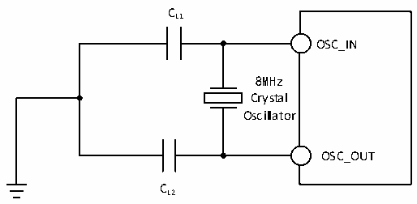
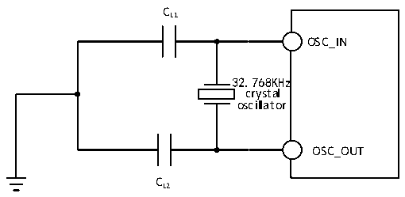

<!-- source-page: 48 -->

[← p.47](0047.md) · [index](../README.md) · [PDF p.48](https://ch32-riscv-ug.github.io/CH32L103/datasheet_en/CH32L103DS0.PDF#page=48) · [p.49 →](0049.md)

<!-- header: CH32L103 Datasheet https://wch-ic.com -->

> ⬆ **Table continued** — rendered in full at [page 47](0047.md). <!-- p48-table-001 -->

<em>Note: 1. It is suggested that the ESR of the crystal should not exceed 80Ω, and the crystal with smaller ESR is</em>  
<em>preferred. Refer to the requirements of the crystal manual for load capacitance.</em>  
<em>2. Start-up time refers to the time difference from when HSEON is turned on to when HSERDY is set.</em>  
Circuit reference design and requirements:  
The load capacitance of the crystal is based on the crystal manufacturer&#x27;s recommendation, usually CL1=CL2.  

Figure 3-5 Typical circuit for external 8M crystal  
 <!-- rendered from the PDF; verify at https://ch32-riscv-ug.github.io/CH32L103/datasheet_en/CH32L103DS0.PDF#page=48 -->

🖼 Text parsed from the figure above

CL1  
OSC_IN  
8MHz  
Crystal  
Oscillator  
OSC_OUT  
CL2  

<!-- p48-table-002 (table-3-13@1) -->
<table><caption>Table 3-13 Low-speed external clocks generated using a crystal/ceramic resonator (fLSE=32.768KHz)</caption><tr><th>Symbol</th><th>Parameter</th><th>Condition</th><th>Min.</th><th>Typ.</th><th>Max.</th><th>Unit</th></tr><tr><td style="text-align:left">RF</td><td>Feedback resistance</td><td></td><td></td><td>5</td><td></td><td>MΩ</td></tr><tr><td style="text-align:left">C /C L1 L2</td><td style="text-align:left">Suggested load capacitance with corresponding crystal serial impedance RS</td><td style="text-align:left">R = 70KΩS</td><td></td><td></td><td>15</td><td>pF</td></tr><tr><td style="text-align:left">i (1) 2</td><td>LSE drive current</td><td style="text-align:left">V = 3.3VDD</td><td></td><td>0.36</td><td></td><td>uA</td></tr><tr><td style="text-align:left">g (1) m</td><td>Oscillator transconductance</td><td>Startup</td><td></td><td>26</td><td></td><td>uA/V</td></tr><tr><td style="text-align:left">t SU(LSE)</td><td>Startup time</td><td style="text-align:left">V stabilization DD</td><td></td><td>1000(1)</td><td></td><td>ms</td></tr></table>

<em>Note: The startup time is the time difference between when LSEON is turned on and when LSERDY is set.</em>  
Circuit reference design and requirements:  
The load capacitance of the crystal is based on the crystal manufacturer&#x27;s recommendation, usually CL1=CL2,  
optional about 12pF.  

Figure 3-6 Typical Circuit for External 32.768K Crystal  
 <!-- rendered from the PDF; verify at https://ch32-riscv-ug.github.io/CH32L103/datasheet_en/CH32L103DS0.PDF#page=48 -->

🖼 Text parsed from the figure above

CL1  
OSC_IN  
32.768KHz  
crystal  
oscillator  
OSC_OUT  
CL2  

<em>Note: The load capacitance CL is calculated by the following formula: CL= CL1× CL2/ (CL1+ CL2) + Cstray,</em>  
<em>where Cstray is the capacitance of the pins and the capacitance associated with the PCB board or PCB, and its</em>  
<em>typical value is between 2pF and 7pF.</em>  
<!-- image: p48-draw-image-00001 bbox=[515.88, 783.6, 535.32, 793.8] -->
<!-- footer: V2.1 45 -->
