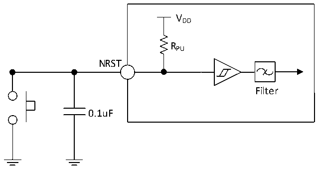

<!-- source-page: 52 -->

[← p.51](0051.md) · [index](../README.md) · [PDF p.52](https://ch32-riscv-ug.github.io/CH32L103/datasheet_en/CH32L103DS0.PDF#page=52) · [p.53 →](0053.md)

<!-- header: CH32L103 Datasheet https://wch-ic.com -->

### 3.3.11 NRST Pin Characteristics

<!-- p52-table-001 (table-3-23@1) -->
<table><caption>Table 3-23 External reset pin characteristics</caption><tr><th>Symbol</th><th>Parameter</th><th>Condition</th><th>Min.</th><th>Typ.</th><th>Max.</th><th>Unit</th></tr><tr><td style="text-align:left">VIL(NRST)</td><td style="text-align:left">NRST input low level voltage</td><td></td><td>-0.3</td><td></td><td style="text-align:left">0.28*(V -1.8)+0.6DD</td><td>V</td></tr><tr><td style="text-align:left">VIH(NRST)</td><td style="text-align:left">NRST input high level voltage</td><td></td><td style="text-align:left">0.41*(V -1.8)+1.3DD</td><td></td><td style="text-align:left">V +0.3DD</td><td>V</td></tr><tr><td style="text-align:left">V hys(NRST)</td><td style="text-align:left">NRST Schmitt trigger voltage hysteresis</td><td></td><td>150</td><td></td><td></td><td>mV</td></tr><tr><td style="text-align:left">R (1) PU</td><td style="text-align:left">Pull-up equivalent resistance</td><td></td><td>30</td><td>40</td><td>50</td><td>kΩ</td></tr><tr><td style="text-align:left">VF(NRST)</td><td style="text-align:left">NRST input can be filtered for pulse width</td><td></td><td></td><td></td><td>100</td><td>ns</td></tr><tr><td style="text-align:left">VNF(NRST)</td><td style="text-align:left">NRST input cannot be filtered pulse width</td><td></td><td>300</td><td></td><td></td><td>ns</td></tr></table>

<em>Note: 1. The pull-up resistor is a real resistor in series with a switchable PMOS implementation. The resistance of</em>  
<em>this PMOS/NMOS switch is very small (about 10%).</em>  
Circuit reference design and requirements:  

Figure 3-7 Typical circuit of external reset pin  
 <!-- rendered from the PDF; verify at https://ch32-riscv-ug.github.io/CH32L103/datasheet_en/CH32L103DS0.PDF#page=52 -->

🖼 Text parsed from the figure above

VDD  
RPU  
NRST  
Filter  
0.1uF  

<em>Note: The capacitors shown are optional and can be used to filter out key jitter.</em>  

### 3.3.12 USB PD Interface Characteristics

<!-- p52-table-003 (table-3-24-1@1) pages 52-53 -->
<table><caption>Table 3-24-1 PD interface I/O characteristics</caption><tr><th>Symbol</th><th>Parameter</th><th>Condition</th><th>Min.</th><th>Typ.</th><th>Max.</th><th>Unit</th></tr><tr><td>tRise</td><td>Rising time</td><td style="text-align:left">The time between 10% and 90% of the range, with the minimum value being the time under no-load conditions.</td><td>240</td><td>400</td><td></td><td>ns</td></tr><tr><td>tFall</td><td>Falling time</td><td style="text-align:left">The time between 10% and 90% of the range, with the minimum value being the time under no-load conditions.</td><td>240</td><td>400</td><td></td><td>ns</td></tr><tr><td style="text-align:left">VSwing</td><td style="text-align:left">Output voltage swing (Peak-to-peak)</td><td></td><td>1.04</td><td>1.12</td><td>1.20</td><td>V</td></tr><tr><td style="text-align:left">ZDriver</td><td>Output impedance</td><td></td><td>26</td><td></td><td>90</td><td>Ω</td></tr></table>

<!-- image: p52-draw-image-00001 bbox=[515.88, 783.6, 535.32, 793.8] -->
<!-- footer: V2.1 49 -->
