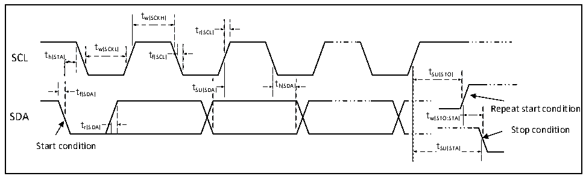

<!-- source-page: 53 -->

[← p.52](0052.md) · [index](../README.md) · [PDF p.53](https://ch32-riscv-ug.github.io/CH32L103/datasheet_en/CH32L103DS0.PDF#page=53) · [p.54 →](0054.md)

<!-- header: CH32L103 Datasheet https://wch-ic.com -->

> ⬆ **Table continued** — rendered in full at [page 52](0052.md). <!-- p53-table-001 -->

<!-- p53-table-002 (table-3-24-2@1) -->
<table><caption>Table 3-24-2 Type-C I/O characteristics</caption><tr><th>Symbol</th><th>Parameter</th><th>Condition</th><th>Min.</th><th>Typ.</th><th>Max.</th><th>Unit</th></tr><tr><td rowspan="3" style="text-align:left">I pu</td><td rowspan="3">Pull-up current</td><td rowspan="3" style="text-align:left">PAD &lt; V -0.6VDD</td><td></td><td>80</td><td></td><td>uA</td></tr><tr><td></td><td>180</td><td></td><td>uA</td></tr><tr><td></td><td>330</td><td></td><td>uA</td></tr><tr><td>Rd</td><td style="text-align:left">Pull-down current</td><td style="text-align:left">V ≥ 1.6V or external pull-up 330uADD</td><td>4.08</td><td>5.1</td><td>6.12</td><td>kΩ</td></tr></table>

### 3.3.13 TIM Timer Characteristics

<!-- p53-table-003 (table-3-25@1) -->
<table><caption>Table 3-25 TIMx characteristics</caption><tr><th>Symbol</th><th>Parameter</th><th>Condition</th><th>Min.</th><th>Max.</th><th>Unit</th></tr><tr><td rowspan="2" style="text-align:left">t res(TIM)</td><td rowspan="2">Timer reference clock</td><td></td><td>1</td><td></td><td style="text-align:left">t TIMxCLK</td></tr><tr><td style="text-align:left">f = 48MHz TIMxCLK</td><td>20.8</td><td></td><td>ns</td></tr><tr><td rowspan="2" style="text-align:left">FEXT</td><td rowspan="2" style="text-align:left">Timer external clock frequency on CH1 to CH4</td><td></td><td>0</td><td style="text-align:left">f / TIMxCLK2</td><td>MHz</td></tr><tr><td style="text-align:left">f = 48MHz TIMxCLK</td><td>0</td><td>24</td><td>MHz</td></tr><tr><td style="text-align:left">R esTIM</td><td>Timer resolution</td><td></td><td></td><td>16</td><td>Bit</td></tr><tr><td rowspan="2" style="text-align:left">t COUNTER</td><td rowspan="2" style="text-align:left">16-bit counter clock cycle when the internal clock is selected</td><td></td><td>1</td><td>65536</td><td style="text-align:left">t TIMxCLK</td></tr><tr><td style="text-align:left">f = 48MHz TIMxCLK</td><td>0.02</td><td>1363</td><td>us</td></tr><tr><td rowspan="2" style="text-align:left">t MAX_COUNT</td><td rowspan="2">Maximum possible count</td><td></td><td></td><td>65535</td><td style="text-align:left">t TIMxCLK</td></tr><tr><td style="text-align:left">f = 48MHz TIMxCLK</td><td></td><td>1363</td><td>us</td></tr></table>

### 3.3.14 I2C Interface Characteristics

Figure 3-8 I2C bus timing diagram  
 <!-- rendered from the PDF; verify at https://ch32-riscv-ug.github.io/CH32L103/datasheet_en/CH32L103DS0.PDF#page=53 -->

🖼 Text parsed from the figure above

tw(SCKH)  
tr(SCL)  
t  
SCL t h(STA) w(SCKL) t f(SCL)  
tSU(STO)  
t t SU(SDA) t h(SDA)  
th(SDA)  
f(SDA)  
Repeat start condition  
t  
r(SDA) Stop condition  
Start condition tSU(STA)  

<!-- image: p53-draw-image-00001 bbox=[515.88, 783.6, 535.32, 793.8] -->
<!-- footer: V2.1 50 -->
