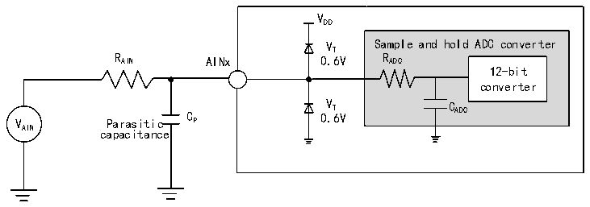

<!-- source-page: 58 -->

[← p.57](0057.md) · [index](../README.md) · [PDF p.58](https://ch32-riscv-ug.github.io/CH32L103/datasheet_en/CH32L103DS0.PDF#page=58) · [p.59 →](0059.md)

<!-- header: CH32L103 Datasheet https://wch-ic.com -->

> ⬆ **Table continued** — rendered in full at [page 57](0057.md). <!-- p58-table-001 -->

<em>Note: The above are guaranteed design parameters.</em>  
Formula: Maximum RAIN  
<!-- image: p58-draw-image-00002 bbox=[219.36, 169.08, 375.84, 193.2] -->
The above formula is used to determine the maximum external impedance such that the error can be less than 1/4  
LSB. where N=12 (indicating 12-bit resolution).  

<!-- p58-table-002 (table-3-30@1) -->
<table><caption>Table 3-30 Maximum RAIN at fADC= 14MHz</caption><tr><th style="text-align:left">T (cycle) S</th><th style="text-align:left">t (us) S</th><th style="text-align:left">Maximum R (kΩ) AIN</th></tr><tr><td>1.5</td><td>0.11</td><td>1.2</td></tr><tr><td>7.5</td><td>0.54</td><td>12.3</td></tr><tr><td>13.5</td><td>0.96</td><td>23.3</td></tr><tr><td>28.5</td><td>2.04</td><td>50</td></tr><tr><td>41.5</td><td>2.96</td><td>75</td></tr><tr><td>55.5</td><td>3.96</td><td>No limit</td></tr><tr><td>71.5</td><td>5.11</td><td>No limit</td></tr><tr><td>239.5</td><td>17.1</td><td>No limit</td></tr></table>

<!-- p58-table-003 (table-3-31@1) -->
<table><caption>Table 3-31 ADC error</caption><tr><th>Symbol</th><th>Parameter</th><th>Condition</th><th>Min.</th><th>Typ.</th><th>Max.</th><th>Unit</th></tr><tr><td>ET</td><td>Total error</td><td rowspan="3" style="text-align:left">f = 14MHz, ADC R &lt; 10kΩ, AIN V = 3.3V, DD 15mV &lt; V &lt; (V -15mV) AIN DD Measurements are calibrated.</td><td></td><td>±3</td><td>±8</td><td rowspan="3">LSB</td></tr><tr><td>ED</td><td>Differential nonlinear error</td><td></td><td>±2</td><td>±5</td></tr><tr><td>EL</td><td>Integral nonlinear error</td><td></td><td>±3</td><td>±5</td></tr></table>

<em>Note: The above are guaranteed design parameters.</em>  

Figure 3-12 ADC typical connection diagram  
 <!-- rendered from the PDF; verify at https://ch32-riscv-ug.github.io/CH32L103/datasheet_en/CH32L103DS0.PDF#page=58 -->

🖼 Text parsed from the figure above

V  
DD  
V Sample and hold ADC converter  
T  
R AIN AINx 0.6V R ADC  
12-bit  
converter  
V Parasitic C P 0 V . T 6V C ADC  
AIN capacitance  

Cp indicates the parasitic capacitance on the PCB and pads (About 5pF), which may be related to the quality of  
<!-- image: p58-draw-image-00001 bbox=[515.88, 783.6, 535.32, 793.8] -->
<!-- footer: V2.1 55 -->
