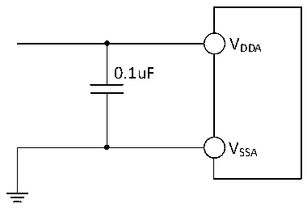

<!-- source-page: 59 -->

[← p.58](0058.md) · [index](../README.md) · [PDF p.59](https://ch32-riscv-ug.github.io/CH32L103/datasheet_en/CH32L103DS0.PDF#page=59) · [p.60 →](0060.md)

<!-- header: CH32L103 Datasheet https://wch-ic.com -->
the pads and PCB layout. Larger values of Cp will reduce the conversion accuracy and the solution is to reduce  
the fADC value.  

Figure 3-13 Analog power supply and decoupling circuit reference  
 <!-- rendered from the PDF; verify at https://ch32-riscv-ug.github.io/CH32L103/datasheet_en/CH32L103DS0.PDF#page=59 -->

🖼 Text parsed from the figure above

VDDA  
0.1uF  
VSSA  

### 3.3.18 TS Characteristics

<!-- p59-table-001 (table-3-32@1) -->
<table><caption>Table 3-32 TS characteristics</caption><tr><th>Symbol</th><th>Parameter</th><th>Condition</th><th>Min.</th><th>Typ.</th><th>Max.</th><th>Unit</th></tr><tr><td style="text-align:left">RTS</td><td>Temperature sensor measurement range</td><td></td><td>-40</td><td></td><td>85</td><td></td></tr><tr><td style="text-align:left">ATSC</td><td style="text-align:left">Measurement error of temperature sensors</td><td></td><td></td><td>±12</td><td></td><td></td></tr><tr><td>Avg_Slope</td><td style="text-align:left">Average slope (negative temperature coefficient)</td><td></td><td>3.7</td><td>4.2</td><td>4.7</td><td>mV/℃</td></tr><tr><td style="text-align:left">V25</td><td>Voltage at 25°C</td><td></td><td>1.4</td><td>1.45</td><td>1.5</td><td>V</td></tr><tr><td style="text-align:left">TS_temp</td><td style="text-align:left">ADC sampling time when reading temperature</td><td style="text-align:left">f = 14MHz ADC</td><td></td><td></td><td>20</td><td>us</td></tr></table>

### 3.3.19 OPA Characteristics

<!-- p59-table-002 (table-3-33-1@1) pages 59-60 -->
<table><caption>Table 3-33-1 OPA characteristics</caption><tr><th>Symbol</th><th>Parameter</th><th>Condition</th><th>Min.</th><th>Typ.</th><th>Max.</th><th>Unit</th></tr><tr><td style="text-align:left">VDDA</td><td>Supply voltage</td><td style="text-align:left">Recommended not less than 2.4V</td><td>1.8</td><td>3.3</td><td>3.6</td><td>V</td></tr><tr><td style="text-align:left">VCM</td><td style="text-align:left">Common mode input voltage</td><td></td><td>0</td><td></td><td style="text-align:left">VDDA</td><td>V</td></tr><tr><td style="text-align:left">VIOFFSET0</td><td>Input offset voltage</td><td>Before calibration</td><td></td><td>±2</td><td>±8</td><td>mV</td></tr><tr><td style="text-align:left">VIOFFSET</td><td>Input offset voltage</td><td>After calibration</td><td></td><td>±0.2</td><td>±0.8</td><td>mV</td></tr><tr><td style="text-align:left">ILOAD</td><td>Drive current</td><td style="text-align:left">R = 4kΩLOAD</td><td></td><td></td><td>900</td><td>uA</td></tr><tr><td style="text-align:left">ILOAD_PGA</td><td>PGA mode drive current</td><td></td><td></td><td></td><td>500</td><td>uA</td></tr><tr><td style="text-align:left">IDDOPAMP</td><td>Current consumption</td><td>No load, static mode</td><td></td><td>220</td><td></td><td>uA</td></tr><tr><td style="text-align:left">C (1) MRR</td><td style="text-align:left">Common mode rejection ratio</td><td>@1kHz</td><td></td><td>96</td><td></td><td>dB</td></tr><tr><td style="text-align:left">P (1) SRR</td><td style="text-align:left">Power supply rejection ratio</td><td>@1kHz</td><td></td><td>82</td><td></td><td>dB</td></tr><tr><td>Av(1)</td><td>Open loop gain</td><td style="text-align:left">C = 5pFLOAD</td><td></td><td>115</td><td></td><td>dB</td></tr><tr><td style="text-align:left">G (1) BW</td><td>Unit gain bandwidth</td><td style="text-align:left">C = 5pFLOAD</td><td></td><td>9</td><td></td><td>MHz</td></tr><tr><td style="text-align:left">P (1) M</td><td>Phase margin</td><td style="text-align:left">C = 5pFLOAD</td><td></td><td>75</td><td></td><td></td></tr><tr><td style="text-align:left">S (1) R</td><td>Slew rate limited</td><td style="text-align:left">C = 5pFLOAD</td><td></td><td>5</td><td></td><td>V/us</td></tr><tr><td style="text-align:left">t (1) WAKUP</td><td style="text-align:left">Setup time from shutdown to wake up, 0.1%</td><td style="text-align:left">Input V /2, DDA C = 50pF, LOAD R = 4kΩLOAD</td><td></td><td></td><td>0.8</td><td>us</td></tr><tr><td style="text-align:left">RLOAD</td><td>Resistive load</td><td></td><td>4</td><td></td><td></td><td>kΩ</td></tr><tr><td style="text-align:left">CLOAD</td><td>Capacitive load</td><td></td><td></td><td></td><td>40</td><td>pF</td></tr><tr><td rowspan="2" style="text-align:left">V (2) OHSAT</td><td rowspan="2" style="text-align:left">High saturation output voltage</td><td style="text-align:left">R = 4kΩLOAD</td><td style="text-align:left">V -25DDA0</td><td style="text-align:left">V -150DDA</td><td></td><td rowspan="2">mV</td></tr><tr><td style="text-align:left">R = 20kΩLOAD</td><td style="text-align:left">V -50DDA</td><td style="text-align:left">V -30DDA</td><td></td></tr><tr><td rowspan="2" style="text-align:left">V (2) OLSAT</td><td rowspan="2" style="text-align:left">Low saturation output voltage</td><td style="text-align:left">R = 4kΩLOAD</td><td></td><td>3</td><td>10</td><td rowspan="2">mV</td></tr><tr><td style="text-align:left">R = 20kΩLOAD</td><td></td><td>3</td><td>10</td></tr><tr><td rowspan="5" style="text-align:left">PGAGain(1)</td><td style="text-align:left">NSEL=010b mode in phase</td><td style="text-align:left">Gain = 32, PB10 = VSS</td><td>-3</td><td></td><td>3</td><td>%</td></tr><tr><td rowspan="4">Internal in-phase PGA</td><td style="text-align:left">Gain = 8， V &lt;(V /7) INP DDA</td><td>-1</td><td></td><td>1</td><td>%</td></tr><tr><td style="text-align:left">Gain = 16， V &lt;(V /15) INP DDA</td><td>-1</td><td></td><td>1</td><td>%</td></tr><tr><td style="text-align:left">Gain = 32， V &lt;(V /31) INP DDA</td><td>-1</td><td></td><td>1</td><td>%</td></tr><tr><td style="text-align:left">Gain = 64， V &lt;(V /63) INP DDA</td><td>-1</td><td></td><td>1</td><td>%</td></tr><tr><td>Delta R</td><td style="text-align:left">Absolute change in resistance</td><td></td><td>-15</td><td></td><td>15</td><td>%</td></tr><tr><td rowspan="2">eN(1)</td><td rowspan="2" style="text-align:left">Equivalent input voltage noise</td><td style="text-align:left">R = 4kΩ@1kHz LOAD</td><td></td><td>100</td><td></td><td rowspan="2" style="text-align:left">nV/ sqrt(Hz)</td></tr><tr><td style="text-align:left">R = LOAD20kΩ@1KHz</td><td></td><td>60</td><td></td></tr></table>

<!-- image: p59-draw-image-00001 bbox=[515.88, 783.6, 535.32, 793.8] -->
<!-- footer: V2.1 56 -->
