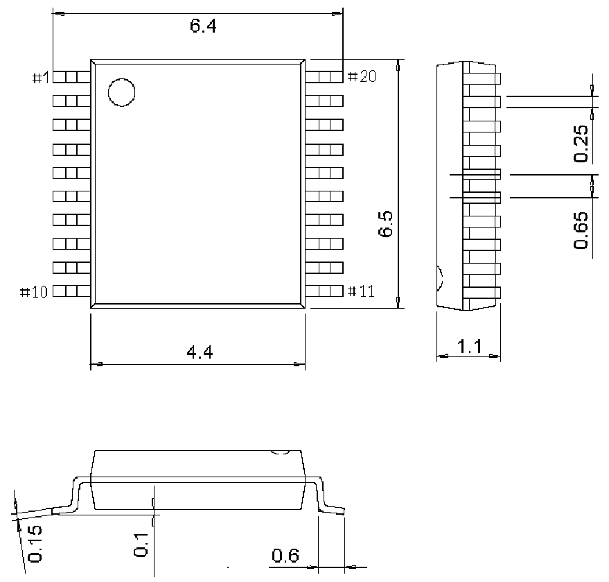

<!-- source-page: 68 -->

[← p.67](0067.md) · [index](../README.md) · [PDF p.68](https://ch32-riscv-ug.github.io/CH32L103/datasheet_en/CH32L103DS0.PDF#page=68) · [p.69 →](0069.md)

<!-- header: CH32L103 Datasheet https://wch-ic.com -->

## 4.5 TSSOP20 package

 <!-- p68-draw-image-00002 rendered from the PDF -->

<!-- image: p68-draw-image-00001 bbox=[515.88, 783.6, 535.32, 793.8] -->
<!-- footer: V2.1 65 -->
