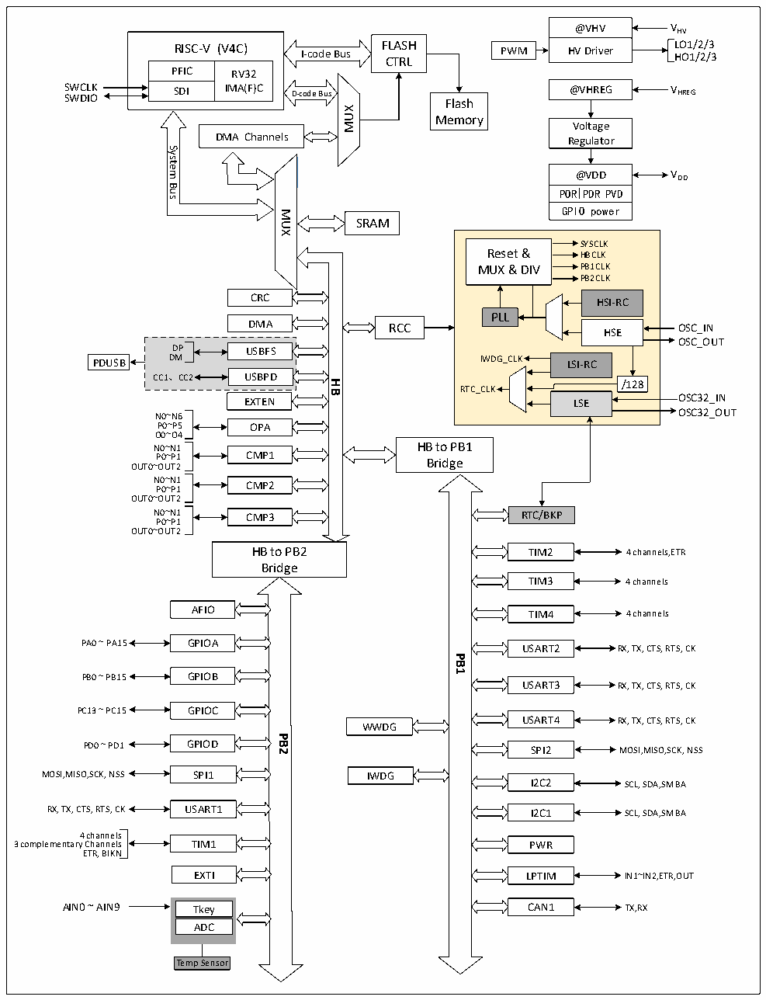

<!-- source-page: 4 -->

[← p.3](0003.md) · [index](../README.md) · [PDF p.4](https://ch32-riscv-ug.github.io/CH32L103/datasheet_zh/CH32L103DS0.PDF#page=4) · [p.5 →](0005.md)

<!-- header: CH32L103/M103数据手册 https://wch.cn -->

图1-1-2 CH32M103G8R6系统框图  
 <!-- rendered from the PDF; verify at https://ch32-riscv-ug.github.io/CH32L103/datasheet_zh/CH32L103DS0.PDF#page=4 -->

🖼 Text parsed from the figure above

@VHV  HV Driver  
RISC-V (V4C)  PFIC  RV32IMA(F)C  SDI  
<!-- image: p4-draw-image-00003 inside the figure -->
RISC-V (V4C) FLASH CTRL  
I-code Bus  
SWCLK SWDIO  
@VHREG VHREG  
D-code Bus  
Flash  
MUX  
Memory  
Voltage  
DMA Channels  
Regulator  
System  
<!-- image: p4-draw-image-00002 inside the figure -->
@VDD  POR  PDR  PVD  GPIO power  
Bus  
MUX  
SRAM  
SYSCLK  
Reset &amp; HBCLK  
MUX &amp; DIV PB1CLK  
PB2CLK  
CRC  
HSI-RC  
PLL  
DMA RCC  
HSE OSC_IN  
DP USBFSDM CC1、CC2 USBPD  
OSC_OUT  
DM IWDG_CLK LSI-RC  
PDUSB  
<strong>HB</strong>  
/128  
RTC_CLK  
OSC32_IN LSE  
EXTEN  
N0~N6 OSC32_OUT  
P0~P5  
OPA  
O0~O4  
HB to PB1  
N0~N1  
P0~P1 CMP1  
Bridge  
OUT0~OUT2  
N0~N1 CMP2  
P0~P1  
OUT0~OUT2  
N0~N1 CMP3 RTC/BKP  
P0~P1  
OUT0~OUT2  
HB to PB2  
TIM2  
4 channels,ETR  
Bridge  
TIM3  
4 channels  
AFIO 4 channels  
TIM4  
PA0 ~ PA15 GPIOA RX, TX, CTS, RTS, CK  
USART2  
<strong>PB1</strong>  
PB0 ~ PB15 GPIOB  
USART3  
RX, TX, CTS, RTS, CK  
PC13 ~ PC15 GPIOC  
USART4  
RX, TX, CTS, RTS, CK  
WWDG  
<strong>PB2</strong>  
PD0 ~ PD1 GPIOD MOSI,MISO,SCK, NSS  
SPI2  
MOSI,MISO,SCK, NSS SPI1  
IWDG  
I2C2  
SCL, SDA,SMBA  
RX, TX, CTS, RTS, CK USART1 SCL, SDA,SMBA  
I2C1  
4 channels  
3 complementary Channels TIM1  
PWR  
ETR, BIKN  
EXTI IN1~IN2,ETR,OUT  
LPTIM  
AIN0 ~ AIN9 Tkey TX,RX  
CAN1  
ADC  
Temp Sensor  

<!-- image: p4-draw-image-00001 bbox=[496.32, 779.28, 515.76, 789.6] -->
<!-- footer: V2.1 2 -->
