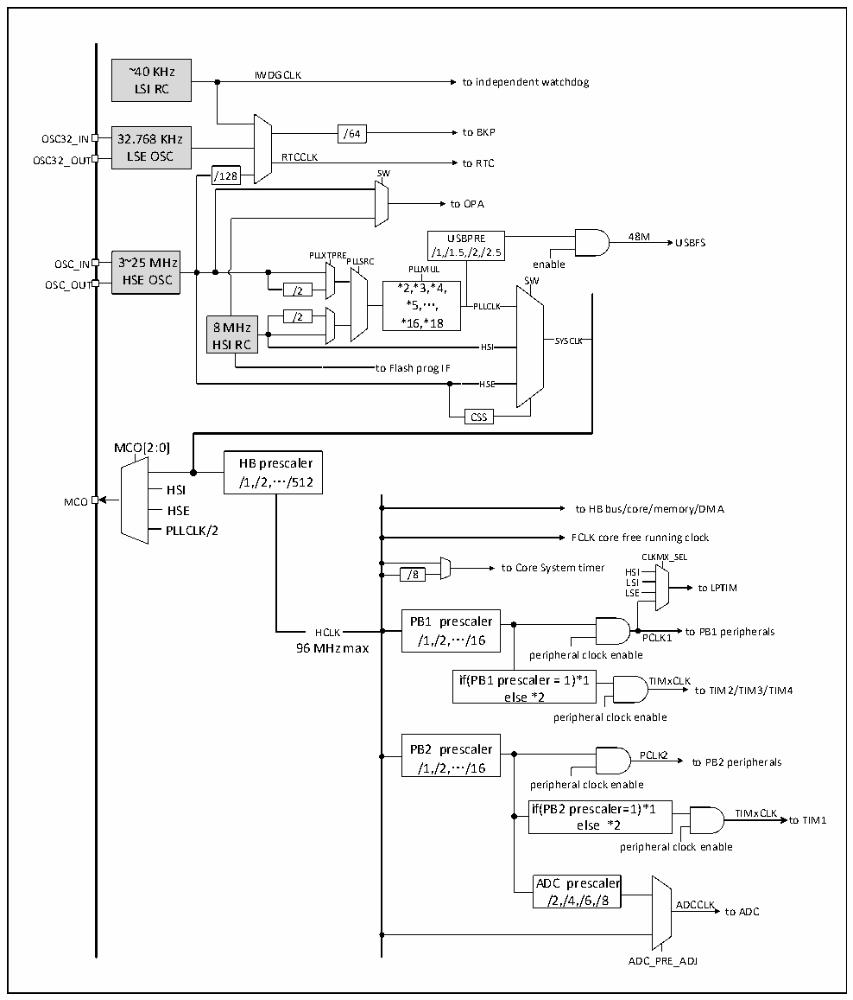

<!-- source-page: 6 -->

[← p.5](0005.md) · [index](../README.md) · [PDF p.6](https://ch32-riscv-ug.github.io/CH32L103/datasheet_zh/CH32L103DS0.PDF#page=6) · [p.7 →](0007.md)

<!-- header: CH32L103/M103数据手册 https://wch.cn -->

## 1.3 时钟树

系统中引入4组时钟源：内部高频RC振荡器（HSI）、内部低频RC振荡器(LSI)、外接高频振荡器  
(HSE)、外接低频振荡器(LSE)。其中，低频时钟源为RTC和独立看门狗提供了时钟基准。高频时钟源  
直接或者间接通过PLL倍频后输出为系统总线时钟（SYSCLK），系统时钟再由各预分频器提供了HB域、  
PB1域、PB2域外设控制时钟及采样或接口输出时钟，部分模块工作需要由PLL时钟直接提供。  

图1-3 时钟树框图  
 <!-- rendered from the PDF; verify at https://ch32-riscv-ug.github.io/CH32L103/datasheet_zh/CH32L103DS0.PDF#page=6 -->

🖼 Text parsed from the figure above

~40 KHz IWDGCLK  
to independent watchdog  
LSI RC  
32.768 KHz LSE OSC  
OSC32_IN 32.768 KHz /64 to BKP  
OSC32_OUT LSE OSC RTCCLK to RTC  
/128 SW  
to OPA  
USBPRE 48M USBFS  
OSC_IN 3~25 MHz PLLXTPRE PLLSRC /1,/1.5,/2,/2.5 enable  
3~25 MHz HSE OSC  
PLLMUL  
OSC_OUT HSE OSC /2 *2,*3,*4, SW  
*5,…, *16,*18  PLLCLK  
/2  
8 MHz *16,*18  
HSI RC HSI SYSCLK  
to Flash prog IF  
HSE  HSE  
CSS  
MCO[2:0]  
HB prescaler  
/1,/2,…/512  
HSI  
MCO  
HSE to HB bus/core/memory/DMA  
PLLCLK/2  
FCLK core free running clock  
CLKMX_SEL  
/8 to Core System timer HSI  
L L S S E I to LPTIM  
PB1 prescaler  
HCLK /1,/2,…/16 PCLK1 to PB1 peripherals  
96MHz max  
peripheral clock enable  
if(PB1 prescaler = 1)*1 TIMxCLK  
to TIM2/TIM3/TIM4  
else *2  
peripheral clock enable  
PB2 prescaler  
PCLK2  
/1,/2,…/16 to PB2 peripherals  
peripheral clock enable  
if(PB2 prescaler=1)*1 TIMxCLK  
<!-- image: p6-draw-image-00002 inside the figure -->
<!-- image: p6-draw-image-00003 inside the figure -->
else *2 to TIM1  
peripheral clock enable  
ADC prescaler  
/2,/4,/6,/8 ADCCLK  
to ADC  
ADC_PRE_ADJ  

<!-- image: p6-draw-image-00001 bbox=[496.32, 779.28, 515.76, 789.6] -->
<!-- footer: V2.1 4 -->
