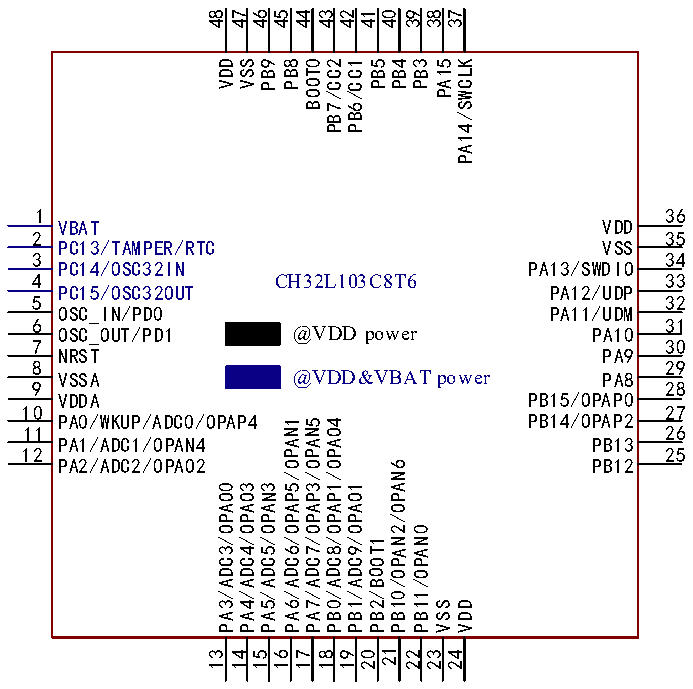
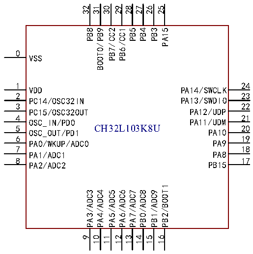

<!-- source-page: 13 -->

[← p.12](0012.md) · [index](../README.md) · [PDF p.13](https://ch32-riscv-ug.github.io/CH32L103/datasheet_zh/CH32L103DS0.PDF#page=13) · [p.14 →](0014.md)

<!-- header: CH32L103/M103数据手册 https://wch.cn -->

# 第 2 章 引脚信息

## 2.1 引脚排列

### 2.1.1 CH32L103引脚排列

 <!-- p13-cluster-01 uncaptioned graphics, rendered from the PDF; verify at https://ch32-riscv-ug.github.io/CH32L103/datasheet_zh/CH32L103DS0.PDF#page=13 -->

 <!-- p13-cluster-02 uncaptioned graphics, rendered from the PDF; verify at https://ch32-riscv-ug.github.io/CH32L103/datasheet_zh/CH32L103DS0.PDF#page=13 -->

🖼 Text parsed from the figure above

48 47 46 45 44 43 42 41 40 39 38 37  
VDD  
VSS  
PB9  
PB8  
BOOT0  
PB7/CC2  
PB6/CC1  
PB5  
PB4  
PB3  
PA15  
PA14/SWCLK  
1  
36  
VBAT VDD  
2  
35  
PC13/TAMPER/RTC VSS  
3  
34  
PC14/OSC32IN PA13/SWDIO  
4  
33  
CH32L103C8T6  
PC15/OSC32OUT PA12/UDP  
5  
32  
OSC_IN/PD0 PA11/UDM  
6  
31  
OSC_OUT/PD1 @VDD power PA10  
7  
30  
NRST PA9  
8  
29  
VSSA @VDD&amp;VBAT power PA8  
9  
28  
VDDA PB15/OPAP0  
10  
27  
PA0/WKUP/ADC0/OPAP4 PB14/OPAP2  
PA6/ADC6/OPAP5/OPAN1  
PA7/ADC7/OPAP3/OPAN5  
PB0/ADC8/OPAP1/OPAO4  
26  
11  
PA1/ADC1/OPAN4 PB13  
12  
25  
PA2/ADC2/OPAO2 PB12  
PB10/OPAN2/OPAN6  
PA3/ADC3/OPAO0  
PA4/ADC4/OPAO3  
PA5/ADC5/OPAN3  
PB1/ADC9/OPAO1  
PB11/OPAN0  
PB2/BOOT1  
VSS  
VDD  
16 17 18 19 20 21 22 23 24  
13 14 15  
32 31 30 29 28 27 26 25  
PB8  
BOOT0/PB9  
PB7/CC2  
PB6/CC1  
PB5  
PB4  
PB3  
PA15  
0  
VSS  
1  
24  
VDD PA14/SWCLK  
2  
23  
PC14/OSC32IN PA13/SWDIO  
3  
22  
PC15/OSC32OUT PA12/UDP  
4  
21  
OSC_IN/PD0 PA11/UDM  
5 CH32L103K8U  
20  
OSC_OUT/PD1 PA10  
6  
19  
PA0/WKUP/ADC0 PA9  
7  
18  
PA1/ADC1 PA8  
8 17  
PA2/ADC2 PB15  
PB2/BOOT1  
PA3/ADC3  
PA4/ADC4  
PA5/ADC5  
PA6/ADC6  
PA7/ADC7  
PB0/ADC8  
PB1/ADC9  
9  
10  
11  
12  
13  
14  
15  
16  

<!-- image: p13-draw-image-00001 bbox=[500.88, 779.28, 520.32, 789.6] -->
<!-- footer: V2.1 11 -->
