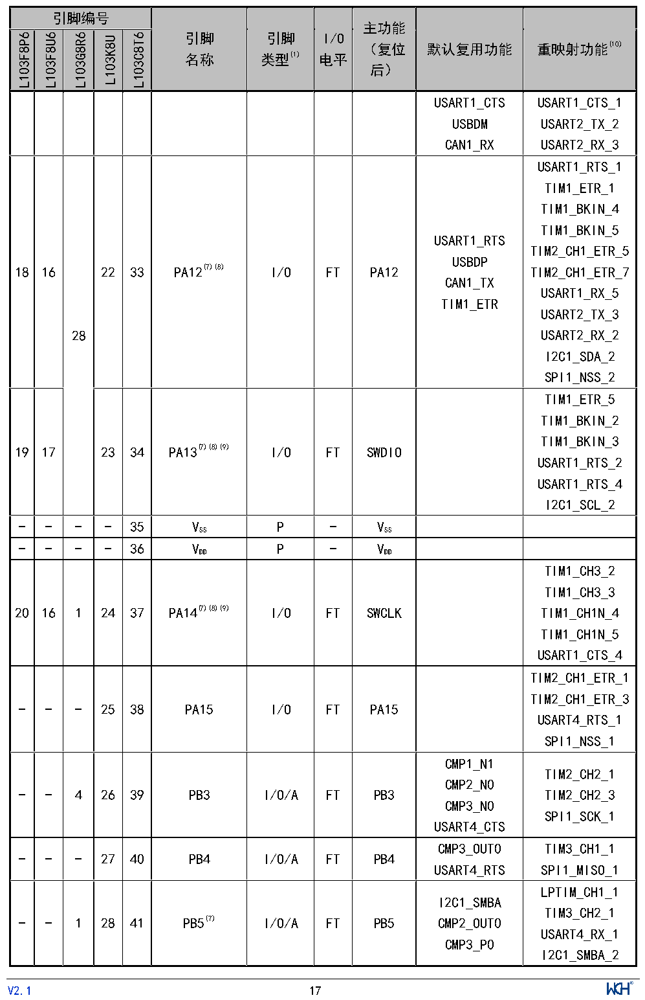

<!-- source-page: 19 -->

[← p.18](0018.md) · [index](../README.md) · [PDF p.19](https://ch32-riscv-ug.github.io/CH32L103/datasheet_zh/CH32L103DS0.PDF#page=19) · [p.20 →](0020.md)

<!-- header: CH32L103/M103数据手册 https://wch.cn -->

 <!-- p19-cluster-01 uncaptioned graphics, rendered from the PDF; verify at https://ch32-riscv-ug.github.io/CH32L103/datasheet_zh/CH32L103DS0.PDF#page=19 -->

🖼 Text parsed from the figure above

> ⬆ **Table continued** — rendered in full at [page 16](0016.md). <!-- p19-table-001 -->

<!-- image: p19-draw-image-00001 inside the figure -->
<!-- footer: V2.1 17 -->

