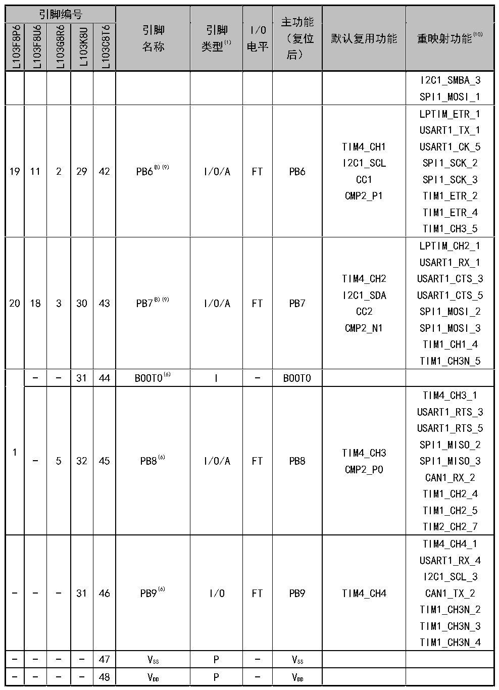

<!-- source-page: 20 -->

[← p.19](0019.md) · [index](../README.md) · [PDF p.20](https://ch32-riscv-ug.github.io/CH32L103/datasheet_zh/CH32L103DS0.PDF#page=20) · [p.21 →](0021.md)

<!-- header: CH32L103/M103数据手册 https://wch.cn -->

 <!-- p20-cluster-01 uncaptioned graphics, rendered from the PDF; verify at https://ch32-riscv-ug.github.io/CH32L103/datasheet_zh/CH32L103DS0.PDF#page=20 -->

🖼 Text parsed from the figure above

> ⬆ **Table continued** — rendered in full at [page 16](0016.md). <!-- p20-table-001 -->

注1：表格缩写解释  
I = TTL/CMOS 电平斯密特输入；O = CMOS 电平三态输出；  
A = 模拟信号输入或输出；P = 电源；FT = 耐受5V；  
注2：VDD 和VBAT 均可连接内部模拟开关为备份区域以及PC13、PC14和PC15引脚供电，这个模拟开关只能够  
<!-- image: p20-draw-image-00001 bbox=[500.88, 779.28, 520.32, 789.6] -->
<!-- footer: V2.1 18 -->
