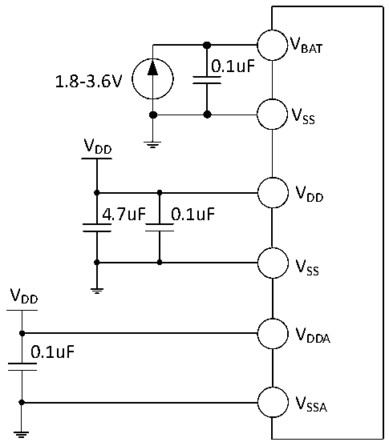

<!-- source-page: 30 -->

[← p.29](0029.md) · [index](../README.md) · [PDF p.30](https://ch32-riscv-ug.github.io/CH32L103/datasheet_zh/CH32L103DS0.PDF#page=30) · [p.31 →](0031.md)

<!-- header: CH32L103/M103数据手册 https://wch.cn -->

# 第 3 章 电气特性

## 3.1 测试条件

除非特殊说明和标注，所有电压都以Vss 为基准。  
所有最小值和最大值将在最坏的环境温度、供电电压和时钟频率条件下得到保证。  
CH32L103的典型数值是基于常温25℃、VDD= 3.3V环境下。  
CH32M103G8R6的典型数值是基于常温25℃、供电VHV= 15V和VHREG= 7V、产生VDD= 3.3V的环境  
用于设计指导。  
对于通过综合评估、设计模拟或工艺特性得到的数据，不会在生产线进行测试。在综合评估的基  
础上，最小和最大值是通过样本测试后统计得到。除非特殊说明为实测值，否则特性参数以综合评估  
或设计保证。  
供电方案：  

图3-1-1 CH32L103常规供电典型电路  
 <!-- rendered from the PDF; verify at https://ch32-riscv-ug.github.io/CH32L103/datasheet_zh/CH32L103DS0.PDF#page=30 -->

🖼 Text parsed from the figure above

VBAT  
0.1uF  
1.8-3.6V  
VSS  
VDD  
VDD  
4.7uF 0.1uF  
VSS  
VDD  
VDDA  
0.1uF  
VSSA  

<!-- image: p30-draw-image-00001 bbox=[502.8, 786.36, 522.24, 796.68] -->
<!-- footer: V2.1 28 -->
