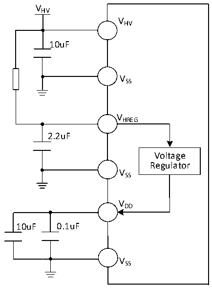

<!-- source-page: 31 -->

[← p.30](0030.md) · [index](../README.md) · [PDF p.31](https://ch32-riscv-ug.github.io/CH32L103/datasheet_zh/CH32L103DS0.PDF#page=31) · [p.32 →](0032.md)

<!-- header: CH32L103/M103数据手册 https://wch.cn -->

图3-1-2 CH32M103常规供电典型电路（图中电阻可选，用于分摊压降减少芯片发热）  
 <!-- rendered from the PDF; verify at https://ch32-riscv-ug.github.io/CH32L103/datasheet_zh/CH32L103DS0.PDF#page=31 -->

🖼 Text parsed from the figure above

VHV  
VHV  
10uF  
VSS  
VHREG  
2.2uF  
Voltage  
Regulator  
VSS  
VDD  
10uF 0.1uF  
VSS  

## 3.2 绝对最大值

临界或者超过绝对最大值将可能导致芯片工作不正常甚至损坏。  

<!-- p31-table-001 (table-3-1@1) pages 31-32 -->
<table><caption>表3-1 绝对最大值参数表</caption><tr><th>符号</th><th colspan="3">描述</th><th>最小值</th><th>最大值</th><th>单位</th></tr><tr><td rowspan="2" style="text-align:left">TA</td><td rowspan="2">工作时的环境温度</td><td colspan="2">型号末位为6的芯片</td><td>-40</td><td>85</td><td>℃</td></tr><tr><td colspan="2">型号末位为7的芯片</td><td>-40</td><td>105</td><td>℃</td></tr><tr><td style="text-align:left">TS</td><td colspan="3">存储时的环境温度</td><td>-40</td><td>125</td><td>℃</td></tr><tr><td rowspan="2" style="text-align:left">VDD</td><td colspan="2" style="text-align:left">外部主供电电压（包含V 和V ） DDA DD</td><td>CH32L103</td><td>-0.3</td><td>4.0</td><td>V</td></tr><tr><td colspan="2">内部电压调节器的输出电压</td><td>CH32M103G8R6</td><td>-0.3</td><td>4.0</td><td>V</td></tr><tr><td style="text-align:left">VHV</td><td colspan="2">高压电源和栅极驱动器的电源电压</td><td>CH32M103G8R6</td><td>-0.4</td><td>28</td><td>V</td></tr><tr><td style="text-align:left">VHREG</td><td colspan="2">内部电压调节器的输入电源电压</td><td>CH32M103G8R6</td><td>-0.4</td><td>28</td><td>V</td></tr><tr><td rowspan="2" style="text-align:left">VIN</td><td colspan="3">FT（耐受5V）引脚上的输入电压</td><td style="text-align:left">V -0.3SS</td><td>5.5</td><td>V</td></tr><tr><td colspan="3">其他引脚上的电压</td><td style="text-align:left">V -0.3SS</td><td style="text-align:left">V +0.3DD</td><td>V</td></tr><tr><td style="text-align:left">VHO</td><td colspan="2">高侧驱动器的输出电压</td><td>CH32M103G8R6</td><td>-0.4</td><td style="text-align:left">V +0.4HV</td><td>V</td></tr><tr><td style="text-align:left">VLO</td><td colspan="2">低侧驱动器的输出电压</td><td>CH32M103G8R6</td><td>-0.4</td><td style="text-align:left">V +0.4HV</td><td>V</td></tr><tr><td style="text-align:left">|△V | DD_x</td><td colspan="3" style="text-align:left">主供电引脚各V 之间的电压差DD</td><td></td><td>50</td><td>mV</td></tr><tr><td style="text-align:left">|△V | SS_x</td><td colspan="3">不同接地引脚之间的电压差</td><td></td><td>50</td><td>mV</td></tr><tr><td rowspan="3" style="text-align:left">VESD(HBM)</td><td colspan="3">普通I/O引脚的ESD静电放电电压（HBM）</td><td colspan="2">4K</td><td>V</td></tr><tr><td colspan="3">USB引脚的ESD静电放电电压（HBM）</td><td colspan="2">4K</td><td>V</td></tr><tr><td colspan="2">专用引脚的ESD静电放电电压（HBM）</td><td>CH32M103G8R6</td><td colspan="2">2K</td><td>V</td></tr><tr><td style="text-align:left">IAVVHV</td><td colspan="3" style="text-align:left">引脚连续输入电流HV</td><td></td><td>50</td><td>mA</td></tr><tr><td style="text-align:left">IVDD</td><td colspan="3" style="text-align:left">经过V /V 电源线的总电流（供应电流） DD DDA</td><td></td><td>150</td><td>mA</td></tr><tr><td style="text-align:left">IVss</td><td colspan="3" style="text-align:left">经过V 地线的总电流（流出电流） SS</td><td></td><td>150</td><td>mA</td></tr><tr><td rowspan="2" style="text-align:left">IIO</td><td colspan="3">任意I/O和控制引脚上的灌电流</td><td></td><td>25</td><td>mA</td></tr><tr><td colspan="3">任意I/O和控制引脚上的源电流</td><td></td><td>-25</td><td>mA</td></tr><tr><td rowspan="3" style="text-align:left">IINJ(PIN)</td><td colspan="3">NRST引脚注入电流</td><td></td><td>+/-5</td><td>mA</td></tr><tr><td colspan="3">HSE的OSC_IN引脚和LSE的OSC_IN引脚注入电流</td><td></td><td>+/-5</td><td>mA</td></tr><tr><td colspan="3">其他引脚的注入电流</td><td></td><td>+/-5</td><td>mA</td></tr><tr><td style="text-align:left">∑IINJ(PIN)</td><td colspan="3">所有IO和控制引脚的总注入电流</td><td></td><td>+/-25</td><td>mA</td></tr></table>

<!-- image: p31-draw-image-00001 bbox=[502.8, 786.36, 522.24, 796.68] -->
<!-- footer: V2.1 29 -->
