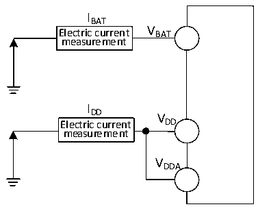

<!-- source-page: 34 -->

[← p.33](0033.md) · [index](../README.md) · [PDF p.34](https://ch32-riscv-ug.github.io/CH32L103/datasheet_zh/CH32L103DS0.PDF#page=34) · [p.35 →](0035.md)

<!-- header: CH32L103/M103数据手册 https://wch.cn -->

图3-2-1 CH32L103电流消耗测量  
 <!-- rendered from the PDF; verify at https://ch32-riscv-ug.github.io/CH32L103/datasheet_zh/CH32L103DS0.PDF#page=34 -->

🖼 Text parsed from the figure above

IBAT  
Electric current V BAT  
measurement  
I  
DD V  
Electric current DD  
measurement  
VDDA  

图3-2-2 CH32M103G8R6电流消耗测量  
 <!-- rendered from the PDF; verify at https://ch32-riscv-ug.github.io/CH32L103/datasheet_zh/CH32L103DS0.PDF#page=34 -->

🖼 Text parsed from the figure above

IHV  
Electric current V HV  
measurement  
IHREG  
V  
Electric current HREG  
measurement  
VDD  

CH32L103处于下列条件：  
常温VDD= 3.3V情况下，测试时：R16_PORT_CC1的位CC1_PD和R16_PORT_CC2的位CC2_PD均 = 0，  
所有I/O引脚配置为下拉输入，运行于高速内部RC振荡器HSI，HSI = 8M，FPLCK1= FHCLK/2，FPLCK2= FHCLK，  
使能或关闭所有外设时钟的功耗。  
CH32M103G8R6处于下列条件：  
VHV= 15V、VHREG= 7V、VDD= 3.3V情况下，测试时：R16_PORT_CC1的位CC1_PD和R16_PORT_CC2  
的位 CC2_PD 均 = 0，所有 I/O 引脚配置为下拉输入，运行于高速内部 RC 振荡器 HSI，HSI = 8M，  
FPLCK1=FHCLK/2，FPLCK2= FHCLK，使能或关闭所有外设时钟的功耗。  
注：小封装型号未封装出的引脚或者已封装出来但未使用的引脚，建议配置为上拉输入或者下拉输入，  
否则可能影响电流指标，具体操作请参考EVT低功耗例程。  

<!-- p34-table-001 (table-3-6@1) pages 34-35 -->
<table><caption>表3-6 数据处理代码从FLASH中运行，设置LDOTRIM[1:0]=10、LDO_EC=0</caption><tr><th rowspan="2">符号</th><th rowspan="2">参数</th><th colspan="3">条件</th><th colspan="2">典型值</th><th rowspan="2">单位</th></tr><tr><td>HSILP</td><td>PLLON</td><td style="text-align:left">FHCLK</td><td>使能所有外设</td><td>关闭所有外设</td></tr><tr><td rowspan="4" style="text-align:left">I (1)(2) DD</td><td rowspan="4" style="text-align:left">运行模式下的供应电流</td><td>0</td><td>1</td><td>96MHz</td><td>7.46</td><td>4.70</td><td rowspan="4">mA</td></tr><tr><td>0</td><td>1</td><td>48MHz</td><td>5.13</td><td>3.77</td></tr><tr><td>0</td><td>1</td><td>8MHz</td><td>2.23</td><td>1.95</td></tr><tr><td>0</td><td>1</td><td>1MHz</td><td>1.46</td><td>1.43</td></tr><tr><td rowspan="12"></td><td rowspan="4"></td><td>1</td><td>1</td><td>1MHz</td><td>1.27</td><td>1.24</td><td rowspan="4"></td></tr><tr><td>0</td><td>0</td><td>8MHz</td><td>2.14</td><td>1.87</td></tr><tr><td>0</td><td>0</td><td>1MHz</td><td>1.37</td><td>1.34</td></tr><tr><td>1</td><td>0</td><td>1MHz</td><td>1.19</td><td>1.17</td></tr><tr><td rowspan="8" style="text-align:left">睡眠模式下的供应电流（此时外设供电和时钟保持）</td><td>0</td><td>1</td><td>96MHz</td><td>5.58</td><td>2.82</td><td rowspan="8">mA</td></tr><tr><td>0</td><td>1</td><td>48MHz</td><td>3.52</td><td>2.14</td></tr><tr><td>0</td><td>1</td><td>8MHz</td><td>1.74</td><td>1.47</td></tr><tr><td>0</td><td>1</td><td>1MHz</td><td>1.40</td><td>1.37</td></tr><tr><td>1</td><td>1</td><td>1MHz</td><td>1.21</td><td>1.18</td></tr><tr><td>0</td><td>0</td><td>8MHz</td><td>1.65</td><td>1.38</td></tr><tr><td>0</td><td>0</td><td>1MHz</td><td>1.31</td><td>1.28</td></tr><tr><td>1</td><td>0</td><td>1MHz</td><td>1.13</td><td>1.10</td></tr></table>

<!-- image: p34-draw-image-00001 bbox=[502.8, 786.36, 522.24, 796.68] -->
<!-- footer: V2.1 32 -->
