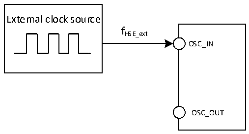
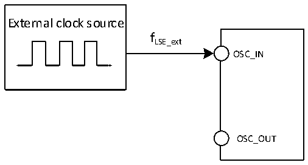

<!-- source-page: 39 -->

[← p.38](0038.md) · [index](../README.md) · [PDF p.39](https://ch32-riscv-ug.github.io/CH32L103/datasheet_zh/CH32L103DS0.PDF#page=39) · [p.40 →](0040.md)

<!-- header: CH32L103/M103数据手册 https://wch.cn -->

> ⬆ **Table continued** — rendered in full at [page 38](0038.md). <!-- p39-table-001 -->

注1：不满足此条件可能会引起电平识别错误。  

图3-3 外部提供高频时钟源电路  
 <!-- rendered from the PDF; verify at https://ch32-riscv-ug.github.io/CH32L103/datasheet_zh/CH32L103DS0.PDF#page=39 -->

🖼 Text parsed from the figure above

External clock source  
fHSE_ext  
OSC_IN  
OSC_OUT  

<!-- p39-table-002 (table-3-11@1) -->
<table><caption>表3-11 来自外部低速时钟</caption><tr><th>符号</th><th>参数</th><th>条件</th><th>最小值</th><th>典型值</th><th>最大值</th><th>单位</th></tr><tr><td style="text-align:left">FLSE_ext</td><td>用户外部时钟频率</td><td></td><td></td><td>32.768</td><td>1000</td><td>KHz</td></tr><tr><td style="text-align:left">VLSEH</td><td>OSC32_IN输入引脚高电平电压</td><td></td><td style="text-align:left">0.8VDD</td><td></td><td style="text-align:left">VDD</td><td>V</td></tr><tr><td style="text-align:left">VLSEL</td><td>OSC32_IN输入引脚低电平电压</td><td></td><td>0</td><td></td><td style="text-align:left">0.2VDD</td><td>V</td></tr><tr><td style="text-align:left">C in(LSE)</td><td>OSC32_IN输入电容</td><td></td><td></td><td>5</td><td></td><td>pF</td></tr><tr><td style="text-align:left">DuCy LSE</td><td>占空比(Duty cycle)</td><td></td><td></td><td>50</td><td></td><td>%</td></tr><tr><td style="text-align:left">IL</td><td>OSC32_IN输入漏电流</td><td></td><td></td><td></td><td>±1</td><td>uA</td></tr></table>

图3-4 外部提供低频时钟源电路  
 <!-- rendered from the PDF; verify at https://ch32-riscv-ug.github.io/CH32L103/datasheet_zh/CH32L103DS0.PDF#page=39 -->

🖼 Text parsed from the figure above

External clock source  
fLSE_ext  
OSC_IN  
OSC_OUT  

<!-- p39-table-003 (table-3-12@1) pages 39-40 -->
<table><caption>表3-12 使用一个晶体/陶瓷谐振器产生的高速外部时钟</caption><tr><th>符号</th><th>参数</th><th>条件</th><th>最小值</th><th>典型值</th><th>最大值</th><th>单位</th></tr><tr><td style="text-align:left">FOSC_IN</td><td>谐振器频率</td><td></td><td>3</td><td>8</td><td>25</td><td>MHz</td></tr><tr><td style="text-align:left">RF</td><td>反馈电阻</td><td></td><td></td><td>250</td><td></td><td>kΩ</td></tr><tr><td>C</td><td style="text-align:left">建议的负载电容与对应晶体串行阻抗RS</td><td style="text-align:left">R = 60Ω(1) S</td><td></td><td>20</td><td></td><td>pF</td></tr><tr><td rowspan="2" style="text-align:left">I2</td><td rowspan="2">HSE驱动电流</td><td style="text-align:left">V = 3.3V，20p负载DD</td><td></td><td>1</td><td></td><td>mA</td></tr><tr><td style="text-align:left">低功耗模式，V = 3.3V， DD20p负载</td><td></td><td>0.55</td><td></td><td>mA</td></tr><tr><td style="text-align:left">g m</td><td>振荡器的跨导</td><td>启动</td><td></td><td>21</td><td></td><td>mA/V</td></tr><tr><td style="text-align:left">t SU(HSE)</td><td>启动时间</td><td style="text-align:left">V 稳定，8M晶体DD</td><td></td><td>1.5(2)</td><td></td><td>ms</td></tr></table>

<!-- image: p39-draw-image-00001 bbox=[502.8, 786.36, 522.24, 796.68] -->
<!-- footer: V2.1 37 -->
