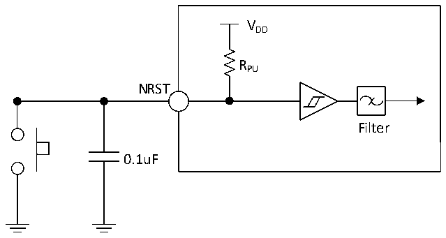

<!-- source-page: 43 -->

[← p.42](0042.md) · [index](../README.md) · [PDF p.43](https://ch32-riscv-ug.github.io/CH32L103/datasheet_zh/CH32L103DS0.PDF#page=43) · [p.44 →](0044.md)

<!-- header: CH32L103/M103数据手册 https://wch.cn -->

> ⬆ **Table continued** — rendered in full at [page 42](0042.md). <!-- p43-table-001 -->

### 3.3.11 NRST引脚特性

<!-- p43-table-002 (table-3-23@1) -->
<table><caption>表3-23 外部复位引脚特性</caption><tr><th>符号</th><th>参数</th><th>条件</th><th>最小值</th><th>典型值</th><th>最大值</th><th>单位</th></tr><tr><td style="text-align:left">VIL(NRST)</td><td>NRST输入低电平电压</td><td></td><td>-0.3</td><td></td><td style="text-align:left">0.28*(V -1.8)+0.6DD</td><td>V</td></tr><tr><td style="text-align:left">VIH(NRST)</td><td>NRST输入高电平电压</td><td></td><td style="text-align:left">0.41*(V -1.8)+1.3DD</td><td></td><td style="text-align:left">V +0.3DD</td><td>V</td></tr><tr><td style="text-align:left">V hys(NRST)</td><td style="text-align:left">NRST施密特触发器电压迟滞</td><td></td><td>150</td><td></td><td></td><td>mV</td></tr><tr><td style="text-align:left">R (1) PU</td><td>上拉等效电阻</td><td></td><td>30</td><td>40</td><td>50</td><td>kΩ</td></tr><tr><td style="text-align:left">VF(NRST)</td><td>NRST输入可被滤波脉宽</td><td></td><td></td><td></td><td>100</td><td>ns</td></tr><tr><td style="text-align:left">VNF(NRST)</td><td>NRST输入无法滤波脉宽</td><td></td><td>300</td><td></td><td></td><td>ns</td></tr></table>

注：1.上拉电阻是一个真正的电阻串联一个可开关的PMOS实现。这个PMOS/NMOS开关的电阻很小(约  
占10%)。  
电路参考设计及要求：  

图3-7 外部复位引脚典型电路  
 <!-- rendered from the PDF; verify at https://ch32-riscv-ug.github.io/CH32L103/datasheet_zh/CH32L103DS0.PDF#page=43 -->

🖼 Text parsed from the figure above

VDD  
RPU  
NRST  
Filter  
0.1uF  

注：图中的电容是可选的，可以用于滤除按键抖动。  
<!-- image: p43-draw-image-00001 bbox=[502.8, 786.36, 522.24, 796.68] -->
<!-- footer: V2.1 41 -->
