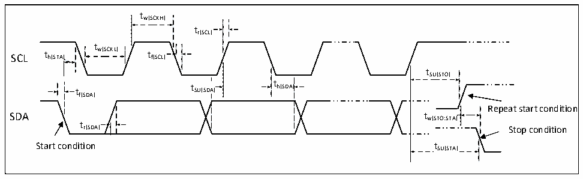

<!-- source-page: 44 -->

[← p.43](0043.md) · [index](../README.md) · [PDF p.44](https://ch32-riscv-ug.github.io/CH32L103/datasheet_zh/CH32L103DS0.PDF#page=44) · [p.45 →](0045.md)

<!-- header: CH32L103/M103数据手册 https://wch.cn -->

### 3.3.12 USB PD接口特性

<!-- p44-table-001 (table-3-24-1@1) -->
<table><caption>表3-24-1 PD接口I/O特性</caption><tr><th>符号</th><th>参数</th><th>条件</th><th>最小值</th><th>典型值</th><th>最大值</th><th>单位</th></tr><tr><td style="text-align:left">t Rise</td><td>上升时间</td><td style="text-align:left">幅度10%到90%之间的时间， 最小值为无负载条件下的时间。</td><td>240</td><td>400</td><td></td><td>ns</td></tr><tr><td style="text-align:left">t Fall</td><td>下降时间</td><td style="text-align:left">幅度10%到90%之间的时间， 最小值为无负载条件下的时间。</td><td>240</td><td>400</td><td></td><td>ns</td></tr><tr><td style="text-align:left">VSwing</td><td style="text-align:left">输出电压摆幅 （峰-峰值）</td><td></td><td>1.04</td><td>1.12</td><td>1.20</td><td>V</td></tr><tr><td style="text-align:left">ZDriver</td><td>输出阻抗</td><td></td><td>26</td><td></td><td>90</td><td>Ω</td></tr></table>

<!-- p44-table-002 (table-3-24-2@1) -->
<table><caption>表3-24-2 Type-C I/O端口特性</caption><tr><th>符号</th><th>参数</th><th>条件</th><th>最小值</th><th>典型值</th><th>最大值</th><th>单位</th></tr><tr><td rowspan="3" style="text-align:left">I pu</td><td rowspan="3">上拉电流</td><td rowspan="3" style="text-align:left">PAD &lt; V -0.6VDD</td><td></td><td>80</td><td></td><td>uA</td></tr><tr><td></td><td>180</td><td></td><td>uA</td></tr><tr><td></td><td>330</td><td></td><td>uA</td></tr><tr><td>Rd</td><td>下拉电阻</td><td style="text-align:left">V ≥ 1.6V或外部上拉330uADD</td><td>4.08</td><td>5.1</td><td>6.12</td><td>kΩ</td></tr></table>

### 3.3.13 TIM定时器特性

<!-- p44-table-003 (table-3-25@1) -->
<table><caption>表3-25 TIMx特性</caption><tr><th>符号</th><th>参数</th><th>条件</th><th>最小值</th><th>最大值</th><th>单位</th></tr><tr><td rowspan="2" style="text-align:left">t res(TIM)</td><td rowspan="2">定时器基准时钟</td><td></td><td>1</td><td></td><td style="text-align:left">t TIMxCLK</td></tr><tr><td style="text-align:left">f = 48MHz TIMxCLK</td><td>20.8</td><td></td><td>ns</td></tr><tr><td rowspan="2" style="text-align:left">FEXT</td><td rowspan="2">CH1至CH4的定时器外部时钟频率</td><td></td><td>0</td><td style="text-align:left">f /2TIMxCLK</td><td>MHz</td></tr><tr><td style="text-align:left">f = 48MHz TIMxCLK</td><td>0</td><td>24</td><td>MHz</td></tr><tr><td style="text-align:left">R esTIM</td><td>定时器分辨率</td><td></td><td></td><td>16</td><td>位</td></tr><tr><td rowspan="2" style="text-align:left">t COUNTER</td><td rowspan="2" style="text-align:left">当选择了内部时钟时，16 位计数器时钟周期</td><td></td><td>1</td><td>65536</td><td style="text-align:left">t TIMxCLK</td></tr><tr><td style="text-align:left">f = 48MHz TIMxCLK</td><td>0.02</td><td>1363</td><td>us</td></tr><tr><td rowspan="2" style="text-align:left">t MAX_COUNT</td><td rowspan="2">最大可能的计数</td><td></td><td></td><td>65535</td><td style="text-align:left">t TIMxCLK</td></tr><tr><td style="text-align:left">f = 48MHz TIMxCLK</td><td></td><td>1363</td><td>us</td></tr></table>

### 3.3.14 I2C接口特性

图3-8 I2C总线时序图  
 <!-- rendered from the PDF; verify at https://ch32-riscv-ug.github.io/CH32L103/datasheet_zh/CH32L103DS0.PDF#page=44 -->

🖼 Text parsed from the figure above

tw(SCKH)  
tr(SCL)  
t  
SCL t h(STA) w(SCKL) t f(SCL)  
tSU(STO)  
t t SU(SDA) t h(SDA)  
th(SDA)  
f(SDA)  
Repeat start condition  
t  
r(SDA) Stop condition  
Start condition tSU(STA)  

<!-- image: p44-draw-image-00001 bbox=[502.8, 786.36, 522.24, 796.68] -->
<!-- footer: V2.1 42 -->
