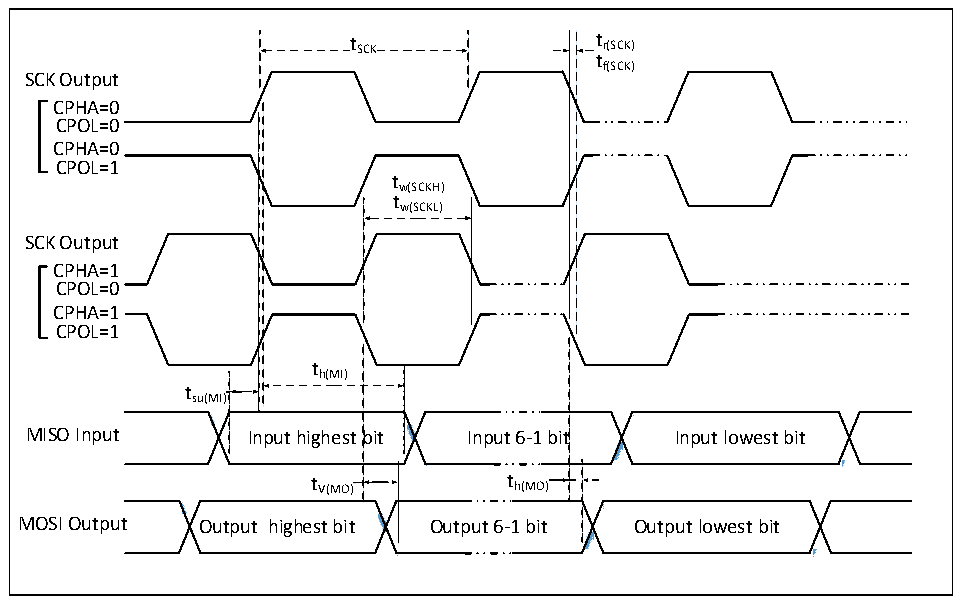

<!-- source-page: 45 -->

[← p.44](0044.md) · [index](../README.md) · [PDF p.45](https://ch32-riscv-ug.github.io/CH32L103/datasheet_zh/CH32L103DS0.PDF#page=45) · [p.46 →](0046.md)

<!-- header: CH32L103/M103数据手册 https://wch.cn -->

<!-- p45-table-001 (table-3-26@1) -->
<table><caption>表3-26 I2C接口特性</caption><tr><th rowspan="2">符号</th><th rowspan="2">参数</th><th colspan="2">标准I2C</th><th colspan="2">快速I2C</th><th rowspan="2">单位</th></tr><tr><td>最小值</td><td>最大值</td><td>最小值</td><td>最大值</td></tr><tr><td style="text-align:left">t w(SCKL)</td><td>SCL时钟低电平时间</td><td>4.7</td><td></td><td>1.2</td><td></td><td>us</td></tr><tr><td style="text-align:left">t w(SCKH)</td><td>SCL时钟高电平时间</td><td>4.0</td><td></td><td>0.6</td><td></td><td>us</td></tr><tr><td style="text-align:left">t SU(SDA)</td><td>SDA数据建立时间</td><td>250</td><td></td><td>100</td><td></td><td>ns</td></tr><tr><td style="text-align:left">t h(SDA)</td><td>SDA数据保持时间</td><td>0</td><td></td><td>0</td><td>900</td><td>ns</td></tr><tr><td style="text-align:left">t /t r(SDA) r(SCL)</td><td>SDA和SCL上升时间</td><td></td><td>1000</td><td>20</td><td></td><td>ns</td></tr><tr><td style="text-align:left">t /t f(SDA) f(SCL)</td><td>SDA和SCL下降时间</td><td></td><td>300</td><td></td><td></td><td>ns</td></tr><tr><td style="text-align:left">t h(STA)</td><td>开始条件保持时间</td><td>4.0</td><td></td><td>0.6</td><td></td><td>us</td></tr><tr><td style="text-align:left">t SU(STA)</td><td>重复的开始条件建立时间</td><td>4.7</td><td></td><td>0.6</td><td></td><td>us</td></tr><tr><td style="text-align:left">t SU(STO)</td><td>停止条件建立时间</td><td>4.0</td><td></td><td>0.6</td><td></td><td>us</td></tr><tr><td style="text-align:left">t w(STO:STA)</td><td>停止条件至开始条件的时间（总线空闲）</td><td>4.7</td><td></td><td>1.2</td><td></td><td>us</td></tr><tr><td style="text-align:left">C b</td><td>每条总线的容性负载</td><td></td><td>400</td><td></td><td>400</td><td>pF</td></tr></table>

### 3.3.15 SPI接口特性

图3-9 SPI主模式时序图  
 <!-- rendered from the PDF; verify at https://ch32-riscv-ug.github.io/CH32L103/datasheet_zh/CH32L103DS0.PDF#page=45 -->

🖼 Text parsed from the figure above

t SCK t r(SCK)  
tf(SCK)  
SCK Output  
CPHA=0  
CPOL=0  
CPHA=0  
CPOL=1  
tw(SCKH)  
tw(SCKL)  
SCK Output  
CPHA=1  
CPOL=0  
CPHA=1  
CPOL=1  
th(MI)  
tsu(MI)  
<!-- image: p45-draw-image-00002 inside the figure -->
<!-- image: p45-draw-image-00003 inside the figure -->
<!-- image: p45-draw-image-00004 inside the figure -->
<!-- image: p45-draw-image-00005 inside the figure -->
bit  t V(MO)  )  
)  
MISO Input Input highest bit Input 6-1 bit Input lowest bit  
t V(MO) t h(MO)  
<!-- image: p45-draw-image-00006 inside the figure -->
<!-- image: p45-draw-image-00007 inside the figure -->
<!-- image: p45-draw-image-00008 inside the figure -->
<!-- image: p45-draw-image-00009 inside the figure -->
MOSI Output Output highest bit Output 6-1 bit Output lowest bit  

<!-- image: p45-draw-image-00001 bbox=[502.8, 786.36, 522.24, 796.68] -->
<!-- footer: V2.1 43 -->
